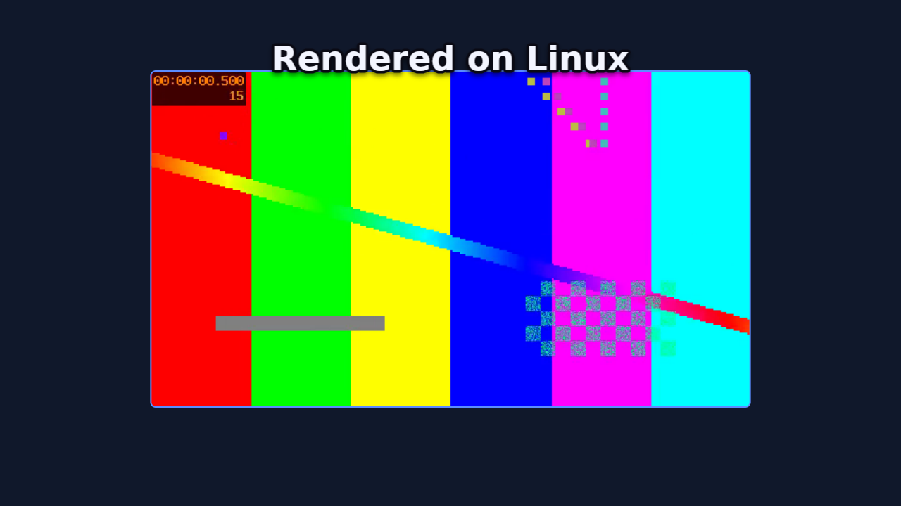

# promoshot

<p align="center">
  
</p>

The rendering engine behind [PromoShot](https://promoshot.app)
([App Store](https://apps.apple.com/us/app/promoshot-app/id6770157576)),
and an open implementation of its project format. A `.promo` project is a
folder — `metadata.json` plus its media — and this workspace is everything
needed to validate, inspect, and render one to stills, image sequences, or
mp4 with mixed audio: no app attached, byte-for-byte the same compositor the
apps ship.

The design bet is that **the format is the interface**. An assistant, a
script, or a person writes `metadata.json`; the engine renders it the same
everywhere — the Mac and iOS apps (Metal + VideoToolbox), this repo's CLI,
or a headless Linux box with no GPU at all (wgpu on lavapipe, ffmpeg as a
subprocess). The format has three faces behind one truth: an authoring
subset with four validated recipes (`promo schema`), the full document
(`--full`), and a types-only JSON Schema generated from the parser's own
structs (`--types`) — and the parser the validator runs is the parser the
renderers use, so "validates" means "renders".

## Crates

| Crate | What it owns |
|---|---|
| `promo-model` | The format: wire structs, migrations, palette roles, `schema.md` |
| `promo-timeline` | Timeline math: keyframes, trims, attachments, waits, validation |
| `promo-gpu` | wgpu compositing: quads, borders, letterbox, vectors, color conversion |
| `promo-text` | Caption shaping and effects (cosmic-text) |
| `promo-engine` | Preview/export orchestration, frame cache, memory governor, PCM mixer |
| `promo-media` | Decoder/encoder trait registry; ffmpeg-subprocess backend + conformance suite |
| `promo-editor` | The document's edit vocabulary: commands with undo, the wizard's arrangement, theme rules — what `promo_apply` and `promo_slideshow` are built on |
| `promo-cli` | `promo` — render a project from the command line |
| `promoshot-mcp` | MCP server over stdio, for agents |

## Build and verify

```
./check-all.sh          # fmt, clippy -D warnings, all tests, release build
```

Rendering video needs `ffmpeg` (and `ffprobe`) on PATH — frames are composited
on the GPU and piped to it raw; ffmpeg only decodes and encodes. On a headless
Linux machine, `mesa-vulkan-drivers` (lavapipe) is enough of a GPU.

## The CLI

```
cargo build --release -p promo-cli     # -> target/release/promo

promo schema                            # authoring subset + recipes; --full, --types
promo validate <project>                # exit 0 == this will render
promo inspect  <project>                # canvas, layers, missing media, undefined colours
promo still    <project> --out f.png --time 2.5
promo frames   <project> --out frames/ --fps 30 --from 0 --to 4
promo video    <project> --out out.mp4 --fps 30
```

Add `--json` to any project command for machine output — one object on
stdout, errors included, exit codes unchanged.

`promo video` mixes the soundtrack the apps would: trims and media cuts,
held frames, speed with pitch preserved, keyframed volume, a focused
narration ducking everything under it, and only the audio tracks the
project keeps.

Headless renders are CLEAN — no watermark, and no license, serial or key
will ever be asked for. (The Mac and iOS apps watermark free-tier renders;
that is their App Store Pro line, and it stays on their side of the fence.)

## The MCP server

`promoshot-mcp` speaks Model Context Protocol over stdio, so any MCP client
can author, inspect and render projects. It owns no rendering code — every
render shells to `promo` (found next to the executable, or on PATH, or via
`--promo`), so the CLI stays the single contract.

### Connect an agent

Two pieces: the MCP server (tools) and the skill (workflow).
Neither is vendor-specific. Agents do not find this repo by themselves.

**1. Build — or don't**

```bash
cargo build --release -p promo-cli -p promoshot-mcp
# binaries: target/release/promo  target/release/promoshot-mcp
```

No Rust toolchain? Grab the prebuilt pair from
[Releases](https://github.com/GarAlex/promoshot/releases) (linux-x64,
macos-arm64), or pull the image:
`docker pull ghcr.io/garalex/promoshot-mcp` — both carry `promo` and
`promoshot-mcp` together.

Put both on PATH, or pass `--promo` to the server. Rendering video also
wants `ffmpeg`/`ffprobe` on PATH.

**2. MCP (required for tools)**

Claude Code / Cursor / any `mcp.json`:

```json
{
  "mcpServers": {
    "promoshot": {
      "command": "/ABS/PATH/target/release/promoshot-mcp",
      "args": ["--workspace", "/ABS/PATH/Promo", "--root", "/ABS/PATH/Promo"]
    }
  }
}
```

`--workspace` is where new projects go; `--root` fences which projects the
server will touch — pointing both at one folder is the tidy setup. Both
optional.

Client one-liners:

```bash
# Claude Code
claude mcp add promoshot /ABS/PATH/target/release/promoshot-mcp

# Grok Build
grok mcp add promoshot -- /ABS/PATH/target/release/promoshot-mcp \
  --workspace /ABS/PATH/Promo --root /ABS/PATH/Promo
grok inspect   # confirms the server registered

# Docker — the host needs nothing but docker (details below)
docker build -t promoshot-mcp .
# then command: docker, args: ["run","-i","--rm","-v","/ABS/PATH/Promo:/projects","promoshot-mcp"]
```

**3. Skill (the workflow)**

Same file everywhere: [skill/SKILL.md](skill/SKILL.md).

```bash
REPO=https://github.com/GarAlex/promoshot
git clone --depth 1 $REPO /tmp/promoshot

# Claude Code (Grok Build also scans this folder)
mkdir -p ~/.claude/skills/promoshot
cp /tmp/promoshot/skill/SKILL.md ~/.claude/skills/promoshot/SKILL.md

# Grok Build explicit path
mkdir -p ~/.grok/skills/promoshot
cp /tmp/promoshot/skill/SKILL.md ~/.grok/skills/promoshot/SKILL.md

# OpenAI Codex / many others
mkdir -p ~/.agents/skills/promoshot
cp /tmp/promoshot/skill/SKILL.md ~/.agents/skills/promoshot/SKILL.md

# Cursor project (in the repo the user is editing, not this engine repo)
mkdir -p .cursor/rules
cp /tmp/promoshot/skill/SKILL.md .cursor/rules/promoshot.md
# or: mkdir -p .agents/skills/promoshot && cp SKILL.md there
```

Any agent that reads instructions can be handed the file directly; it
assumes only these tools (or the CLI).

**4. Verify** — ask the agent for a render:

> Render examples/ProductCard.promo to a still at 3s.

One `promo_validate`, one `promo_render_still`, and a device-framed app
demo comes back as a path. From there, "make me a promo for <my app>" is
the loop the skill teaches.

### The tools

Tools: `promo_schema` (authoring subset + four validated recipes;
`promo_schema_full` is the whole format; `promo_schema_types` is the format
as a generated, types-only JSON Schema — also checked in at
[docs/promo.schema.json](docs/promo.schema.json) for `$schema` editor
autocomplete), `promo_validate`, `promo_inspect` (each layer listed with
its id — the handle the editing tools take),
`promo_render_still`, `promo_render_frames`, `promo_render_video`,
`promo_render_gif`, `promo_workspace`; the senses — `promo_media_probe`,
`promo_media_filmstrip` (a contact sheet of a SOURCE clip, times per cell),
`promo_media_silences` (silence spans and their inverse) and
`promo_media_scenes` (scene cuts and the shots between them), so an agent
knows what footage holds before composing with it; the editor trio,
`promo_init`, `promo_upsert_layer` and `promo_upsert_keyframe`: create a
project, add image/video/caption layers with placements, then animate —
a second placement keyframe is a push-in, viewport keyframes a Ken Burns;
your short ids are used verbatim, unnamed ones get canonical UUIDs, pixel
sizes are stamped, and the composition keeps covering its layers. Device
frames bake headless too — the same slab the apps draw. `promo_slideshow`
is the wizard: pictures and clips in, a complete classic, carousel or
store-listing show out, a caption on any slide becoming a layer that
lives with its picture. `promo_voices`
lists a provider's voices and `promo_speak` synthesizes narration with the
person's own provider key, reusing unchanged text by receipt. The authoring tools answer
with an inline thumbnail of the composition, so a misplaced layer is caught
at the moment it happens. The tools write ordinary `metadata.json`
through the format's own parser — the schema stays the source of truth, and
hand-editing remains first-class. Renders default their output into the
project's `Exports/` folder and return the path written, never the bytes.

Flags, all optional: `--workspace <dir>` (where `promo_workspace` points;
else `$PROMOSHOT_WORKSPACE`, else the XDG data dir), `--root <dir>` (refuse
projects outside this tree), `--promo <path>`.

### Narration keys

Narration spends the person's own provider account, and the key never
passes through the agent: no tool takes one, none shows one. Register it
once in the OS keyring — macOS Keychain, the Secret Service on Linux
(GNOME Keyring, KWallet), the Credential Manager on Windows:

```bash
promoshot-mcp key set openai        # reads the key from stdin: paste, then Ctrl-D
promoshot-mcp key status            # where each provider's key comes from, never the key
promoshot-mcp key remove openai
```

Providers: `openai`, `elevenlabs`, `google`. The key is read from stdin so
it lands in no shell history, no config file and no argument list.

Where there is no keyring — the Docker image, a CI runner — the key is
read from a **secrets file**, the way Docker, Kubernetes and CI systems
hand secrets over: `/run/secrets/OPENAI_API_KEY` (likewise
`ELEVENLABS_API_KEY`, `GOOGLE_API_KEY`), or the path named by
`OPENAI_API_KEY_FILE`. A mode-0400 file, never an environment variable
that `docker inspect` and every same-user process can read:

```bash
docker run -i --rm \
  -v "$HOME/.secrets/openai:/run/secrets/OPENAI_API_KEY:ro" \
  -v /path/to/your/projects:/projects promoshot-mcp
```

An agent can ask before it plans: `promo_speak` with `{"check": true}`
spends nothing and reports, per provider, whether a key is present and
what a real call would synthesize. A real call checks every pending
narration's key before buying anything, and writes each receipt back the
moment it is paid for, so a failure part-way never makes the next call
pay twice. Keys travel in request headers, never URLs, and nothing logs
them.

### Docker

The image is the whole render environment — server, CLI, ffmpeg, a
software Vulkan and the fonts — so a client needs nothing on the host:

```
docker build -t promoshot-mcp .
```

```json
{
  "mcpServers": {
    "promoshot": {
      "command": "docker",
      "args": ["run", "-i", "--rm",
               "-v", "/path/to/your/projects:/projects",
               "promoshot-mcp"]
    }
  }
}
```

Projects live under the mount; `promo_workspace` answers `/projects`. All
the [examples](examples/) are baked in, so the image proves itself with no
mount at all — render `ProductCard.promo` first; the device-framed app
demo is the one that teaches the product-promo path. `server.json` is the MCP Registry manifest (`io.github.GarAlex/promoshot`) for the published
image (`ghcr.io/garalex/promoshot-mcp`). GitHub's [MCP Registry](https://github.com/mcp) consumes that feed after `mcp-publisher publish`.

mcp-name: io.github.GarAlex/promoshot

The skill is drift-tested: a test pins it to the server's actual tool
list, so it cannot teach tools that do not exist.

The Mac app carries its own MCP server (Settings → Automation) sharing the
core tool names, plus app-only abilities — opening the editor, speech
synthesis. The authoring pair, the senses and the types schema are
headless-first.

What a session looks like — three requests in, a validated project and a
rendered frame out (the frame at the top of this page was made exactly this
way):

```json
{"jsonrpc":"2.0","id":1,"method":"initialize","params":{"protocolVersion":"2025-06-18"}}
{"jsonrpc":"2.0","method":"notifications/initialized"}
{"jsonrpc":"2.0","id":2,"method":"tools/call","params":{"name":"promo_validate","arguments":{"project":"examples/LinuxSmoke.promo"}}}
{"jsonrpc":"2.0","id":3,"method":"tools/call","params":{"name":"promo_render_still","arguments":{"project":"examples/LinuxSmoke.promo","time":5.5}}}
```

```json
{"id":2,"result":{"content":[{"type":"text","text":"ok — nothing the renderer would quietly correct"}]}}
{"id":3,"result":{"content":[{"type":"text","text":"wrote examples/LinuxSmoke.promo/Exports/still-5.5s.png (1280x720 at 5.50s)"}]}}
```

## One engine, every platform

The same project rendered on macOS (Metal, VideoToolbox) and on a bare
Linux container (lavapipe software Vulkan, no GPU; ffmpeg) — SSIM 0.983
over the full 240-frame video. The visible difference is the font: the
caption asks the question, the two frames answer it.

Try it yourself — [examples/](examples/) holds one runnable project per
`promo_schema` recipe (each metadata.json IS its recipe, pinned by a
test), from the device-framed product card to the 9:16 re-stamp — plus
the kitchen-sink [LinuxSmoke.promo](examples/LinuxSmoke.promo):

```
promo video examples/ProductCard.promo --out card.mp4
```

## Authoring a project

Start with `promo schema`. The short version: a project folder holds
`metadata.json` and `Resources/`; ids are unique strings (short mnemonics
are fine — apps mint UUIDs on adoption); layers place resources
on a timeline with keyframes (hold-then-ease), placement rules, transitions
and palette-named colours (`@accent`). Validate before rendering — the
validator names what the renderer would silently correct, undefined colour
names included.

```
mkdir -p Demo.promo/Resources
# write Demo.promo/metadata.json, copy media into Resources/
promo validate Demo.promo && promo still Demo.promo --out look.png --time 1
```

Or let the MCP server spend the boilerplate (`promo_init`,
`promo_upsert_layer`), and give your editor autocomplete by pointing
`"$schema"` at [docs/promo.schema.json](docs/promo.schema.json).

## Invariants and plans

- `SPECS.md` — the invariants the tests pin.

## License

Apache-2.0. The PromoShot applications built on this engine are separate,
proprietary products.

## Proxies for long sources

`promo proxy <project>` builds a tier-1 proxy (960 px long edge, every
frame a keyframe) for each video resource, in a cache outside the
package (`$PROMO_PROXY_DIR`, else the platform cache directory under
`promoshot/proxies`). `still`, `frames`, `gif` and `video` take
`--proxy auto|on|off`: `auto` (default) reads a built proxy when the
output's long edge fits it, `on` builds missing proxies first, `off`
reads the source — and a full-size render always does. The MCP tools
take the same `proxy` argument; `promo_proxy` builds them.
