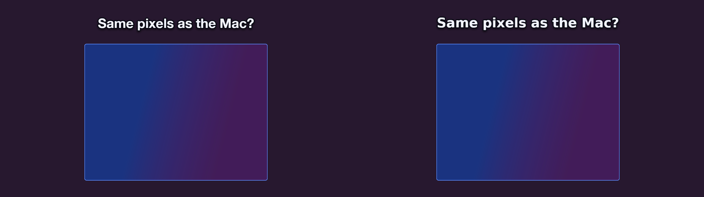

# promoshot

<p align="center">
  
</p>

The rendering engine behind [PromoShot](https://promoshot.app)
([App Store](https://apps.apple.com/us/app/promoshot-app/id6770157576)),
and an open implementation of its project format. A `.promo` project is a
folder — `metadata.json` plus its media — and this workspace is everything
needed to validate, inspect, and render one to stills, image sequences, or
mp4 with mixed audio: no app attached, byte-for-byte the same compositor the
apps ship.

The design bet is that **the format is the interface**. An assistant, a
script, or a person writes `metadata.json`; the engine renders it the same
everywhere — the Mac and iOS apps (Metal + VideoToolbox), this repo's CLI,
or a headless Linux box with no GPU at all (wgpu on lavapipe, ffmpeg as a
subprocess). The format has three faces behind one truth: an authoring
subset with four validated recipes (`promo schema`), the full document
(`--full`), and a types-only JSON Schema generated from the parser's own
structs (`--types`) — and the parser the validator runs is the parser the
renderers use, so "validates" means "renders".

## Crates

| Crate | What it owns |
|---|---|
| `promo-model` | The format: wire structs, migrations, palette roles, `schema.md` |
| `promo-timeline` | Timeline math: keyframes, trims, attachments, waits, validation |
| `promo-gpu` | wgpu compositing: quads, borders, letterbox, vectors, color conversion |
| `promo-text` | Caption shaping and effects (cosmic-text) |
| `promo-engine` | Preview/export orchestration, frame cache, memory governor, PCM mixer |
| `promo-media` | Decoder/encoder trait registry; ffmpeg-subprocess backend + conformance suite |
| `promo-editor` | The editor brain, front-end-agnostic: the core owns the document — commands, undo, lanes, viewport, transport, selection |
| `promo-ffi` | The C ABI the Swift apps link |
| `promo-cli` | `promo` — render a project from the command line |
| `promoshot-mcp` | MCP server over stdio, for agents |

## Build and verify

```
./check-all.sh          # fmt, clippy -D warnings, all tests, release build
```

Rendering video needs `ffmpeg` (and `ffprobe`) on PATH — frames are composited
on the GPU and piped to it raw; ffmpeg only decodes and encodes. On a headless
Linux machine, `mesa-vulkan-drivers` (lavapipe) is enough of a GPU.

## The CLI

```
cargo build --release -p promo-cli     # -> target/release/promo

promo schema                            # authoring subset + recipes; --full, --types
promo validate <project>                # exit 0 == this will render
promo inspect  <project>                # canvas, layers, missing media, undefined colours
promo still    <project> --out f.png --time 2.5
promo frames   <project> --out frames/ --fps 30 --from 0 --to 4
promo video    <project> --out out.mp4 --fps 30
```

Add `--json` to any project command for machine output — one object on
stdout, errors included, exit codes unchanged.

## The MCP server

`promoshot-mcp` speaks Model Context Protocol over stdio, so any MCP client
can author, inspect and render projects. It owns no rendering code — every
render shells to `promo` (found next to the executable, or on PATH, or via
`--promo`), so the CLI stays the single contract.

### Connect an agent

Two pieces: the MCP server (tools) and the skill (workflow).
Neither is vendor-specific. Agents do not find this repo by themselves.

**1. Build**

```bash
cargo build --release -p promo-cli -p promoshot-mcp
# binaries: target/release/promo  target/release/promoshot-mcp
```

`promoshot-mcp` finds `promo` next to itself; rendering video also wants
`ffmpeg`/`ffprobe` on PATH.

**2. Register the server** with whatever speaks MCP:

```json
{
  "mcpServers": {
    "promoshot": {
      "command": "/absolute/path/to/target/release/promoshot-mcp"
    }
  }
}
```

(Claude Code: `claude mcp add promoshot /absolute/path/to/promoshot-mcp`.
Prefer the Docker image below when the host should not need ffmpeg or a
GPU.)

**3. Install the skill** — the workflow layer the tools do not carry:

```bash
cp -r skill ~/.claude/skills/promoshot
```

— or hand [skill/SKILL.md](skill/SKILL.md) to any agent that reads
instructions; it assumes only these tools (or the CLI).

**4. Verify** — ask the agent for a render:

> Render examples/ProductCard.promo to a still at 3s.

One `promo_validate`, one `promo_render_still`, and a device-framed app
demo comes back as a path. From there, "make me a promo for <my app>" is
the loop the skill teaches.

### The tools

Tools: `promo_schema` (authoring subset + four validated recipes;
`promo_schema_full` is the whole format; `promo_schema_types` is the format
as a generated, types-only JSON Schema — also checked in at
[docs/promo.schema.json](docs/promo.schema.json) for `$schema` editor
autocomplete), `promo_validate`, `promo_inspect`,
`promo_render_still`, `promo_render_frames`, `promo_render_video`,
`promo_workspace`; the senses — `promo_media_probe`,
`promo_media_filmstrip` (a contact sheet of a SOURCE clip, times per cell)
and `promo_media_silences` (silence spans and their inverse), so an agent
knows what footage holds before composing with it — and the editor pair,
`promo_init` and
`promo_upsert_layer`: create a project, add image/video/caption layers with
placements; your short ids are used verbatim, unnamed ones get canonical
UUIDs, pixel sizes are stamped, and the composition keeps covering its
layers. The tools write ordinary `metadata.json`
through the format's own parser — the schema stays the source of truth, and
hand-editing remains first-class. Renders default their output into the
project's `Exports/` folder and return the path written, never the bytes.

Flags, all optional: `--workspace <dir>` (where `promo_workspace` points;
else `$PROMOSHOT_WORKSPACE`, else the XDG data dir), `--root <dir>` (refuse
projects outside this tree), `--promo <path>`.

### Docker

The image is the whole render environment — server, CLI, ffmpeg, a
software Vulkan and the fonts — so a client needs nothing on the host:

```
docker build -t promoshot-mcp .
```

```json
{
  "mcpServers": {
    "promoshot": {
      "command": "docker",
      "args": ["run", "-i", "--rm",
               "-v", "/path/to/your/projects:/projects",
               "promoshot-mcp"]
    }
  }
}
```

Projects live under the mount; `promo_workspace` answers `/projects`. All
the [examples](examples/) are baked in, so the image proves itself with no
mount at all — render `ProductCard.promo` first; the device-framed app
demo is the one that teaches the product-promo path. `server.json` is the MCP registry manifest for the published
image (`ghcr.io/garalex/promoshot-mcp`).

The skill is drift-tested: a test pins it to the server's actual tool
list, so it cannot teach tools that do not exist.

The Mac app carries its own MCP server (Settings → Automation) sharing the
core tool names, plus app-only abilities — opening the editor, speech
synthesis. The authoring pair, the senses and the types schema are
headless-first.

What a session looks like — three requests in, a validated project and a
rendered frame out (the frame at the top of this page was made exactly this
way):

```json
{"jsonrpc":"2.0","id":1,"method":"initialize","params":{"protocolVersion":"2025-06-18"}}
{"jsonrpc":"2.0","method":"notifications/initialized"}
{"jsonrpc":"2.0","id":2,"method":"tools/call","params":{"name":"promo_validate","arguments":{"project":"examples/LinuxSmoke.promo"}}}
{"jsonrpc":"2.0","id":3,"method":"tools/call","params":{"name":"promo_render_still","arguments":{"project":"examples/LinuxSmoke.promo","time":5.5}}}
```

```json
{"id":2,"result":{"content":[{"type":"text","text":"ok — nothing the renderer would quietly correct"}]}}
{"id":3,"result":{"content":[{"type":"text","text":"wrote examples/LinuxSmoke.promo/Exports/still-5.5s.png (1280x720 at 5.50s)"}]}}
```

## One engine, every platform

The same project rendered on macOS (Metal, VideoToolbox) and on a bare
Linux container (lavapipe software Vulkan, no GPU; ffmpeg) — SSIM 0.983
over the full 240-frame video. The visible difference is the font: the
caption asks the question, the two frames answer it.

<p align="center">
  
</p>

Try it yourself — [examples/](examples/) holds one runnable project per
`promo_schema` recipe (each metadata.json IS its recipe, pinned by a
test), from the device-framed product card to the 9:16 re-stamp — plus
the kitchen-sink [LinuxSmoke.promo](examples/LinuxSmoke.promo):

```
promo video examples/ProductCard.promo --out card.mp4
```

## Authoring a project

Start with `promo schema`. The short version: a project folder holds
`metadata.json` and `Resources/`; ids are unique strings (short mnemonics
are fine — apps mint UUIDs on adoption); layers place resources
on a timeline with keyframes (hold-then-ease), placement rules, transitions
and palette-named colours (`@accent`). Validate before rendering — the
validator names what the renderer would silently correct, undefined colour
names included.

```
mkdir -p Demo.promo/Resources
# write Demo.promo/metadata.json, copy media into Resources/
promo validate Demo.promo && promo still Demo.promo --out look.png --time 1
```

Or let the MCP server spend the boilerplate (`promo_init`,
`promo_upsert_layer`), and give your editor autocomplete by pointing
`"$schema"` at [docs/promo.schema.json](docs/promo.schema.json).

## Invariants and plans

- `SPECS.md` — the invariants the tests pin.
- [docs/LINUX-READY-PLAN.md](docs/LINUX-READY-PLAN.md) — how the engine became portable, measured; the
  first real-Linux run's results are in its Status section.
- [docs/EDITOR-PLAN.md](docs/EDITOR-PLAN.md) — where `promo-editor` is heading: the core owns the
  document, front ends send commands.

## License

Apache-2.0. The PromoShot applications built on this engine are separate,
proprietary products.
