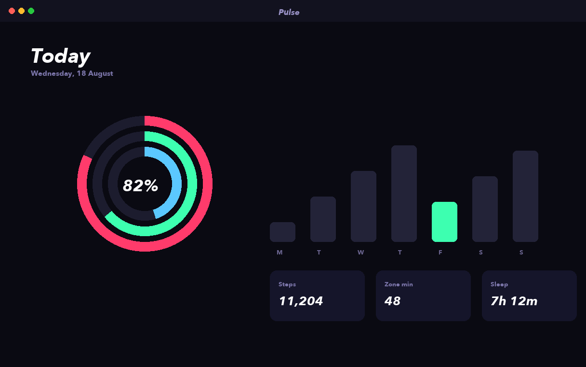
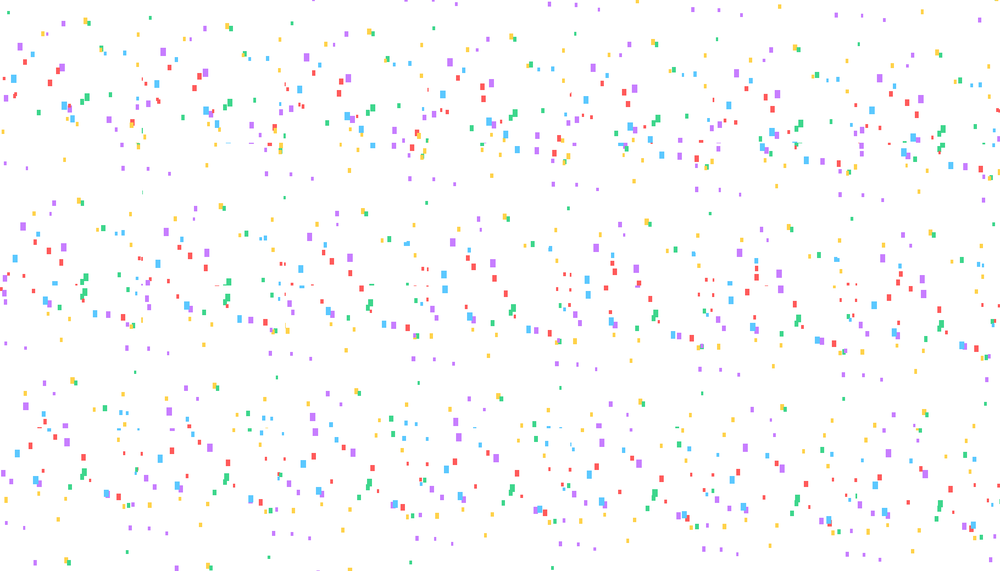
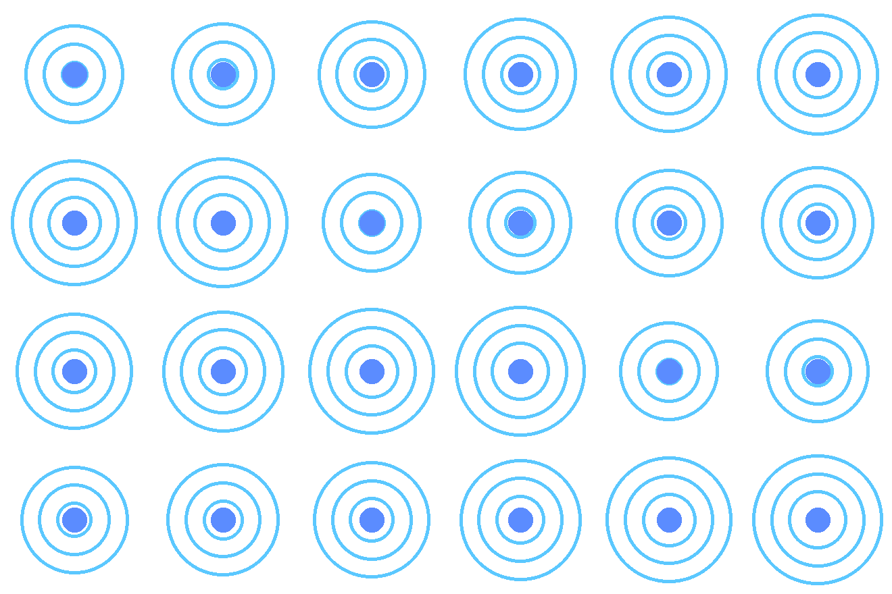
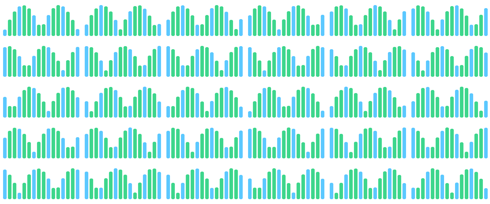
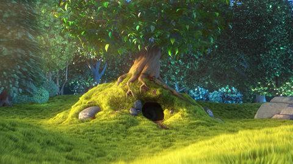
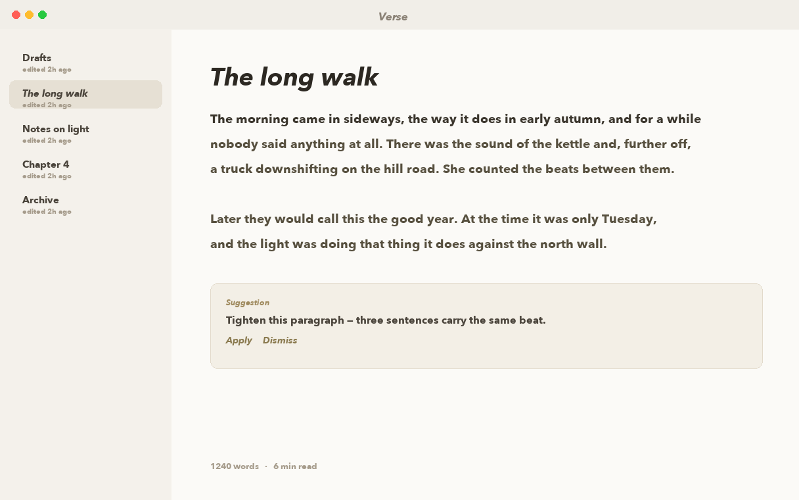
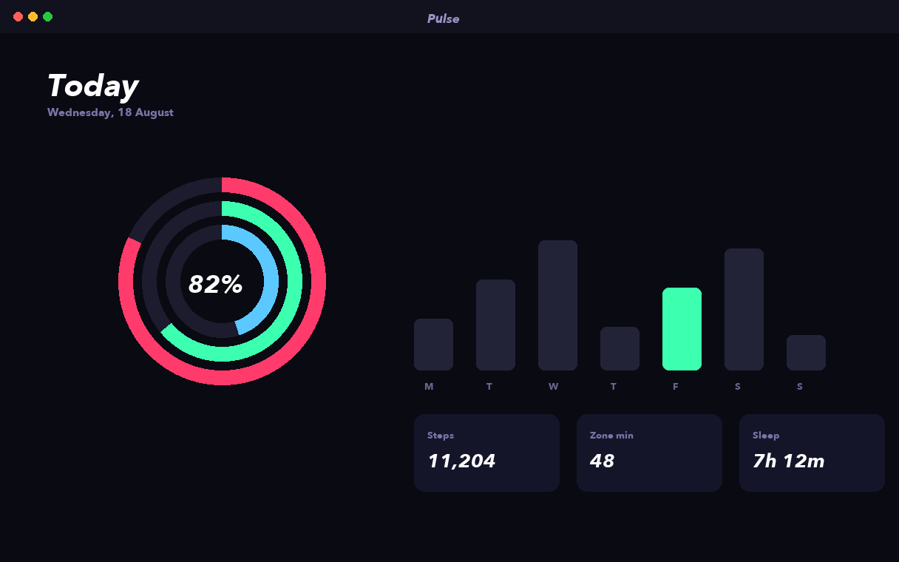
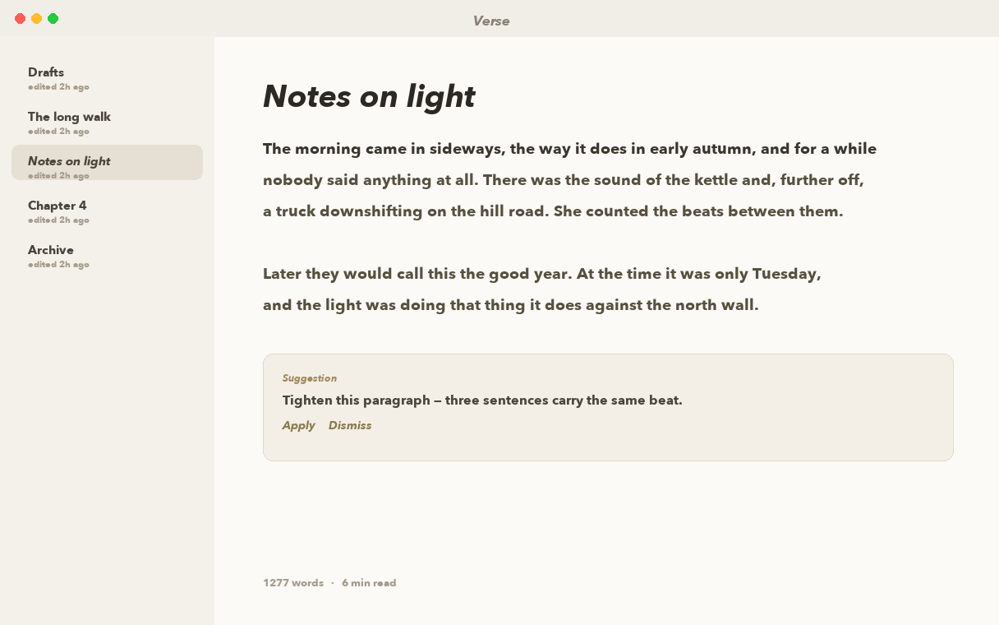
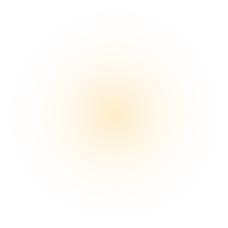

# Demos — prompt in, video out

Every piece below was made by a **fresh agent**: a Claude Code session
with nothing but the media shown, the prompt shown, the public
[PromoShot skill](skill/SKILL.md) and the headless PromoShot MCP server
fenced to an empty folder. No repository, no memory, no example to copy.
It wrote the project, validated it, rendered it — and the result is shown
beside the piece a person built by hand for the same prompt, at the same
six moments, with a structural score: canvas, length, the mix of layers,
the features the prompt implied, the words that reach the screen.

The suite lives in [demos/](demos/): the media, the prompts, the rubrics,
the runner and the scorer. Adding a demo is adding a folder; see
[demos/README.md](demos/README.md). `docs/demo/demo.json` carries the
same material for the website. Footage credit: Big Buck Bunny (Blender
Foundation, CC BY 3.0) where a screen recording stands in.

## 01 App Store Hero

*1440×900, 15 s.*

**Resources given to the agent**

 
 
 
 
 

**The prompt**

> Make a 15-second Mac App Store preview video, 1440 by 900, from these five screenshots. One framed window in the middle of a dark studio background that drifts very slowly the whole time, swapping through all five screenshots in turn with a gentle transition between them, and one short headline above the window for each screenshot, arriving word by word.
> 
> Files in `resources/`: ui_lumen_1.png, ui_lumen_2.png, ui_lumen_5.png, ui_pulse_1.png, ui_verse_1.png.
> 
> Text to use, in order:
> - Every number, one screen.
> - Revenue that explains itself.
> - Write without the noise.
> - Move, measured.
> - Ship the story.

*Not run yet.*

## 02 Focus Follow

*1920×1080, 0 s.*

**Resources given to the agent**

 
`rec_lumen_2560.mp4` ([file](demos/02-focus-follow/resources/rec_lumen_2560.mp4))

**The prompt**

> This is a screen recording of a finance app. Make a 16-second clip where a framed window of the recording stays exactly where it is while the view inside it zooms in on the chart tooltip, then the account row, then the alert switch — each move a smooth push into that spot, each with a caption naming what we are looking at.
> 
> Files in `resources/`: rec_lumen_2560.mp4.
> 
> Text to use, in order:
> - The window stays put.
> - Follow the number…
> - …then the account…
> - …then the switch.
> - One layer. No cuts.

*Not run yet.*

## 03 Sprite Arcade

*1920×1080, 0 s.*

**Resources given to the agent**

 
 
 
 

**The prompt**

> These images are sprite sheets: looping animations laid out in cells. Make a playful 13-second clip on a dark background where each sprite plays its animation while flying along a curved path from the left edge to the right edge, staggered so they are not all in the air at once, with a title.
> 
> Files in `resources/`: sprite_bird.png, sprite_coin.png, sprite_rocket.png, sprite_spark.png.
> 
> Text to use, in order:
> - Sprites are just images.
> - They move, spin and fade
> like anything else.
> - The sheet animates while
> the layer flies.
> - One image. Two clocks.

*Not run yet.*

## 04 Gradient Drift

*1920×1080, 0 s.*

**Resources given to the agent**

 

**The prompt**

> Make a 12-second looping background piece: a smooth gradient of several colours, ending on the colour it started with, that scrolls seamlessly in one direction so it can loop; the ring image breathes gently in the middle; one short caption fades in by word.
> 
> Files in `resources/`: sprite_ring.png.
> 
> Text to use, in order:
> - colour that moves
> - repeat · mirror · clamp
> - a gradient is a keyframe too

*Not run yet.*

## 05 Carousel

*1920×1080, 0 s.*

**Resources given to the agent**

 
 
 
 

**The prompt**

> Make a 15-second carousel of these cards. Each card enters from the right, rests in the centre while a caption names it, then leaves to the left, tilting slightly as it moves. No two cards on screen at the same time except during the hand-off.
> 
> Files in `resources/`: ui_lumen_2.png, ui_lumen_4.png, ui_pulse_2.png, ui_verse_2.png.
> 
> Text to use, in order:
> - Dashboards
> - Long-form writing
> - Daily movement
> - Funnels that add up
> - One layer per card.
> Four ramps each.

*Not run yet.*

## 06 GIF Board

*1920×1080, 0 s.*

**Resources given to the agent**

 
 
 

**The prompt**

> Arrange these animated GIFs on a grid, all playing at once, for 13 seconds, with a title above the grid. Cells of different shapes should line up on their centres.
> 
> Files in `resources/`: sheet_confetti.png, sheet_pulse.png, sheet_wave.png.
> 
> Text to use, in order:
> - A GIF is a grid of frames.
> - Import bakes it into a sheet…
> - …and then it is just an image:
> it flies, spins and fades.
> - Twelve loops, one draw call each.

*Not run yet.*

## 07 Narrated Tour

*1920×1080, 0 s.*

**Resources given to the agent**

 
`bbb_test.mp4` ([file](demos/_media/bbb_test.mp4))

**The prompt**

> Make a 21-second narrated product tour from this screen recording. Framed window, a little smaller than the canvas. Synthesize the narration from the lines below and pace the piece by how long each line takes to speak; as each line plays, the view inside the window moves to the feature it mentions. Put the captions on the footage with an outline and shadow, no plate.
> 
> Files in `resources/`: bbb_test.mp4.
> 
> Text to use, in order:
> - Some footage tells the story on its own.
> - The camera never moved — the viewport did.
> - Narration is written here, not recorded.
> - Add a voice key and it speaks.
> - Everything else already renders.

*Not run yet.*

## 08 Speed Ramp

*1920×1080, 0 s.*

**Resources given to the agent**

 
`bbb_test.mp4` ([file](demos/_media/bbb_test.mp4))

**The prompt**

> Make a 14-second speed-ramped edit of this clip that fills the canvas: a half-speed section first, then a double-speed section, then one at three-quarter speed, cross-dissolving between them, each section lasting as long as that piece takes at that speed, with a caption naming the speed.
> 
> Files in `resources/`: bbb_test.mp4.
> 
> Text to use, in order:
> - 0.5× — the drift
> - 2× — the rush
> - 0.75× — the hold
> - One recording.
> Three cuts, three rates.

*Not run yet.*

## 09 Kinetic Type

*1920×1080, 0 s.*

**Resources given to the agent**

*None — the prompt carries the text.*

**The prompt**

> Make a 12-second kinetic typography piece from the lines below, on a slowly moving gradient background. Give each line a different way of arriving: a typewriter, a word-by-word rise, a pop, and a karaoke highlight that walks along the last line.
> 
> Text to use, in order:
> - type
> - that knows
> - where it is going
> - three tracks.
> one caption.

*Not run yet.*

## 10 Logo Sting

*1920×1080, 0 s.*

**Resources given to the agent**

 
 

**The prompt**

> Make a 10-second logo sting. A radial bloom opens on a dark background, the rocket climbs a curved path with motion blur, a burst of sparkles goes off around it, then the wordmark lands and holds to the end. Reveal the title letter by letter and type the URL underneath.
> 
> Files in `resources/`: sprite_rocket.png, sprite_spark.png.
> 
> Text to use, in order:
> - LUMEN
> - see the whole picture
> - lumen.app

*Not run yet.*

## 11 Whip Deck

*1440×900, 10 s.*

**Resources given to the agent**

 
 
 
 

**The prompt**

> Make a 12-second slide deck from these four screenshots with whip-pan pushes between them, each transition faster and blurrier than the last.
> 
> Files in `resources/`: ui_lumen_1.png, ui_lumen_2.png, ui_pulse_1.png, ui_verse_1.png.
> 
> Text to use, in order:
> - One deck. Every screen.
> - See it move.

*Not run yet.*

## 12 Word for Word

*1080×1920, 12 s.*

**Resources given to the agent**

*None — the prompt carries the text.*

**The prompt**

> Make a vertical 1080 by 1920 caption piece, 12 seconds, from the three statements below. Each statement replaces the previous one with a push. Give the first a word-by-word rise, the second a word-by-word fade, and walk a karaoke highlight along the last.
> 
> Text to use, in order:
> - Ship the story, not the spec.
> - Every word lands on time.
> - Say it once. Ship it everywhere.

*Not run yet.*

## 13 Before & After

*1440×900, 9 s.*

**Resources given to the agent**

 
 

**The prompt**

> Make a calm 12-second before-and-after: a slow crossfade from the old screen to the new one, with a caption that wipes from 'Before' to 'After' at the same moment. No motion blur.
> 
> Files in `resources/`: ui_pulse_2.png, ui_verse_2.png.
> 
> Text to use, in order:
> - Before
> - After — one tap

*Not run yet.*

## 14 Spotlight

*1440×900, 13 s.*

**Resources given to the agent**

 

**The prompt**

> Use this screenshot twice: a flat, desaturated copy underneath, and the full-colour copy visible only inside a soft round spotlight that roams over it, breathes and tilts on its own rhythm, for 13 seconds. In the last few seconds flip it so the spotlight punches the shape out instead.
> 
> Files in `resources/`: ui_lumen_1.png.
> 
> Text to use, in order:
> - Point at what matters
> - Or knock the same shape out

*Not run yet.*

## 15 Grade Room

*1440×900, 15 s.*

**Resources given to the agent**

 

**The prompt**

> One screenshot, 15 seconds: walk it through four looks by ramping the grade rather than cutting — the original, then black and white, then a warm sepia, then a cool duotone — with a caption naming each look as it arrives.
> 
> Files in `resources/`: ui_lumen_1.png.
> 
> Text to use, in order:
> - Straight out of the recorder
> - Mono — saturation to zero
> - Sepia — a warm gel over the grey
> - Duotone — same move, cooler gel

*Not run yet.*

## 16 Light Leak

*1440×900, 12 s.*

**Resources given to the agent**

 
 
 
 

**The prompt**

> Make a 12-second piece over this screenshot: a warm light leak that sweeps across with a screen blend and motion blur, a dark-rimmed vignette plate multiplied over it, and a hot bright core added on top. Generate the leak and vignette as soft images, not hard shapes.
> 
> Files in `resources/`: glow_dot.png, leak_warm.png, ui_lumen_1.png, vignette_soft.png.
> 
> Text to use, in order:
> - Light, laid over

*Not run yet.*

## 17 Chain Reaction

*1440×900, 13 s.*

**Resources given to the agent**

 
 
 
 

**The prompt**

> Chain these clips so each one starts half a second before the one before it ends, and pin a label to each clip's own start and end, so that if any clip is retrimmed everything after it follows. Fill the canvas.
> 
> Files in `resources/`: ui_lumen_1.png, ui_lumen_5.png, ui_pulse_1.png, ui_verse_1.png.
> 
> Text to use, in order:
> - Record it
> - Frame it
> - Say it
> - Ship it

*Not run yet.*

## 18 Reused Title

*1440×900, 13 s.*

**Resources given to the agent**

 

**The prompt**

> Make a 12-second piece that uses one title card three times — as the intro, a mid card and the outro — built once and placed three times rather than copied, with a screenshot between the cards.
> 
> Files in `resources/`: ui_lumen_1.png.
> 
> Text to use, in order:
> - One title card.
> Placed three times.

*Not run yet.*

## 19 Green Room

*1440×900, 12 s.*

**Resources given to the agent**

 
`green_lumen.mp4` ([file](demos/19-green-room/resources/green_lumen.mp4))

**The prompt**

> Key out the green screen in this clip and compose it over a dark gradient with a soft halo behind it, letting it grow slightly over 12 seconds, with a caption that says the plate is gone on every host.
> 
> Files in `resources/`: green_lumen.mp4.
> 
> Text to use, in order:
> - Keyed in the compositor.
> The plate is gone on every host.

*Not run yet.*

## 20 Look Book

*1440×900, 12 s.*

**Resources given to the agent**

`look_cool.cube` ([file](docs/demo/20-look-book/resources/look_cool.cube))
`look_mono.cube` ([file](docs/demo/20-look-book/resources/look_mono.cube))
`look_warm.cube` ([file](docs/demo/20-look-book/resources/look_warm.cube))
 

**The prompt**

> Show this screenshot three times side by side, each with a different look from one of the .cube files (warm, cool, mono), each labelled, with a title saying one shot, three looks from .cube files. 12 seconds.
> 
> Files in `resources/`: look_cool.cube, look_mono.cube, look_warm.cube, ui_lumen_1.png.
> 
> Text to use, in order:
> - One shot. Three looks from .cube files.
> - Warm
> - Cool
> - Mono

*Not run yet.*

## 21 Chapters & Levels

*1440×900, 20 s.*

**Resources given to the agent**

 
`bbb_test.mp4` ([file](demos/_media/bbb_test.mp4))

**The prompt**

> Make the narrated tour again from this recording and the narration lines below, but this time level the voice (normalize its loudness and add gentle compression) and add a chapter marker at the start of each section so a player shows a chapter menu, plus a plain marker at the end card.
> 
> Files in `resources/`: bbb_test.mp4.
> 
> Text to use, in order:
> - Some footage tells the story on its own.
> - The camera never moved — the viewport did.
> - Narration is written here, not recorded.
> - Add a voice key and it speaks.
> - Everything else already renders.

*Not run yet.*

## 22 Product Story

*1440×900, 24 s.*

**Resources given to the agent**

 
`green_lumen.mp4` ([file](demos/22-product-story/resources/green_lumen.mp4))
`look_warm.cube` ([file](docs/demo/22-product-story/resources/look_warm.cube))
 

**The prompt**

> Make a 24-second product story, 1440 by 900, over a gradient: a title card that opens and closes the piece, the green-screen clip keyed and composed over the background, a screenshot with a warm look from the .cube file, one narrated line synthesized from the text below and levelled, and four chapter markers.
> 
> Files in `resources/`: green_lumen.mp4, look_warm.cube, ui_lumen_1.png.
> 
> Text to use, in order:
> - One title card.
> Placed three times.
> - Footage on green, keyed here.
> - A look from a .cube, on top of the grade.
> - One document. Every host renders it the same.

*Not run yet.*

## 23 Soft Focus

*1440×900, 12 s.*

**Resources given to the agent**

 

**The prompt**

> Make a 12-second piece from this one screenshot: a blurred, vignetted, slightly grainy copy as the backdrop; a sharp copy in front that arrives out of a heavy blur and leaves as a sideways smear; a headline that resolves out of a blur and glows once as it lands; and a subline.
> 
> Files in `resources/`: ui_lumen_1.png.
> 
> Text to use, in order:
> - Focus, pulled in the compositor.
> - Blur, glow, vignette, grain and sharpen — on the layer, on every host.

**What the agent made** — score 100% (6/6 rubric checks), turns=65 cost=$3.90 secs=566

[video](docs/demo/23-soft-focus/result.mp4) · [the project it wrote](docs/demo/23-soft-focus/result-metadata.json)

**The hand-built reference, same moments**

