# Demos — prompt in, video out

Every piece here was made by a **fresh agent**: a Claude Code session with
nothing but the media shown, the prompt shown, the public
[PromoShot skill](skill/SKILL.md) and the headless PromoShot MCP server
fenced to an empty folder. No repository, no memory, no example to copy.
It wrote the project, validated it, rendered it. Each page links the
video (GitHub plays it on its own page; the inline loop is a preview) and shows the
resources, the prompt, the result beside the piece a person built by hand
for the same brief at the same six moments, and a structural score:
length, the mix of layers, the features the prompt asked for, the words
that reach the screen.

The suite is in [demos/](demos/README.md) — adding a test is adding a
folder — and `docs/demo/demo.json` carries the same material for the
website. Footage credit: Big Buck Bunny (Blender Foundation, CC BY 3.0)
where a screen recording stands in.

The agent's work is given as turns, wall time, tokens and a cost. The
cost is the API's list price for those tokens; on a Claude subscription
the same run counts against the plan's usage window and bills nothing.
Most of the tokens are cache reads — the session's context re-read on
each turn at a tenth of the input price — which is why a run of a
million-odd tokens costs a couple of dollars at list.

| | demo | what the brief asks for | result · the agent's work |
|---|---|---|---|
| <a href="docs/demo/demo01.md">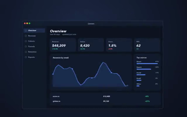</a> | [01 App Store Hero](docs/demo/demo01.md) | Five screenshots on one slowly drifting framed window, swapped in turn under a headline each — a Mac App Store preview. | [▶ watch](https://github.com/garalex/promoshot/raw/demo-media/01-app-store-hero.mp4) · **100%** · 40 turns · 4 min 12 s · $2.07 · 1.8M in / 19k out |
| <a href="docs/demo/demo02.md">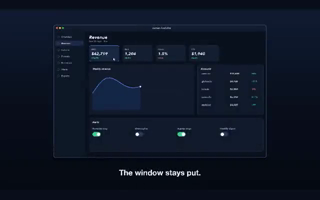</a> | [02 Focus Follow](docs/demo/demo02.md) | A framed recording that never moves while the view inside dives to three details, each captioned. | [▶ watch](https://github.com/garalex/promoshot/raw/demo-media/02-focus-follow.mp4) · **100%** · 34 turns · 4 min 43 s · $2.12 · 1.9M in / 20k out |
| <a href="docs/demo/demo03.md">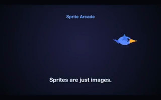</a> | [03 Sprite Arcade](docs/demo/demo03.md) | Sprite sheets animating while they fly curved paths across the canvas, staggered. | [▶ watch](https://github.com/garalex/promoshot/raw/demo-media/03-sprite-arcade.mp4) · **100%** · 46 turns · 5 min 49 s · $2.53 · 2.3M in / 25k out |
| <a href="docs/demo/demo04.md">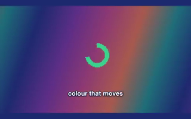</a> | [04 Gradient Drift](docs/demo/demo04.md) | A seamless scrolling multi-colour gradient loop with a ring breathing in the middle. | [▶ watch](https://github.com/garalex/promoshot/raw/demo-media/04-gradient-drift.mp4) · **100%** · 27 turns · 3 min 02 s · $1.54 · 1.3M in / 13k out |
| <a href="docs/demo/demo05.md">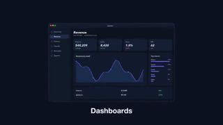</a> | [05 Carousel](docs/demo/demo05.md) | Cards entering from the right, resting under a caption, leaving left with a tilt. | [▶ watch](https://github.com/garalex/promoshot/raw/demo-media/05-carousel.mp4) · **100%** · 26 turns · 2 min 28 s · $1.10 · 855k in / 12k out · MCP 3 s in 9 calls |
| <a href="docs/demo/demo06.md">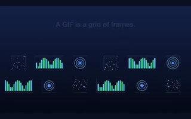</a> | [06 GIF Board](docs/demo/demo06.md) | Animated GIFs on a grid, all playing at once, centred by cell. | [▶ watch](https://github.com/garalex/promoshot/raw/demo-media/06-gif-board.mp4) · **80%** · 72 turns · 18 min 09 s · $7.01 · 7.0M in / 81k out · MCP 8 s in 17 calls |
| <a href="docs/demo/demo07.md">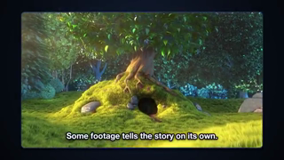</a> | [07 Narrated Tour](docs/demo/demo07.md) | A framed recording toured by the viewport, paced by synthesized narration, captions on the footage. | [▶ watch](https://github.com/garalex/promoshot/raw/demo-media/07-narrated-tour.mp4) · **100%** · 24 turns · 3 min 00 s · $1.37 · 887k in / 14k out · MCP 14 s in 11 calls |
| <a href="docs/demo/demo08.md">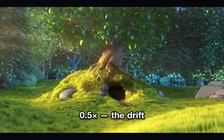</a> | [08 Speed Ramp](docs/demo/demo08.md) | One clip at half, double and three-quarter speed, cross-dissolved, each section as long as it plays. | [▶ watch](https://github.com/garalex/promoshot/raw/demo-media/08-speed-ramp.mp4) · **100%** · 21 turns · 2 min 47 s · $1.28 · 844k in / 13k out · MCP 12 s in 8 calls |
| <a href="docs/demo/demo09.md">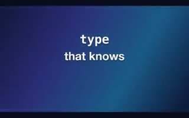</a> | [09 Kinetic Type](docs/demo/demo09.md) | Lines arriving as a typewriter, a word rise, a pop and a karaoke highlight, over moving gradients. | [▶ watch](https://github.com/garalex/promoshot/raw/demo-media/09-kinetic-type.mp4) · **100%** · 27 turns · 2 min 50 s · $1.48 · 1.2M in / 12k out · MCP 4 s in 8 calls |
| <a href="docs/demo/demo10.md">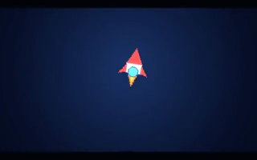</a> | [10 Logo Sting](docs/demo/demo10.md) | A bloom, a rocket on a curved path with motion blur, sparkles, and a wordmark that lands and holds. | [▶ watch](https://github.com/garalex/promoshot/raw/demo-media/10-logo-sting.mp4) · **89%** · 61 turns · 6 min 04 s · $2.76 · 2.6M in / 27k out · MCP 25 s in 25 calls |
| <a href="docs/demo/demo11.md">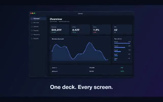</a> | [11 Whip Deck](docs/demo/demo11.md) | Four screenshots with whip-pan pushes, each faster and blurrier than the last. | [▶ watch](https://github.com/garalex/promoshot/raw/demo-media/11-whip-deck.mp4) · **100%** · 31 turns · 3 min 12 s · $1.53 · 1.1M in / 15k out · MCP 10 s in 13 calls |
| <a href="docs/demo/demo12.md">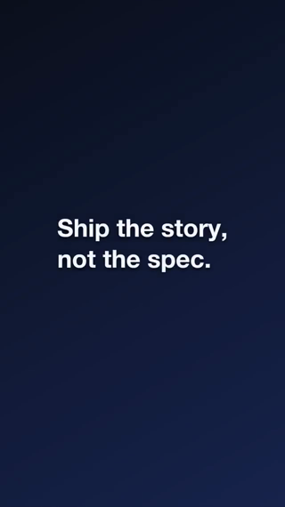</a> | [12 Word for Word](docs/demo/demo12.md) | A vertical piece: three statements replacing each other by push, each with its own reveal. | [▶ watch](https://github.com/garalex/promoshot/raw/demo-media/12-word-for-word.mp4) · **100%** · 34 turns · 3 min 23 s · $1.84 · 1.7M in / 15k out · MCP 2 s in 9 calls |
| <a href="docs/demo/demo13.md">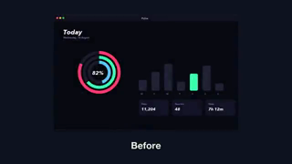</a> | [13 Before & After](docs/demo/demo13.md) | A slow crossfade between two screens under a caption that wipes from Before to After. | [▶ watch](https://github.com/garalex/promoshot/raw/demo-media/13-before-after.mp4) · **86%** · 33 turns · 2 min 44 s · $1.57 · 1.4M in / 12k out · MCP 4 s in 11 calls |
| <a href="docs/demo/demo14.md">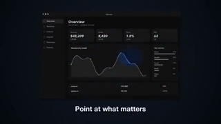</a> | [14 Spotlight](docs/demo/demo14.md) | The same shot flat beneath and in colour inside a roaming spotlight, inverted at the end. | [▶ watch](https://github.com/garalex/promoshot/raw/demo-media/14-spotlight.mp4) · **100%** · 26 turns · 4 min 14 s · $2.02 · 1.6M in / 20k out · MCP 10 s in 10 calls |
| <a href="docs/demo/demo15.md">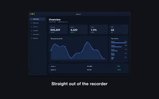</a> | [15 Grade Room](docs/demo/demo15.md) | One shot walked through four looks by ramping the grade, a caption naming each. | [▶ watch](https://github.com/garalex/promoshot/raw/demo-media/15-grade-room.mp4) · **86%** · 33 turns · 3 min 14 s · $1.75 · 1.5M in / 15k out · MCP 5 s in 12 calls |
| <a href="docs/demo/demo16.md">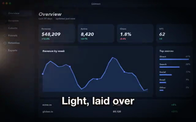</a> | [16 Light Leak](docs/demo/demo16.md) | A warm leak on screen blend, a vignette plate multiplied, a hot core added, over a screenshot. | [▶ watch](https://github.com/garalex/promoshot/raw/demo-media/16-light-leak.mp4) · **100%** · 35 turns · 2 min 55 s · $1.60 · 1.3M in / 13k out · MCP 8 s in 12 calls |
| <a href="docs/demo/demo17.md">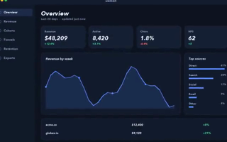</a> | [17 Chain Reaction](docs/demo/demo17.md) | Clips chained half a second before the previous ends, labels pinned to each clip's own edges. | [▶ watch](https://github.com/garalex/promoshot/raw/demo-media/17-chain-reaction.mp4) · **100%** · 42 turns · 3 min 34 s · $2.00 · 1.8M in / 17k out · MCP 2 s in 19 calls |
| <a href="docs/demo/demo18.md">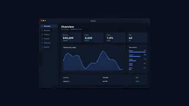</a> | [18 Reused Title](docs/demo/demo18.md) | One title card built once and placed three times around a screenshot. | [▶ watch](https://github.com/garalex/promoshot/raw/demo-media/18-reused-title.mp4) · **100%** · 32 turns · 3 min 04 s · $1.60 · 1.3M in / 14k out · MCP 3 s in 11 calls |
|  | [19 Green Room](docs/demo/demo19.md) | A green-screen clip keyed and composed over a gradient with a halo, growing slowly. | not run yet |
|  | [20 Look Book](docs/demo/demo20.md) | One screenshot three times side by side, each through a different .cube look. | not run yet |
|  | [21 Chapters & Levels](docs/demo/demo21.md) | The narrated tour with the voice levelled and chapter markers a player shows. | not run yet |
|  | [22 Product Story](docs/demo/demo22.md) | A reused title card, a keyed clip, a warm-graded shot, a levelled voice line, four chapters. | not run yet |
| <a href="docs/demo/demo23.md">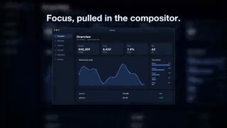</a> | [23 Soft Focus](docs/demo/demo23.md) | A blurred, vignetted, grainy backdrop; a sharp hero that arrives out of blur and smears out; a headline that glows once. | [▶ watch](https://github.com/garalex/promoshot/raw/demo-media/23-soft-focus.mp4) · **100%** · 65 turns · 9 min 25 s · $3.90 · 3.9M in / 42k out |
