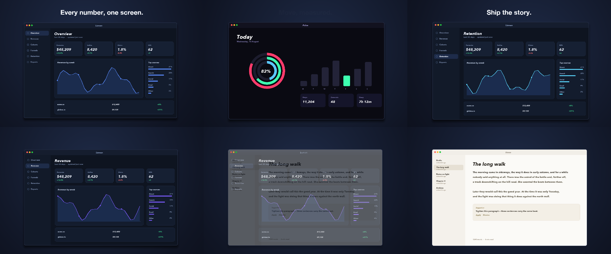
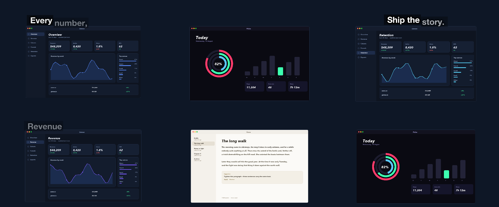

# 01 App Store Hero

Five screenshots on one slowly drifting framed window, swapped in turn under a headline each — a Mac App Store preview.

*1440×900, 15 s.* Part of [the demos](../../demo.md): a fresh agent, the media and the prompt below, the public skill and the headless MCP, nothing else.

## Resources given to the agent

 
 
 
 
 

## The prompt

> Make a 15-second Mac App Store preview video, 1440 by 900, from these five screenshots. One framed window in the middle of a dark studio background that drifts very slowly the whole time, swapping through all five screenshots in turn with a gentle transition between them, and one short headline above the window for each screenshot, arriving word by word.
> 
> Files in `resources/`: ui_lumen_1.png, ui_lumen_2.png, ui_lumen_5.png, ui_pulse_1.png, ui_verse_1.png.
> 
> Text to use, in order:
> - Every number, one screen.
> - Revenue that explains itself.
> - Write without the noise.
> - Move, measured.
> - Ship the story.

## What the agent made

Score **100%** (8 of 8 rubric checks).

| the agent's work | |
|---|---|
| turns | 40 |
| wall time | 4 min 12 s (API 4 min 08 s) |
| cost at API list price | $2.07 — on a Claude subscription this is plan usage, not a bill |
| tokens in | 1.8M (1.7M cache read, 72k cache write) |
| tokens out | 19k (9k thinking) |
| claude-haiku-4-5 | 1k in, 13 out, $0.00 |
| claude-opus-5 | 1.8M in, 19k out, $2.07 |

Six moments:

**[▶ Watch the video](https://github.com/garalex/promoshot/raw/demo-media/01-app-store-hero.mp4)** (1280 wide, 1.7 MB) · [small copy](01-app-store-hero/result.mp4) · [the project it wrote](01-app-store-hero/result-metadata.json)

| check | | detail |
|---|---|---|
| canvas | ✓ | [1440, 900] vs [1440, 900] |
| duration | ✓ | 15.0s vs 15.0s |
| kind:background | ✓ | 1 vs 1 |
| kind:image | ✓ | 1 vs 1 |
| kind:caption | ✓ | 5 vs 5 |
| feature:reveal | ✓ | True |
| feature:swaps | ✓ | 4 vs 4 |
| phrases | ✓ | 5 of 5 lines recognisable |

## The hand-built reference, same moments

---

[← all demos](../../demo.md) · [how the suite works](../../demos/README.md)
