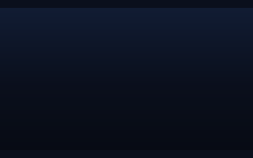
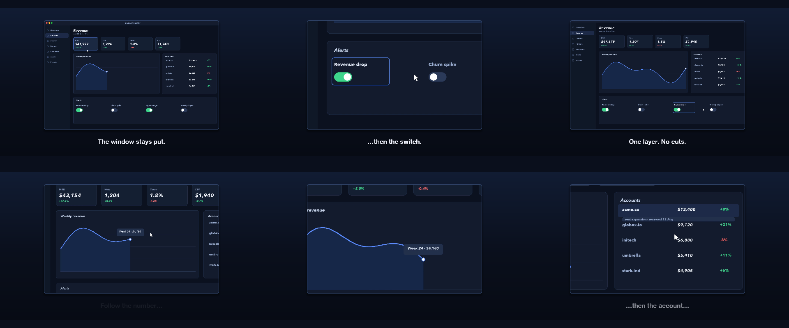
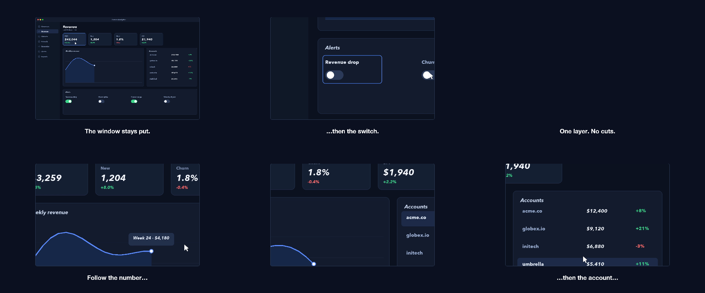

# 02 Focus Follow

A framed recording that never moves while the view inside dives to three details, each captioned.

*1920×1080, 16 s.* Part of [the demos](../../demo.md): a fresh agent, the media and the prompt below, the public skill and the headless MCP, nothing else.

## Resources given to the agent

 
`rec_lumen_2560.mp4` ([file](../../demos/02-focus-follow/resources/rec_lumen_2560.mp4))

## The prompt

> This is a screen recording of a finance app. Make a 16-second clip where a framed window of the recording stays exactly where it is while the view inside it zooms in on the chart tooltip, then the account row, then the alert switch — each move a smooth push into that spot, each with a caption naming what we are looking at.
> 
> Files in `resources/`: rec_lumen_2560.mp4.
> 
> Text to use, in order:
> - The window stays put.
> - Follow the number…
> - …then the account…
> - …then the switch.
> - One layer. No cuts.

## What the agent made

Score **100%** (6 of 6 rubric checks).

| the agent's work | |
|---|---|
| turns | 34 |
| wall time | 4 min 43 s (API 4 min 29 s) |
| cost at API list price | $2.12 — on a Claude subscription this is plan usage, not a bill |
| tokens in | 1.9M (1.8M cache read, 69k cache write) |
| tokens out | 20k (11k thinking) |
| claude-haiku-4-5 | 1k in, 13 out, $0.00 |
| claude-opus-5 | 1.9M in, 20k out, $2.12 |

Six moments:

**[▶ Watch the video](https://github.com/garalex/promoshot/raw/demo-media/02-focus-follow.mp4)** (1280 wide, 1.0 MB) · [small copy](02-focus-follow/result.mp4) · [the project it wrote](02-focus-follow/result-metadata.json)

| check | | detail |
|---|---|---|
| duration | ✓ | 16.0s vs 16.0s |
| kind:background | ✓ | 1 vs 1 |
| kind:video | ✓ | 1 vs 1 |
| kind:caption | ✓ | 5 vs 5 |
| feature:viewport | ✓ | True |
| phrases | ✓ | 5 of 5 lines recognisable |

## The hand-built reference, same moments

---

[← all demos](../../demo.md) · [how the suite works](../../demos/README.md)
