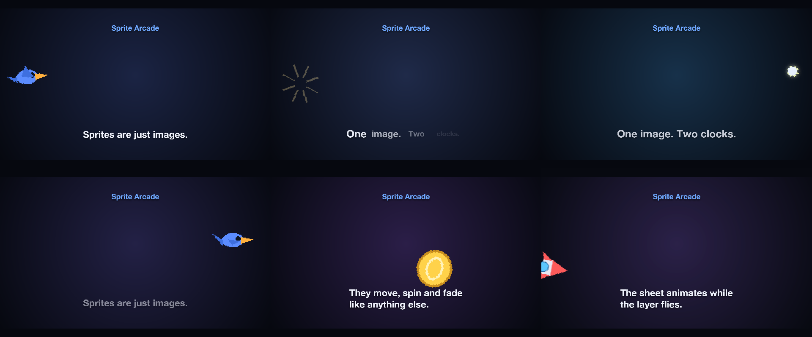
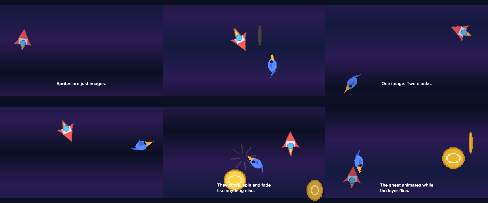

# 03 Sprite Arcade

Sprite sheets animating while they fly curved paths across the canvas, staggered.

*1920×1080, 14 s.* Part of [the demos](../../demo.md): a fresh agent, the media and the prompt below, the public skill and the headless MCP, nothing else.

## Resources given to the agent

 
 
 
 

## The prompt

> These images are sprite sheets: looping animations laid out in cells. Make a playful 13-second clip on a dark background where each sprite plays its animation while flying along a curved path from the left edge to the right edge, staggered so they are not all in the air at once, with a title.
> 
> Files in `resources/`: sprite_bird.png, sprite_coin.png, sprite_rocket.png, sprite_spark.png.
> 
> Text to use, in order:
> - Sprites are just images.
> - They move, spin and fade
> like anything else.
> - The sheet animates while
> the layer flies.
> - One image. Two clocks.

## What the agent made

Score **100%** (7 of 7 rubric checks).

| the agent's work | |
|---|---|
| turns | 46 |
| wall time | 5 min 49 s (API 5 min 29 s) |
| cost at API list price | $2.53 — on a Claude subscription this is plan usage, not a bill |
| tokens in | 2.3M (2.2M cache read, 80k cache write) |
| tokens out | 25k (10k thinking) |
| claude-haiku-4-5 | 1k in, 13 out, $0.00 |
| claude-opus-5 | 2.3M in, 25k out, $2.53 |

Six moments:

[video](03-sprite-arcade/result.mp4) · [the project it wrote](03-sprite-arcade/result-metadata.json)

| check | | detail |
|---|---|---|
| duration | ✓ | 13.0s vs 13.5s |
| kind:background | ✓ | 1 vs 1 |
| kind:image | ✓ | 4 vs 7 |
| kind:caption | ✓ | 5 vs 4 |
| feature:motionPath | ✓ | True |
| feature:sprite | ✓ | True |
| phrases | ✓ | 4 of 4 lines recognisable |

## The hand-built reference, same moments

---

[← all demos](../../demo.md) · [how the suite works](../../demos/README.md)
