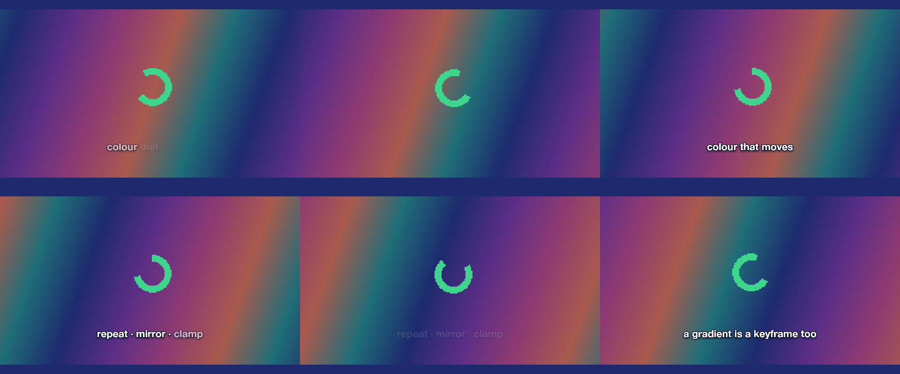
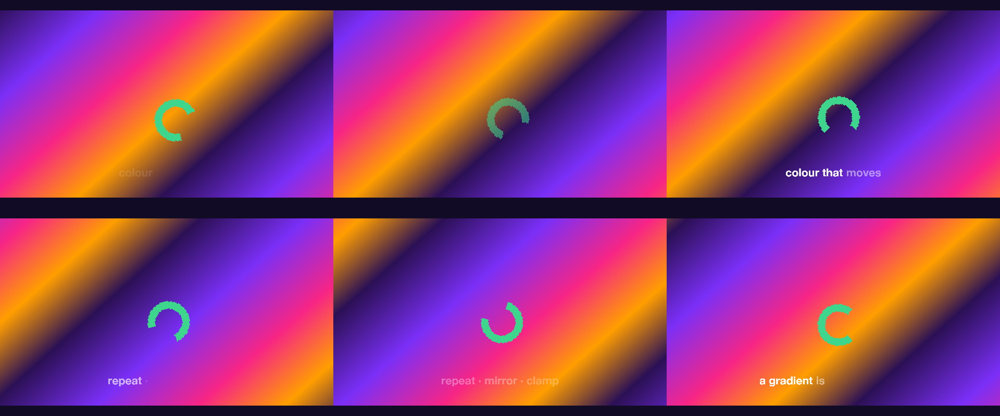

# 04 Gradient Drift

A seamless scrolling multi-colour gradient loop with a ring breathing in the middle.

*1920×1080, 12 s.* Part of [the demos](../../demo.md): a fresh agent, the media and the prompt below, the public skill and the headless MCP, nothing else.

## Resources given to the agent

 

## The prompt

> Make a 12-second looping background piece: a smooth gradient of several colours, ending on the colour it started with, that scrolls seamlessly in one direction so it can loop; the ring image breathes gently in the middle; one short caption fades in by word.
> 
> Files in `resources/`: sprite_ring.png.
> 
> Text to use, in order:
> - colour that moves
> - repeat · mirror · clamp
> - a gradient is a keyframe too

## What the agent made

Score **100%** (7 of 7 rubric checks).

| the agent's work | |
|---|---|
| turns | 27 |
| wall time | 3 min 02 s (API 3 min 06 s) |
| cost at API list price | $1.54 — on a Claude subscription this is plan usage, not a bill |
| tokens in | 1.3M (1.2M cache read, 59k cache write) |
| tokens out | 13k (6k thinking) |
| claude-opus-5 | 1.3M in, 13k out, $1.54 |
| claude-haiku-4-5 | 1k in, 18 out, $0.00 |

Six moments:

**[▶ Watch the video](https://github.com/garalex/promoshot/raw/demo-media/04-gradient-drift.mp4)** (1280 wide, 0.6 MB) · [small copy](04-gradient-drift/result.mp4) · [the project it wrote](04-gradient-drift/result-metadata.json)

| check | | detail |
|---|---|---|
| duration | ✓ | 12.0s vs 12.0s |
| kind:background | ✓ | 1 vs 1 |
| kind:image | ✓ | 1 vs 1 |
| kind:caption | ✓ | 3 vs 3 |
| feature:sprite | ✓ | True |
| feature:gradient | ✓ | True |
| phrases | ✓ | 3 of 3 lines recognisable |

## The hand-built reference, same moments

---

[← all demos](../../demo.md) · [how the suite works](../../demos/README.md)
