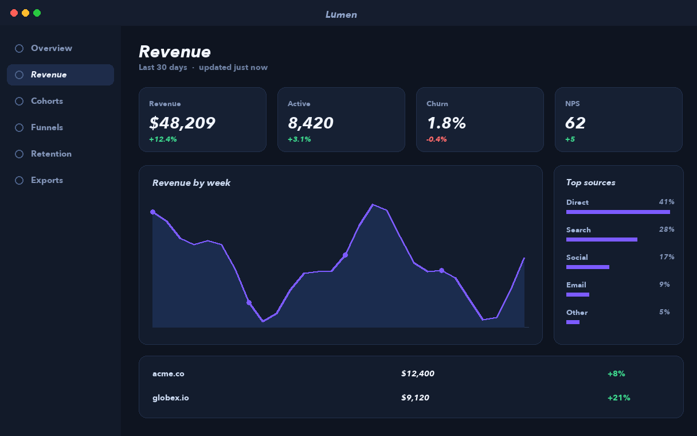
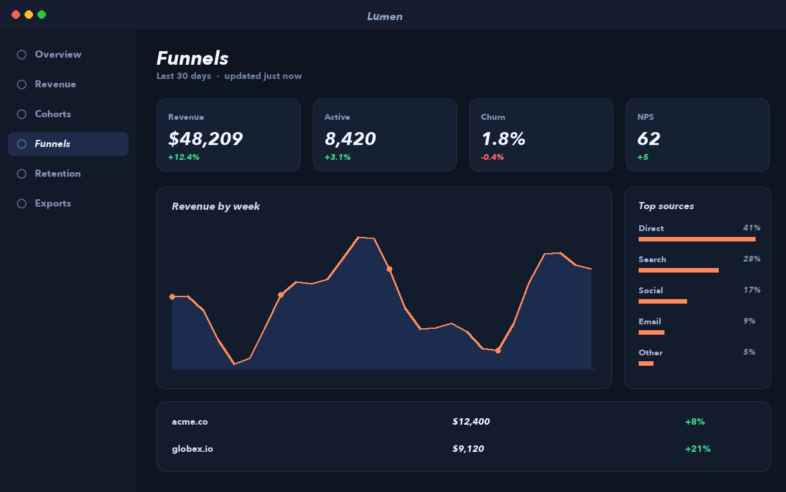
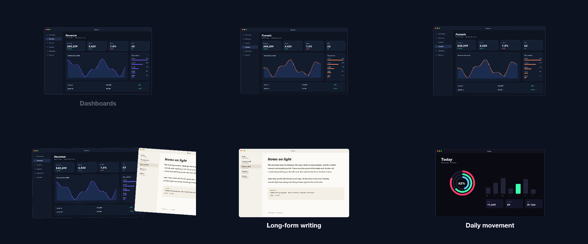
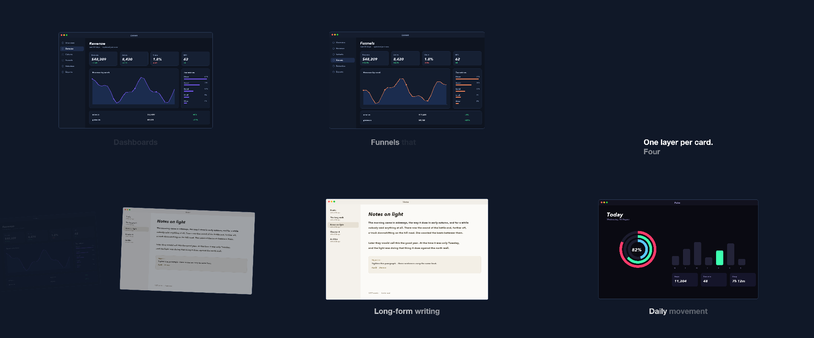

# 05 Carousel

Cards entering from the right, resting under a caption, leaving left with a tilt.

*1920×1080, 15 s.* Part of [the demos](../../demo.md): a fresh agent, the media and the prompt below, the public skill and the headless MCP, nothing else.

## Resources given to the agent

 
 
 
 

## The prompt

> Make a 15-second carousel of these cards. Each card enters from the right, rests in the centre while a caption names it, then leaves to the left, tilting slightly as it moves. No two cards on screen at the same time except during the hand-off.
> 
> Files in `resources/`: ui_lumen_2.png, ui_lumen_4.png, ui_pulse_2.png, ui_verse_2.png.
> 
> Text to use, in order:
> - Dashboards
> - Long-form writing
> - Daily movement
> - Funnels that add up
> - One layer per card.
> Four ramps each.

## What the agent made

Score **100%** (5 of 5 rubric checks).

| the agent's work | |
|---|---|
| turns | 26 |
| wall time | 2 min 28 s (API 2 min 24 s) |
| cost at API list price | $1.10 — on a Claude subscription this is plan usage, not a bill |
| tokens in | 855k (816k cache read, 38k cache write) |
| tokens out | 12k (5k thinking) |
| claude-haiku-4-5 | 1k in, 17 out, $0.00 |
| claude-opus-5 | 855k in, 12k out, $1.10 |

| MCP tool | calls | time |
|---|---|---|
| promo_render_video | 1 | 2 s |
| promo_media_probe | 4 | 0 s |
| promo_render_frames | 1 | 0 s |
| promo_inspect | 1 | 0 s |
| promo_validate | 1 | 0 s |
| promo_schema | 1 | 0 s |
| **all** | 9 | 3 s |

Six moments:

**[▶ Watch the video](https://github.com/garalex/promoshot/raw/demo-media/05-carousel.mp4)** (1280 wide, 1.2 MB) · [small copy](05-carousel/result.mp4) · [the project it wrote](05-carousel/result-metadata.json)

| check | | detail |
|---|---|---|
| duration | ✓ | 15.0s vs 15.0s |
| kind:background | ✓ | 1 vs 1 |
| kind:image | ✓ | 4 vs 4 |
| kind:caption | ✓ | 4 vs 5 |
| phrases | ✓ | 4 of 5 lines recognisable |

## The hand-built reference, same moments

---

[← all demos](../../demo.md) · [how the suite works](../../demos/README.md)
