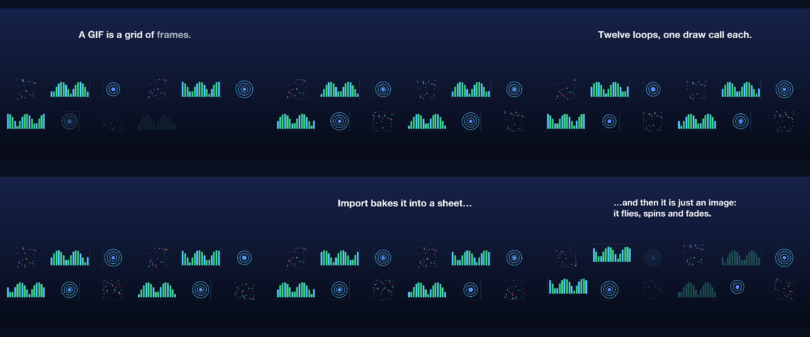
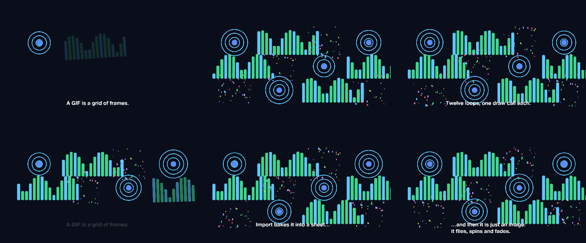

# 06 GIF Board

Animated GIFs on a grid, all playing at once, centred by cell.

*1920×1080, 14 s.* Part of [the demos](../../demo.md): a fresh agent, the media and the prompt below, the public skill and the headless MCP, nothing else.

## Resources given to the agent

 
 
 

## The prompt

> Arrange these animated GIFs on a grid, all playing at once, for 13 seconds, with a title above the grid. Cells of different shapes should line up on their centres.
> 
> Files in `resources/`: sheet_confetti.png, sheet_pulse.png, sheet_wave.png.
> 
> Text to use, in order:
> - A GIF is a grid of frames.
> - Import bakes it into a sheet…
> - …and then it is just an image:
> it flies, spins and fades.
> - Twelve loops, one draw call each.

## What the agent made

Score **80%** (4 of 5 rubric checks).

| the agent's work | |
|---|---|
| turns | 72 |
| wall time | 18 min 09 s (API 17 min 54 s) |
| cost at API list price | $7.01 — on a Claude subscription this is plan usage, not a bill |
| tokens in | 7.0M (6.9M cache read, 155k cache write) |
| tokens out | 81k (53k thinking) |
| claude-haiku-4-5 | 1k in, 18 out, $0.00 |
| claude-opus-5 | 7.0M in, 81k out, $7.01 |

| MCP tool | calls | time |
|---|---|---|
| promo_render_frames | 3 | 4 s |
| promo_render_video | 1 | 4 s |
| promo_render_still | 4 | 0 s |
| promo_media_probe | 3 | 0 s |
| promo_validate | 2 | 0 s |
| promo_inspect | 1 | 0 s |
| promo_schema | 1 | 0 s |
| promo_schema_full | 1 | 0 s |
| promo_workspace | 1 | 0 s |
| **all** | 17 | 8 s |

Six moments:

**[▶ Watch the video](https://github.com/garalex/promoshot/raw/demo-media/06-gif-board.mp4)** (1280 wide, 1.5 MB) · [small copy](06-gif-board/result.mp4) · [the project it wrote](06-gif-board/result-metadata.json)

| check | | detail |
|---|---|---|
| duration | ✓ | 13.0s vs 13.5s |
| kind:background | ✓ | 1 vs 1 |
| kind:image | ✗ | 0 vs 12 |
| kind:caption | ✓ | 4 vs 4 |
| phrases | ✓ | 4 of 4 lines recognisable |

## The hand-built reference, same moments

---

[← all demos](../../demo.md) · [how the suite works](../../demos/README.md)
