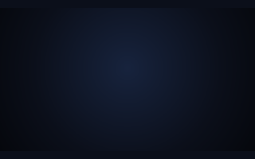
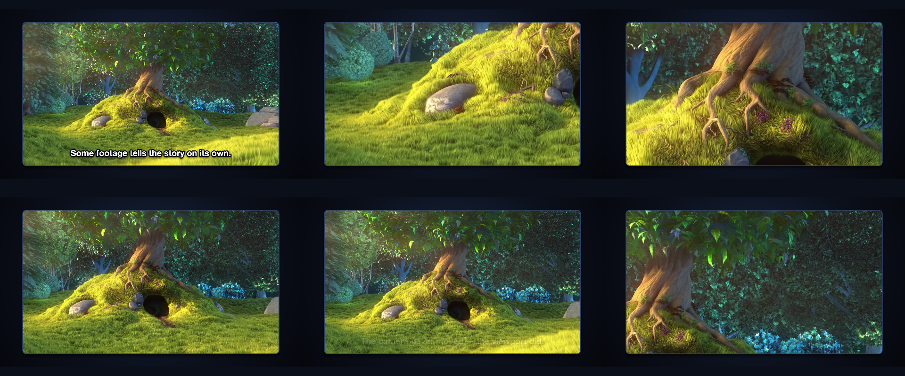
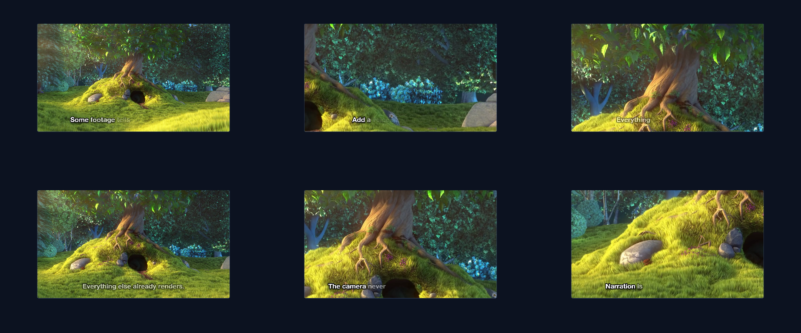

# 07 Narrated Tour

A framed recording toured by the viewport, paced by synthesized narration, captions on the footage.

*1920×1080, 22 s.* Part of [the demos](../../demo.md): a fresh agent, the media and the prompt below, the public skill and the headless MCP, nothing else.

## Resources given to the agent

 
`bbb_test.mp4` ([file](../../demos/_media/bbb_test.mp4))

## The prompt

> Make a 21-second narrated product tour from this screen recording. Framed window, a little smaller than the canvas. Synthesize the narration from the lines below and pace the piece by how long each line takes to speak; as each line plays, the view inside the window moves to the feature it mentions. Put the captions on the footage with an outline and shadow, no plate.
> 
> Files in `resources/`: bbb_test.mp4.
> 
> Text to use, in order:
> - Some footage tells the story on its own.
> - The camera never moved — the viewport did.
> - Narration is written here, not recorded.
> - Add a voice key and it speaks.
> - Everything else already renders.

## What the agent made

Score **100%** (8 of 8 rubric checks).

| the agent's work | |
|---|---|
| turns | 24 |
| wall time | 3 min 00 s (API 2 min 46 s) |
| cost at API list price | $1.37 — on a Claude subscription this is plan usage, not a bill |
| tokens in | 887k (826k cache read, 61k cache write) |
| tokens out | 14k (6k thinking) |
| claude-haiku-4-5 | 1k in, 15 out, $0.00 |
| claude-opus-5 | 887k in, 14k out, $1.37 |

| MCP tool | calls | time |
|---|---|---|
| promo_render_video | 1 | 7 s |
| promo_render_frames | 1 | 6 s |
| promo_media_probe | 2 | 0 s |
| promo_inspect | 1 | 0 s |
| promo_validate | 1 | 0 s |
| promo_speak | 1 | 0 s |
| promo_voices | 1 (1 refused) | 0 s |
| promo_schema | 1 | 0 s |
| promo_schema_full | 1 | 0 s |
| promo_workspace | 1 | 0 s |
| **all** | 11 | 14 s |

Six moments:

**[▶ Watch the video](https://github.com/garalex/promoshot/raw/demo-media/07-narrated-tour.mp4)** (1280 wide, 6.8 MB) · [small copy](07-narrated-tour/result.mp4) · [the project it wrote](07-narrated-tour/result-metadata.json)

| check | | detail |
|---|---|---|
| duration | ✓ | 21.0s vs 21.5s |
| kind:background | ✓ | 1 vs 1 |
| kind:video | ✓ | 1 vs 1 |
| kind:audio | ✓ | 5 vs 5 |
| kind:caption | ✓ | 5 vs 5 |
| feature:viewport | ✓ | True |
| feature:narration | ✓ | True |
| phrases | ✓ | 5 of 5 lines recognisable |

## The hand-built reference, same moments

---

[← all demos](../../demo.md) · [how the suite works](../../demos/README.md)
