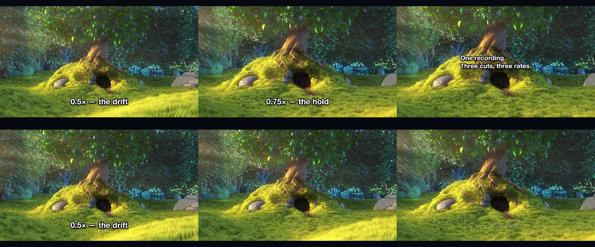
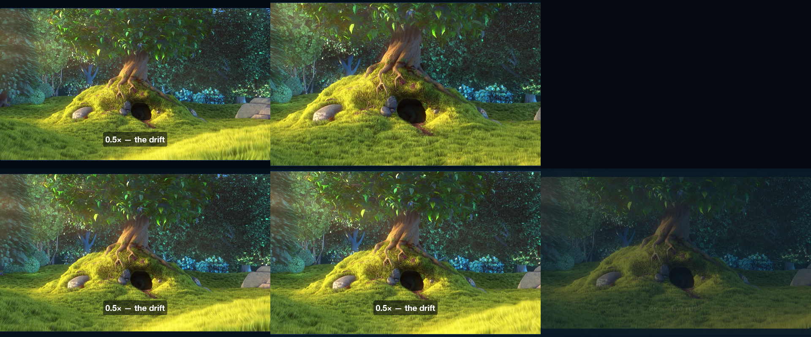

# 08 Speed Ramp

One clip at half, double and three-quarter speed, cross-dissolved, each section as long as it plays.

*1920×1080, 14 s.* Part of [the demos](../../demo.md): a fresh agent, the media and the prompt below, the public skill and the headless MCP, nothing else.

## Resources given to the agent

 
`bbb_test.mp4` ([file](../../demos/_media/bbb_test.mp4))

## The prompt

> Make a 14-second speed-ramped edit of this clip that fills the canvas: a half-speed section first, then a double-speed section, then one at three-quarter speed, cross-dissolving between them, each section lasting as long as that piece takes at that speed, with a caption naming the speed.
> 
> Files in `resources/`: bbb_test.mp4.
> 
> Text to use, in order:
> - 0.5× — the drift
> - 2× — the rush
> - 0.75× — the hold
> - One recording.
> Three cuts, three rates.

## What the agent made

Score **100%** (7 of 7 rubric checks).

| the agent's work | |
|---|---|
| turns | 21 |
| wall time | 2 min 47 s (API 2 min 33 s) |
| cost | $1.28 |
| tokens in | 844k (787k cache read, 57k cache write) |
| tokens out | 13k (7k thinking) |
| claude-haiku-4-5 | 1k in, 17 out, $0.00 |
| claude-opus-5 | 844k in, 13k out, $1.28 |

| MCP tool | calls | time |
|---|---|---|
| promo_render_video | 1 | 10 s |
| promo_render_frames | 1 | 2 s |
| promo_inspect | 1 | 0 s |
| promo_media_probe | 2 | 0 s |
| promo_validate | 1 | 0 s |
| promo_schema | 1 | 0 s |
| promo_schema_full | 1 | 0 s |
| **all** | 8 | 12 s |

Six moments:

[video](08-speed-ramp/result.mp4) · [the project it wrote](08-speed-ramp/result-metadata.json)

| check | | detail |
|---|---|---|
| canvas | ✓ | [1920, 1080] vs [1920, 1080] |
| duration | ✓ | 14.0s vs 14.0s |
| kind:background | ✓ | 1 vs 1 |
| kind:video | ✓ | 3 vs 3 |
| kind:caption | ✓ | 4 vs 4 |
| feature:mediaCuts | ✓ | True |
| phrases | ✓ | 4 of 4 lines recognisable |

## The hand-built reference, same moments

---

[← all demos](../../demo.md) · [how the suite works](../../demos/README.md)
