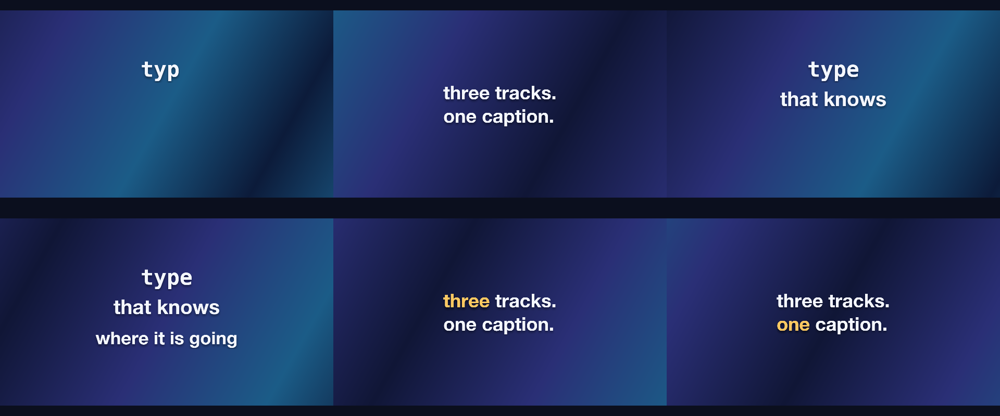
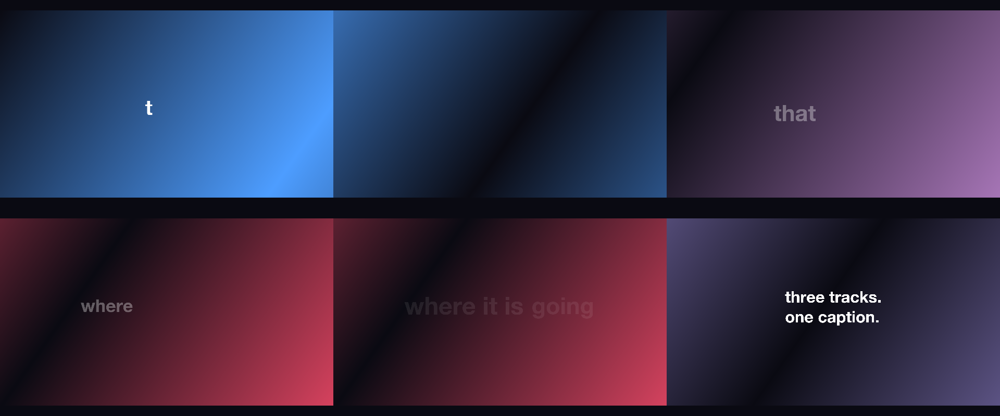

# 09 Kinetic Type

Lines arriving as a typewriter, a word rise, a pop and a karaoke highlight, over moving gradients.

*1920×1080, 12 s.* Part of [the demos](../../demo.md): a fresh agent, the media and the prompt below, the public skill and the headless MCP, nothing else.

## Resources given to the agent

*None — the prompt carries the text.*

## The prompt

> Make a 12-second kinetic typography piece from the lines below, on a slowly moving gradient background. Give each line a different way of arriving: a typewriter, a word-by-word rise, a pop, and a karaoke highlight that walks along the last line.
> 
> Text to use, in order:
> - type
> - that knows
> - where it is going
> - three tracks.
> one caption.

## What the agent made

Score **100%** (5 of 5 rubric checks).

| the agent's work | |
|---|---|
| turns | 27 |
| wall time | 2 min 50 s (API 2 min 45 s) |
| cost | $1.48 |
| tokens in | 1.2M (1.2M cache read, 60k cache write) |
| tokens out | 12k (5k thinking) |
| claude-haiku-4-5 | 1k in, 17 out, $0.00 |
| claude-opus-5 | 1.2M in, 12k out, $1.48 |

| MCP tool | calls | time |
|---|---|---|
| promo_render_video | 1 | 4 s |
| promo_render_frames | 1 | 0 s |
| promo_validate | 2 (1 refused) | 0 s |
| promo_inspect | 1 | 0 s |
| promo_schema | 1 | 0 s |
| promo_schema_full | 1 | 0 s |
| promo_workspace | 1 | 0 s |
| **all** | 8 | 4 s |

Six moments:

[video](09-kinetic-type/result.mp4) · [the project it wrote](09-kinetic-type/result-metadata.json)

| check | | detail |
|---|---|---|
| duration | ✓ | 12.0s vs 12.0s |
| kind:background | ✓ | 1 vs 1 |
| kind:caption | ✓ | 4 vs 4 |
| feature:gradient | ✓ | True |
| phrases | ✓ | 4 of 4 lines recognisable |

## The hand-built reference, same moments

---

[← all demos](../../demo.md) · [how the suite works](../../demos/README.md)
