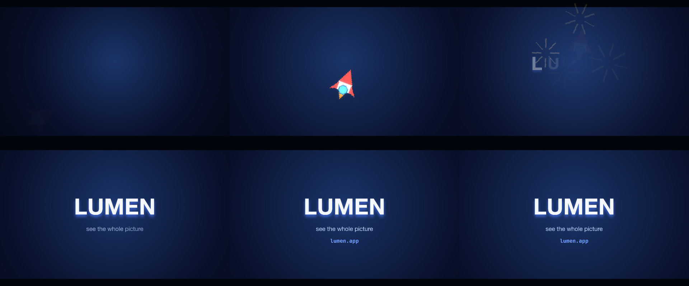
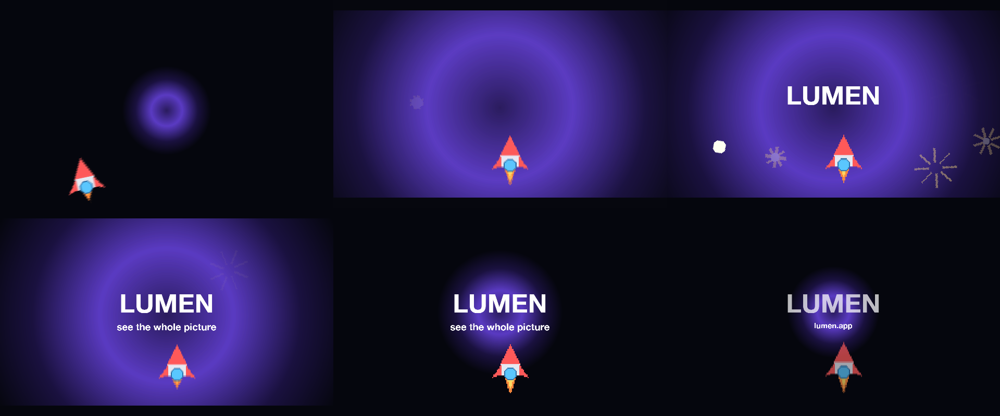

# 10 Logo Sting

A bloom, a rocket on a curved path with motion blur, sparkles, and a wordmark that lands and holds.

*1920×1080, 10 s.* Part of [the demos](../../demo.md): a fresh agent, the media and the prompt below, the public skill and the headless MCP, nothing else.

## Resources given to the agent

 
 

## The prompt

> Make a 10-second logo sting. A radial bloom opens on a dark background, the rocket climbs a curved path with motion blur, a burst of sparkles goes off around it, then the wordmark lands and holds to the end. Reveal the title letter by letter and type the URL underneath.
> 
> Files in `resources/`: sprite_rocket.png, sprite_spark.png.
> 
> Text to use, in order:
> - LUMEN
> - see the whole picture
> - lumen.app

## What the agent made

Score **88%** (7 of 8 rubric checks).

| the agent's work | |
|---|---|
| turns | 61 |
| wall time | 6 min 04 s (API 5 min 38 s) |
| cost at API list price | $2.76 — on a Claude subscription this is plan usage, not a bill |
| tokens in | 2.6M (2.5M cache read, 82k cache write) |
| tokens out | 27k (12k thinking) |
| claude-haiku-4-5 | 1k in, 15 out, $0.00 |
| claude-opus-5 | 2.6M in, 27k out, $2.76 |

| MCP tool | calls | time |
|---|---|---|
| promo_render_frames | 3 | 13 s |
| promo_render_video | 1 | 12 s |
| promo_render_still | 11 | 1 s |
| promo_media_probe | 3 | 0 s |
| promo_validate | 3 (1 refused) | 0 s |
| promo_inspect | 1 | 0 s |
| promo_schema | 1 | 0 s |
| promo_schema_full | 1 | 0 s |
| promo_workspace | 1 | 0 s |
| **all** | 25 | 25 s |

Six moments:

**[▶ Watch the video](https://github.com/garalex/promoshot/raw/demo-media/10-logo-sting.mp4)** (1280 wide, 0.7 MB) · [small copy](10-logo-sting/result.mp4) · [the project it wrote](10-logo-sting/result-metadata.json)

| check | | detail |
|---|---|---|
| duration | ✓ | 10.0s vs 10.0s |
| kind:background | ✓ | 1 vs 1 |
| kind:image | ✗ | 1 vs 9 |
| kind:caption | ✓ | 3 vs 3 |
| feature:motionPath | ✓ | True |
| feature:sprite | ✓ | True |
| feature:motionBlur | ✓ | True |
| phrases | ✓ | 3 of 3 lines recognisable |

## The hand-built reference, same moments

---

[← all demos](../../demo.md) · [how the suite works](../../demos/README.md)
