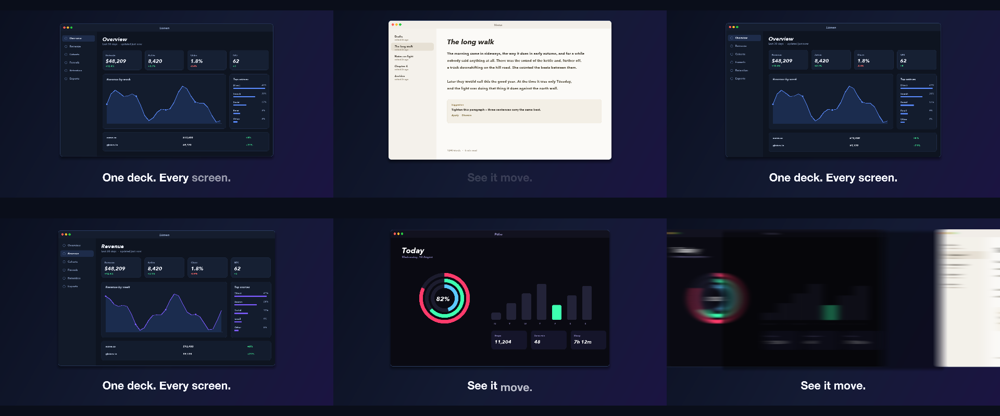
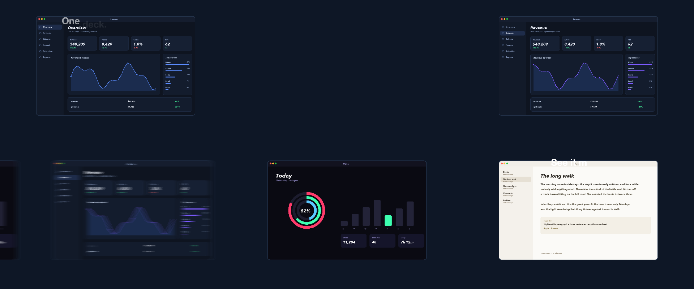

# 11 Whip Deck

Four screenshots with whip-pan pushes, each faster and blurrier than the last.

*1440×900, 10 s.* Part of [the demos](../../demo.md): a fresh agent, the media and the prompt below, the public skill and the headless MCP, nothing else.

## Resources given to the agent

 
 
 
 

## The prompt

> Make a 12-second slide deck from these four screenshots with whip-pan pushes between them, each transition faster and blurrier than the last.
> 
> Files in `resources/`: ui_lumen_1.png, ui_lumen_2.png, ui_pulse_1.png, ui_verse_1.png.
> 
> Text to use, in order:
> - One deck. Every screen.
> - See it move.

## What the agent made

Score **100%** (8 of 8 rubric checks).

| the agent's work | |
|---|---|
| turns | 31 |
| wall time | 3 min 12 s (API 3 min 02 s) |
| cost at API list price | $1.53 — on a Claude subscription this is plan usage, not a bill |
| tokens in | 1.1M (1.0M cache read, 63k cache write) |
| tokens out | 15k (7k thinking) |
| claude-haiku-4-5 | 1k in, 19 out, $0.00 |
| claude-opus-5 | 1.1M in, 15k out, $1.53 |

| MCP tool | calls | time |
|---|---|---|
| promo_render_video | 1 | 9 s |
| promo_render_still | 6 | 1 s |
| promo_render_frames | 1 | 0 s |
| promo_validate | 2 (1 refused) | 0 s |
| promo_inspect | 1 | 0 s |
| promo_schema | 1 | 0 s |
| promo_schema_full | 1 | 0 s |
| **all** | 13 | 10 s |

Six moments:

**[▶ Watch the video](https://github.com/garalex/promoshot/raw/demo-media/11-whip-deck.mp4)** (1280 wide, 1.0 MB) · [small copy](11-whip-deck/result.mp4) · [the project it wrote](11-whip-deck/result-metadata.json)

| check | | detail |
|---|---|---|
| duration | ✓ | 12.0s vs 10.0s |
| kind:background | ✓ | 1 vs 1 |
| kind:image | ✓ | 1 vs 1 |
| kind:caption | ✓ | 2 vs 2 |
| feature:swaps | ✓ | 3 vs 3 |
| feature:transitions | ✓ | True |
| feature:motionBlur | ✓ | True |
| phrases | ✓ | 2 of 2 lines recognisable |

## The hand-built reference, same moments

---

[← all demos](../../demo.md) · [how the suite works](../../demos/README.md)
