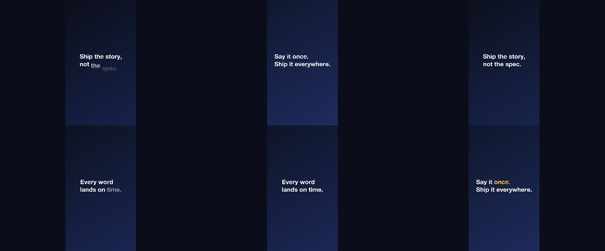
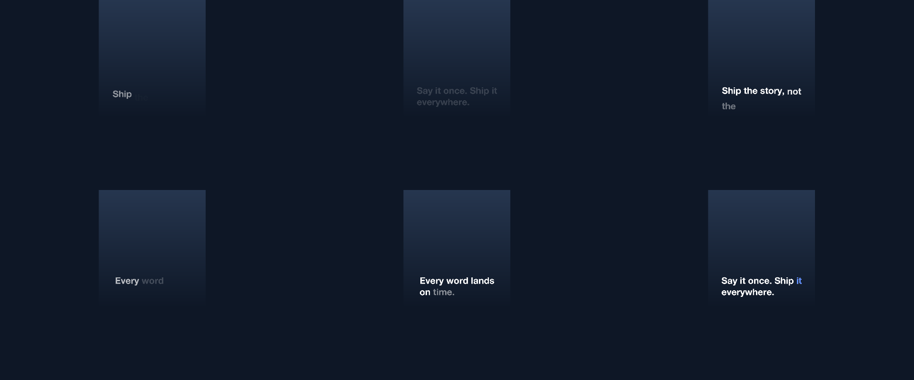

# 12 Word for Word

A vertical piece: three statements replacing each other by push, each with its own reveal.

*1080×1920, 12 s.* Part of [the demos](../../demo.md): a fresh agent, the media and the prompt below, the public skill and the headless MCP, nothing else.

## Resources given to the agent

*None — the prompt carries the text.*

## The prompt

> Make a vertical 1080 by 1920 caption piece, 12 seconds, from the three statements below. Each statement replaces the previous one with a push. Give the first a word-by-word rise, the second a word-by-word fade, and walk a karaoke highlight along the last.
> 
> Text to use, in order:
> - Ship the story, not the spec.
> - Every word lands on time.
> - Say it once. Ship it everywhere.

## What the agent made

Score **100%** (8 of 8 rubric checks).

| the agent's work | |
|---|---|
| turns | 34 |
| wall time | 3 min 23 s (API 3 min 20 s) |
| cost at API list price | $1.84 — on a Claude subscription this is plan usage, not a bill |
| tokens in | 1.7M (1.6M cache read, 66k cache write) |
| tokens out | 15k (7k thinking) |
| claude-haiku-4-5 | 1k in, 18 out, $0.00 |
| claude-opus-5 | 1.7M in, 15k out, $1.84 |

| MCP tool | calls | time |
|---|---|---|
| promo_render_video | 1 | 2 s |
| promo_render_frames | 2 | 0 s |
| promo_validate | 1 | 0 s |
| promo_inspect | 1 | 0 s |
| promo_schema_types | 1 | 0 s |
| promo_schema | 1 | 0 s |
| promo_workspace | 1 | 0 s |
| promo_schema_full | 1 | 0 s |
| **all** | 9 | 2 s |

Six moments:

**[▶ Watch the video](https://github.com/garalex/promoshot/raw/demo-media/12-word-for-word.mp4)** (1280 wide, 0.9 MB) · [small copy](12-word-for-word/result.mp4) · [the project it wrote](12-word-for-word/result-metadata.json)

| check | | detail |
|---|---|---|
| canvas | ✓ | [1080, 1920] vs [1080, 1920] |
| duration | ✓ | 12.0s vs 12.0s |
| kind:background | ✓ | 1 vs 1 |
| kind:caption | ✓ | 1 vs 1 |
| feature:reveal | ✓ | True |
| feature:swaps | ✓ | 2 vs 2 |
| feature:transitions | ✓ | True |
| phrases | ✓ | 3 of 3 lines recognisable |

## The hand-built reference, same moments

---

[← all demos](../../demo.md) · [how the suite works](../../demos/README.md)
