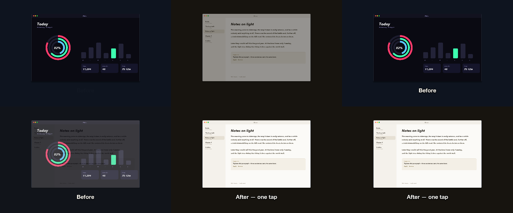
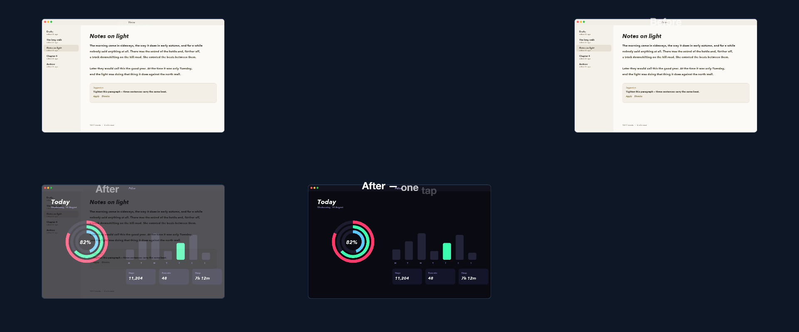

# 13 Before & After

A slow crossfade between two screens under a caption that wipes from Before to After.

*1440×900, 9 s.* Part of [the demos](../../demo.md): a fresh agent, the media and the prompt below, the public skill and the headless MCP, nothing else.

## Resources given to the agent

 
 

## The prompt

> Make a calm 12-second before-and-after: a slow crossfade from the old screen to the new one, with a caption that wipes from 'Before' to 'After' at the same moment. No motion blur.
> 
> Files in `resources/`: ui_pulse_2.png, ui_verse_2.png.
> 
> Text to use, in order:
> - Before
> - After — one tap

## What the agent made

Score **86%** (6 of 7 rubric checks).

| the agent's work | |
|---|---|
| turns | 33 |
| wall time | 2 min 44 s (API 2 min 39 s) |
| cost at API list price | $1.57 — on a Claude subscription this is plan usage, not a bill |
| tokens in | 1.4M (1.3M cache read, 60k cache write) |
| tokens out | 12k (5k thinking) |
| claude-haiku-4-5 | 1k in, 19 out, $0.00 |
| claude-opus-5 | 1.4M in, 12k out, $1.57 |

| MCP tool | calls | time |
|---|---|---|
| promo_render_video | 1 | 4 s |
| promo_render_frames | 2 | 0 s |
| promo_media_probe | 2 | 0 s |
| promo_validate | 2 (1 refused) | 0 s |
| promo_inspect | 1 | 0 s |
| promo_schema | 1 | 0 s |
| promo_schema_full | 1 | 0 s |
| promo_workspace | 1 | 0 s |
| **all** | 11 | 4 s |

Six moments:

**[▶ Watch the video](https://github.com/garalex/promoshot/raw/demo-media/13-before-after.mp4)** (1280 wide, 0.4 MB) · [small copy](13-before-after/result.mp4) · [the project it wrote](13-before-after/result-metadata.json)

| check | | detail |
|---|---|---|
| duration | ✗ | 12.0s vs 9.0s |
| kind:background | ✓ | 1 vs 1 |
| kind:image | ✓ | 1 vs 1 |
| kind:caption | ✓ | 2 vs 1 |
| feature:swaps | ✓ | 1 vs 2 |
| feature:transitions | ✓ | True |
| phrases | ✓ | 2 of 2 lines recognisable |

## The hand-built reference, same moments

---

[← all demos](../../demo.md) · [how the suite works](../../demos/README.md)
