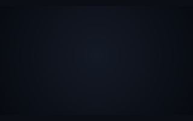
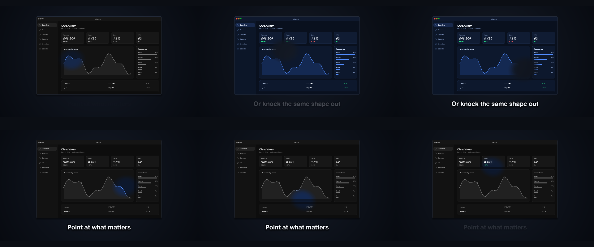
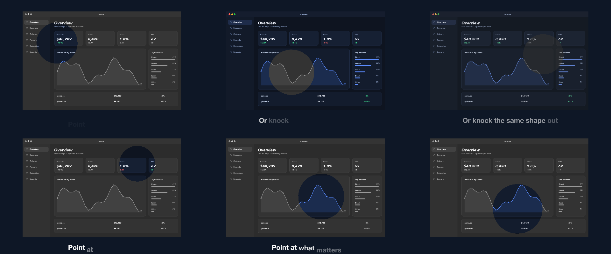

# 14 Spotlight

The same shot flat beneath and in colour inside a roaming spotlight, inverted at the end.

*1440×900, 13 s.* Part of [the demos](../../demo.md): a fresh agent, the media and the prompt below, the public skill and the headless MCP, nothing else.

## Resources given to the agent

 

## The prompt

> Use this screenshot twice: a flat, desaturated copy underneath, and the full-colour copy visible only inside a soft round spotlight that roams over it, breathes and tilts on its own rhythm, for 13 seconds. In the last few seconds flip it so the spotlight punches the shape out instead.
> 
> Files in `resources/`: ui_lumen_1.png.
> 
> Text to use, in order:
> - Point at what matters
> - Or knock the same shape out

## What the agent made

Score **100%** (8 of 8 rubric checks).

| the agent's work | |
|---|---|
| turns | 26 |
| wall time | 4 min 14 s (API 4 min 03 s) |
| cost at API list price | $2.02 — on a Claude subscription this is plan usage, not a bill |
| tokens in | 1.6M (1.5M cache read, 76k cache write) |
| tokens out | 20k (9k thinking) |
| claude-haiku-4-5 | 1k in, 20 out, $0.00 |
| claude-opus-5 | 1.6M in, 20k out, $2.02 |

| MCP tool | calls | time |
|---|---|---|
| promo_render_video | 1 | 5 s |
| promo_render_frames | 2 | 4 s |
| promo_media_probe | 1 | 0 s |
| promo_validate | 2 (1 refused) | 0 s |
| promo_inspect | 1 | 0 s |
| promo_schema | 1 | 0 s |
| promo_workspace | 1 | 0 s |
| promo_schema_full | 1 | 0 s |
| **all** | 10 | 10 s |

Six moments:

**[▶ Watch the video](https://github.com/garalex/promoshot/raw/demo-media/14-spotlight.mp4)** (1280 wide, 0.4 MB) · [small copy](14-spotlight/result.mp4) · [the project it wrote](14-spotlight/result-metadata.json)

| check | | detail |
|---|---|---|
| duration | ✓ | 13.0s vs 13.0s |
| kind:background | ✓ | 1 vs 1 |
| kind:image | ✓ | 3 vs 3 |
| kind:caption | ✓ | 2 vs 2 |
| feature:mask | ✓ | True |
| feature:maskInverted | ✓ | True |
| feature:grade | ✓ | True |
| phrases | ✓ | 2 of 2 lines recognisable |

## The hand-built reference, same moments

---

[← all demos](../../demo.md) · [how the suite works](../../demos/README.md)
