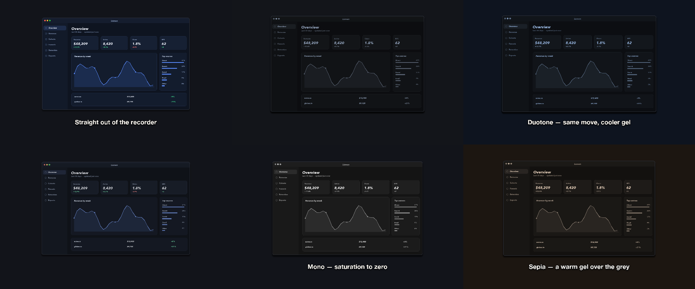
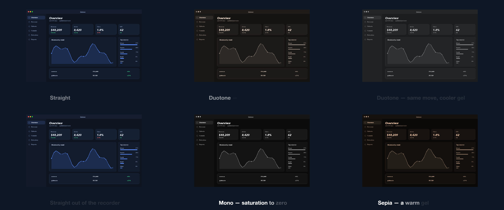

# 15 Grade Room

One shot walked through four looks by ramping the grade, a caption naming each.

*1440×900, 15 s.* Part of [the demos](../../demo.md): a fresh agent, the media and the prompt below, the public skill and the headless MCP, nothing else.

## Resources given to the agent

 

## The prompt

> One screenshot, 15 seconds: walk it through four looks by ramping the grade rather than cutting — the original, then black and white, then a warm sepia, then a cool duotone — with a caption naming each look as it arrives.
> 
> Files in `resources/`: ui_lumen_1.png.
> 
> Text to use, in order:
> - Straight out of the recorder
> - Mono — saturation to zero
> - Sepia — a warm gel over the grey
> - Duotone — same move, cooler gel

## What the agent made

Score **100%** (6 of 6 rubric checks).

| the agent's work | |
|---|---|
| turns | 33 |
| wall time | 3 min 14 s (API 3 min 08 s) |
| cost at API list price | $1.75 — on a Claude subscription this is plan usage, not a bill |
| tokens in | 1.5M (1.5M cache read, 63k cache write) |
| tokens out | 15k (5k thinking) |
| claude-haiku-4-5 | 1k in, 18 out, $0.00 |
| claude-opus-5 | 1.5M in, 15k out, $1.75 |

| MCP tool | calls | time |
|---|---|---|
| promo_render_video | 1 | 3 s |
| promo_render_frames | 1 | 2 s |
| promo_media_probe | 2 | 0 s |
| promo_validate | 3 | 0 s |
| promo_inspect | 2 | 0 s |
| promo_schema | 1 | 0 s |
| promo_schema_full | 1 | 0 s |
| promo_workspace | 1 | 0 s |
| **all** | 12 | 5 s |

Six moments:

**[▶ Watch the video](https://github.com/garalex/promoshot/raw/demo-media/15-grade-room.mp4)** (1280 wide, 0.7 MB) · [small copy](15-grade-room/result.mp4) · [the project it wrote](15-grade-room/result-metadata.json)

| check | | detail |
|---|---|---|
| duration | ✓ | 15.0s vs 15.0s |
| kind:background | ✓ | 1 vs 1 |
| kind:image | ✓ | 3 vs 1 |
| kind:caption | ✓ | 4 vs 4 |
| feature:grade | ✓ | True |
| phrases | ✓ | 4 of 4 lines recognisable |

## The hand-built reference, same moments

---

[← all demos](../../demo.md) · [how the suite works](../../demos/README.md)
