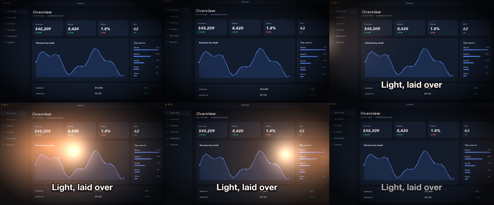
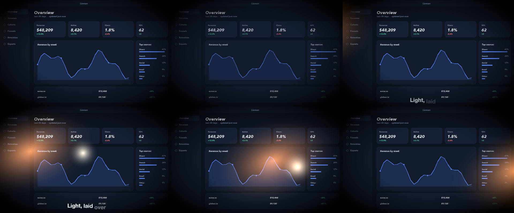

# 16 Light Leak

A warm leak on screen blend, a vignette plate multiplied, a hot core added, over a screenshot.

*1440×900, 12 s.* Part of [the demos](../../demo.md): a fresh agent, the media and the prompt below, the public skill and the headless MCP, nothing else.

## Resources given to the agent

 
 
 
 

## The prompt

> Make a 12-second piece over this screenshot: a warm light leak that sweeps across with a screen blend and motion blur, a dark-rimmed vignette plate multiplied over it, and a hot bright core added on top. Generate the leak and vignette as soft images, not hard shapes.
> 
> Files in `resources/`: glow_dot.png, leak_warm.png, ui_lumen_1.png, vignette_soft.png.
> 
> Text to use, in order:
> - Light, laid over

## What the agent made

Score **100%** (7 of 7 rubric checks).

| the agent's work | |
|---|---|
| turns | 35 |
| wall time | 2 min 55 s (API 2 min 46 s) |
| cost at API list price | $1.60 — on a Claude subscription this is plan usage, not a bill |
| tokens in | 1.3M (1.3M cache read, 66k cache write) |
| tokens out | 13k (5k thinking) |
| claude-haiku-4-5 | 1k in, 13 out, $0.00 |
| claude-opus-5 | 1.3M in, 13k out, $1.60 |

| MCP tool | calls | time |
|---|---|---|
| promo_render_video | 1 | 7 s |
| promo_render_frames | 1 | 0 s |
| promo_media_probe | 4 | 0 s |
| promo_validate | 3 (1 refused) | 0 s |
| promo_inspect | 1 | 0 s |
| promo_schema | 1 | 0 s |
| promo_schema_full | 1 | 0 s |
| **all** | 12 | 8 s |

Six moments:

**[▶ Watch the video](https://github.com/garalex/promoshot/raw/demo-media/16-light-leak.mp4)** (1280 wide, 1.5 MB) · [small copy](16-light-leak/result.mp4) · [the project it wrote](16-light-leak/result-metadata.json)

| check | | detail |
|---|---|---|
| duration | ✓ | 12.0s vs 12.0s |
| kind:background | ✓ | 1 vs 1 |
| kind:image | ✓ | 4 vs 4 |
| kind:caption | ✓ | 1 vs 1 |
| feature:blendModes | ✓ | ['add', 'multiply', 'screen'] vs ['add', 'multiply', 'screen'] |
| feature:motionBlur | ✓ | True |
| phrases | ✓ | 1 of 1 lines recognisable |

## The hand-built reference, same moments

---

[← all demos](../../demo.md) · [how the suite works](../../demos/README.md)
