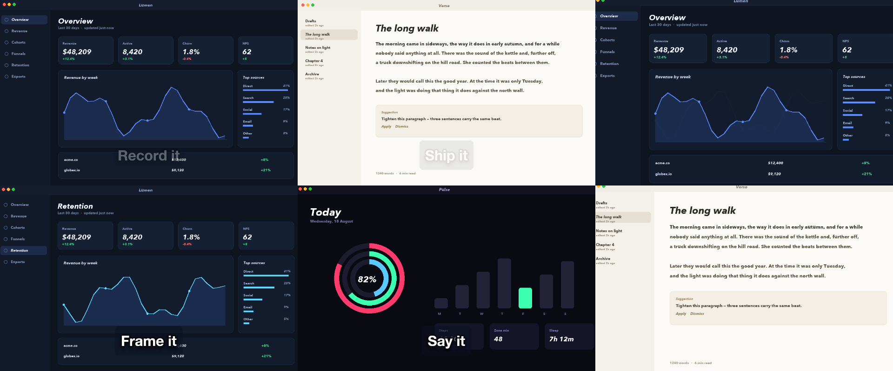
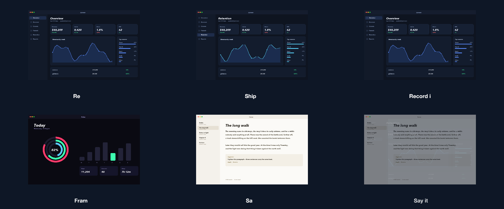

# 17 Chain Reaction

Clips chained half a second before the previous ends, labels pinned to each clip's own edges.

*1440×900, 13 s.* Part of [the demos](../../demo.md): a fresh agent, the media and the prompt below, the public skill and the headless MCP, nothing else.

## Resources given to the agent

 
 
 
 

## The prompt

> Chain these clips so each one starts half a second before the one before it ends, and pin a label to each clip's own start and end, so that if any clip is retrimmed everything after it follows. Fill the canvas.
> 
> Files in `resources/`: ui_lumen_1.png, ui_lumen_5.png, ui_pulse_1.png, ui_verse_1.png.
> 
> Text to use, in order:
> - Record it
> - Frame it
> - Say it
> - Ship it

## What the agent made

Score **100%** (6 of 6 rubric checks).

| the agent's work | |
|---|---|
| turns | 42 |
| wall time | 3 min 34 s (API 3 min 31 s) |
| cost at API list price | $2.00 — on a Claude subscription this is plan usage, not a bill |
| tokens in | 1.8M (1.8M cache read, 68k cache write) |
| tokens out | 17k (7k thinking) |
| claude-haiku-4-5 | 1k in, 15 out, $0.00 |
| claude-opus-5 | 1.8M in, 17k out, $1.99 |

| MCP tool | calls | time |
|---|---|---|
| promo_render_video | 1 | 2 s |
| promo_render_frames | 2 | 0 s |
| promo_render_still | 3 | 0 s |
| promo_media_probe | 4 | 0 s |
| promo_validate | 3 (1 refused) | 0 s |
| promo_inspect | 2 | 0 s |
| promo_explain | 1 | 0 s |
| promo_schema | 1 | 0 s |
| promo_workspace | 1 | 0 s |
| promo_schema_full | 1 | 0 s |
| **all** | 19 | 2 s |

Six moments:

**[▶ Watch the video](https://github.com/garalex/promoshot/raw/demo-media/17-chain-reaction.mp4)** (1280 wide, 1.1 MB) · [small copy](17-chain-reaction/result.mp4) · [the project it wrote](17-chain-reaction/result-metadata.json)

| check | | detail |
|---|---|---|
| duration | ✓ | 12.1s vs 13.2s |
| kind:background | ✓ | 1 vs 1 |
| kind:image | ✓ | 4 vs 4 |
| kind:caption | ✓ | 4 vs 4 |
| feature:timingAnchors | ✓ | True |
| phrases | ✓ | 3 of 4 lines recognisable |

## The hand-built reference, same moments

---

[← all demos](../../demo.md) · [how the suite works](../../demos/README.md)
