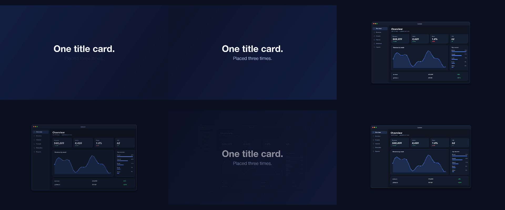
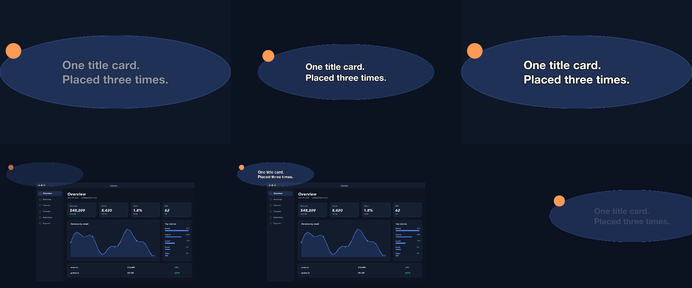

# 18 Reused Title

One title card built once and placed three times around a screenshot.

*1440×900, 13 s.* Part of [the demos](../../demo.md): a fresh agent, the media and the prompt below, the public skill and the headless MCP, nothing else.

## Resources given to the agent

 

## The prompt

> Make a 12-second piece that uses one title card three times — as the intro, a mid card and the outro — built once and placed three times rather than copied, with a screenshot between the cards.
> 
> Files in `resources/`: ui_lumen_1.png.
> 
> Text to use, in order:
> - One title card.
> Placed three times.

## What the agent made

Score **100%** (6 of 6 rubric checks).

| the agent's work | |
|---|---|
| turns | 32 |
| wall time | 3 min 04 s (API 3 min 00 s) |
| cost at API list price | $1.60 — on a Claude subscription this is plan usage, not a bill |
| tokens in | 1.3M (1.3M cache read, 60k cache write) |
| tokens out | 14k (6k thinking) |
| claude-haiku-4-5 | 1k in, 19 out, $0.00 |
| claude-opus-5 | 1.3M in, 14k out, $1.60 |

| MCP tool | calls | time |
|---|---|---|
| promo_render_video | 1 | 2 s |
| promo_render_frames | 3 | 0 s |
| promo_media_probe | 1 | 0 s |
| promo_validate | 2 | 0 s |
| promo_inspect | 1 | 0 s |
| promo_schema | 1 | 0 s |
| promo_workspace | 1 | 0 s |
| promo_schema_full | 1 | 0 s |
| **all** | 11 | 3 s |

Six moments:

**[▶ Watch the video](https://github.com/garalex/promoshot/raw/demo-media/18-reused-title.mp4)** (1280 wide, 0.7 MB) · [small copy](18-reused-title/result.mp4) · [the project it wrote](18-reused-title/result-metadata.json)

| check | | detail |
|---|---|---|
| duration | ✓ | 12.0s vs 13.0s |
| kind:background | ✓ | 1 vs 1 |
| kind:video | ✓ | 3 vs 3 |
| kind:image | ✓ | 2 vs 1 |
| feature:composition | ✓ | True |
| phrases | ✓ | 1 of 1 lines recognisable |

## The hand-built reference, same moments

---

[← all demos](../../demo.md) · [how the suite works](../../demos/README.md)
