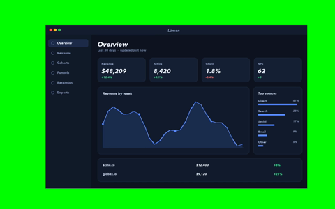
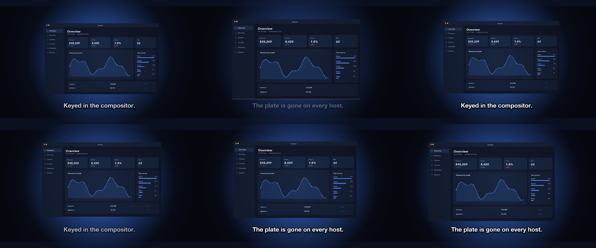
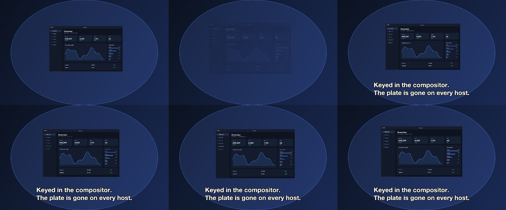

# 19 Green Room

A green-screen clip keyed and composed over a gradient with a halo, growing slowly.

*1440×900, 12 s.* Part of [the demos](../../demo.md): a fresh agent, the media and the prompt below, the public skill and the headless MCP, nothing else.

## Resources given to the agent

 
`green_lumen.mp4` ([file](../../demos/19-green-room/resources/green_lumen.mp4))

## The prompt

> Key out the green screen in this clip and compose it over a dark gradient with a soft halo behind it, letting it grow slightly over 12 seconds, with a caption that says the plate is gone on every host.
> 
> Files in `resources/`: green_lumen.mp4.
> 
> Text to use, in order:
> - Keyed in the compositor.
> The plate is gone on every host.

## What the agent made

Score **88%** (7 of 8 rubric checks).

| the agent's work | |
|---|---|
| turns | 37 |
| wall time | 3 min 24 s (API 3 min 14 s) |
| cost at API list price | $1.94 — on a Claude subscription this is plan usage, not a bill |
| tokens in | 1.9M (1.8M cache read, 67k cache write) |
| tokens out | 14k (5k thinking) |
| claude-haiku-4-5 | 1k in, 20 out, $0.00 |
| claude-opus-5 | 1.9M in, 14k out, $1.94 |

| MCP tool | calls | time |
|---|---|---|
| promo_render_frames | 3 | 5 s |
| promo_render_video | 1 | 4 s |
| promo_media_filmstrip | 1 | 0 s |
| promo_inspect | 1 | 0 s |
| promo_media_probe | 1 | 0 s |
| promo_validate | 3 (1 refused) | 0 s |
| promo_schema | 1 | 0 s |
| promo_schema_full | 1 | 0 s |
| **all** | 12 | 9 s |

Six moments:

**[▶ Watch the video](https://github.com/garalex/promoshot/raw/demo-media/19-green-room.mp4)** (1280 wide, 0.9 MB) · [small copy](19-green-room/result.mp4) · [the project it wrote](19-green-room/result-metadata.json)

| check | | detail |
|---|---|---|
| duration | ✓ | 12.0s vs 12.0s |
| kind:background | ✓ | 1 vs 1 |
| kind:drawing | ✗ | 0 vs 1 |
| kind:video | ✓ | 2 vs 1 |
| kind:caption | ✓ | 2 vs 1 |
| feature:chromaKey | ✓ | True |
| feature:gradient | ✓ | True |
| phrases | ✓ | 1 of 1 lines recognisable |

## The hand-built reference, same moments

---

[← all demos](../../demo.md) · [how the suite works](../../demos/README.md)
