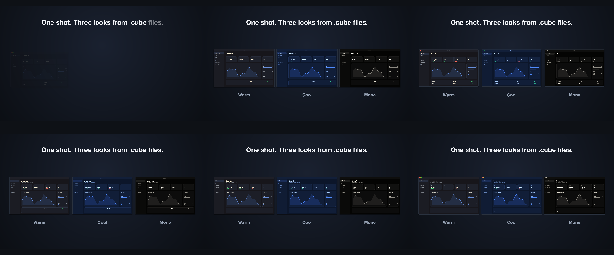
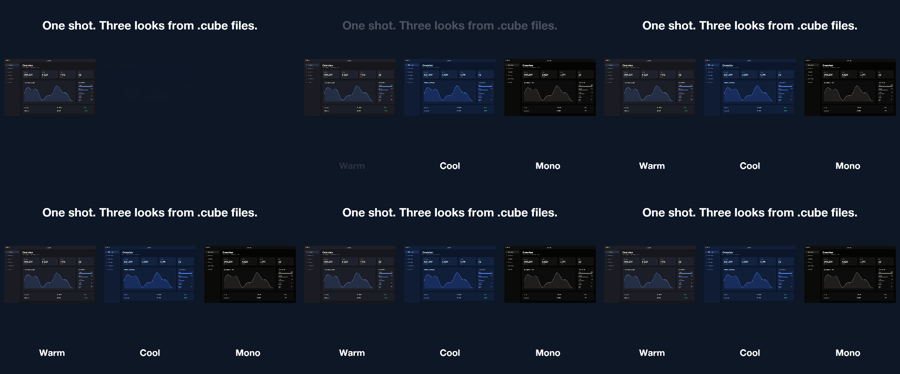

# 20 Look Book

One screenshot three times side by side, each through a different .cube look.

*1440×900, 12 s.* Part of [the demos](../../demo.md): a fresh agent, the media and the prompt below, the public skill and the headless MCP, nothing else.

## Resources given to the agent

`look_cool.cube` ([file](20-look-book/resources/look_cool.cube))
`look_mono.cube` ([file](20-look-book/resources/look_mono.cube))
`look_warm.cube` ([file](20-look-book/resources/look_warm.cube))
 

## The prompt

> Show this screenshot three times side by side, each with a different look from one of the .cube files (warm, cool, mono), each labelled, with a title saying one shot, three looks from .cube files. 12 seconds.
> 
> Files in `resources/`: look_cool.cube, look_mono.cube, look_warm.cube, ui_lumen_1.png.
> 
> Text to use, in order:
> - One shot. Three looks from .cube files.
> - Warm
> - Cool
> - Mono

## What the agent made

Score **100%** (7 of 7 rubric checks).

| the agent's work | |
|---|---|
| turns | 24 |
| wall time | 3 min 01 s (API 2 min 55 s) |
| cost at API list price | $1.56 — on a Claude subscription this is plan usage, not a bill |
| tokens in | 1.3M (1.2M cache read, 63k cache write) |
| tokens out | 13k (5k thinking) |
| claude-haiku-4-5 | 1k in, 14 out, $0.00 |
| claude-opus-5 | 1.3M in, 13k out, $1.56 |

| MCP tool | calls | time |
|---|---|---|
| promo_render_frames | 1 | 3 s |
| promo_render_video | 1 | 2 s |
| promo_media_probe | 1 | 0 s |
| promo_validate | 1 | 0 s |
| promo_inspect | 1 | 0 s |
| promo_schema | 1 | 0 s |
| promo_workspace | 1 | 0 s |
| promo_schema_full | 1 | 0 s |
| **all** | 8 | 5 s |

Six moments:

**[▶ Watch the video](https://github.com/garalex/promoshot/raw/demo-media/20-look-book.mp4)** (1280 wide, 0.6 MB) · [small copy](20-look-book/result.mp4) · [the project it wrote](20-look-book/result-metadata.json)

| check | | detail |
|---|---|---|
| duration | ✓ | 12.0s vs 12.0s |
| kind:background | ✓ | 1 vs 1 |
| kind:image | ✓ | 3 vs 3 |
| kind:caption | ✓ | 4 vs 4 |
| feature:lut | ✓ | True |
| feature:grade | ✓ | True |
| phrases | ✓ | 4 of 4 lines recognisable |

## The hand-built reference, same moments

---

[← all demos](../../demo.md) · [how the suite works](../../demos/README.md)
