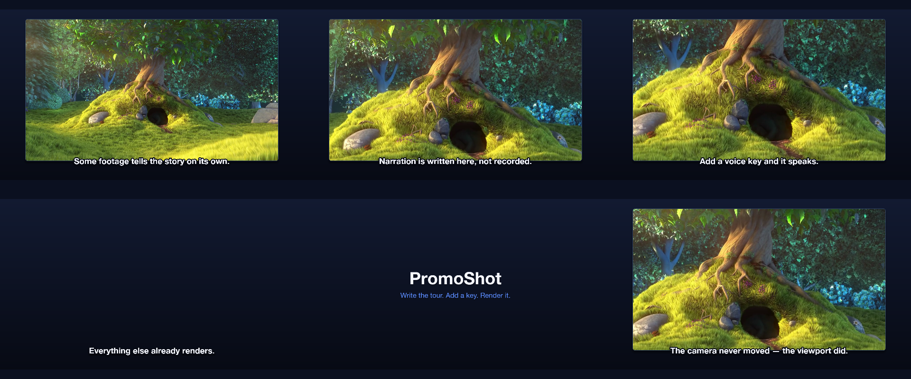
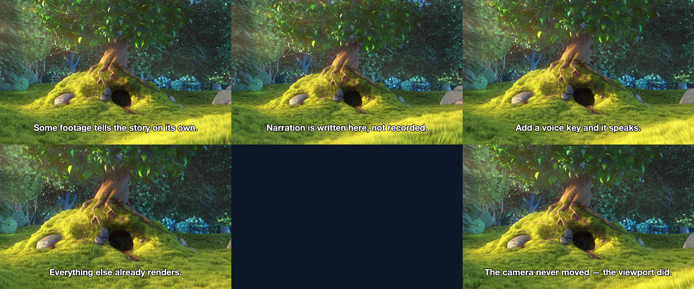

# 21 Chapters & Levels

The narrated tour with the voice levelled and chapter markers a player shows.

*1440×900, 20 s.* Part of [the demos](../../demo.md): a fresh agent, the media and the prompt below, the public skill and the headless MCP, nothing else.

## Resources given to the agent

 
`bbb_test.mp4` ([file](../../demos/_media/bbb_test.mp4))

## The prompt

> Make the narrated tour again from this recording and the narration lines below, but this time level the voice (normalize its loudness and add gentle compression) and add a chapter marker at the start of each section so a player shows a chapter menu, plus a plain marker at the end card.
> 
> Files in `resources/`: bbb_test.mp4.
> 
> Text to use, in order:
> - Some footage tells the story on its own.
> - The camera never moved — the viewport did.
> - Narration is written here, not recorded.
> - Add a voice key and it speaks.
> - Everything else already renders.

## What the agent made

Score **100%** (10 of 10 rubric checks).

| the agent's work | |
|---|---|
| turns | 37 |
| wall time | 4 min 03 s (API 3 min 43 s) |
| cost at API list price | $1.89 — on a Claude subscription this is plan usage, not a bill |
| tokens in | 1.6M (1.5M cache read, 67k cache write) |
| tokens out | 19k (7k thinking) |
| claude-haiku-4-5 | 1k in, 18 out, $0.00 |
| claude-opus-5 | 1.6M in, 19k out, $1.89 |

| MCP tool | calls | time |
|---|---|---|
| promo_render_video | 1 | 14 s |
| promo_render_frames | 1 | 3 s |
| promo_inspect | 1 | 0 s |
| promo_media_probe | 2 | 0 s |
| promo_validate | 2 (1 refused) | 0 s |
| promo_voices | 1 (1 refused) | 0 s |
| promo_speak | 2 | 0 s |
| promo_schema | 1 | 0 s |
| promo_workspace | 1 | 0 s |
| promo_schema_full | 1 | 0 s |
| **all** | 13 | 18 s |

Six moments:

**[▶ Watch the video](https://github.com/garalex/promoshot/raw/demo-media/21-chapters-levels.mp4)** (1280 wide, 8.1 MB) · [small copy](21-chapters-levels/result.mp4) · [the project it wrote](21-chapters-levels/result-metadata.json)

| check | | detail |
|---|---|---|
| duration | ✓ | 24.0s vs 20.0s |
| kind:background | ✓ | 1 vs 1 |
| kind:video | ✓ | 5 vs 1 |
| kind:audio | ✓ | 5 vs 5 |
| kind:caption | ✓ | 7 vs 5 |
| feature:chapters | ✓ | 5 vs 6 |
| feature:markers | ✓ | 6 vs 7 |
| feature:audioEffects | ✓ | True |
| feature:narration | ✓ | True |
| phrases | ✓ | 5 of 5 lines recognisable |

## The hand-built reference, same moments

---

[← all demos](../../demo.md) · [how the suite works](../../demos/README.md)
