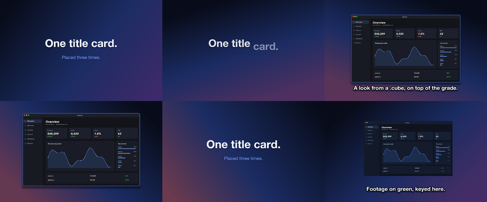
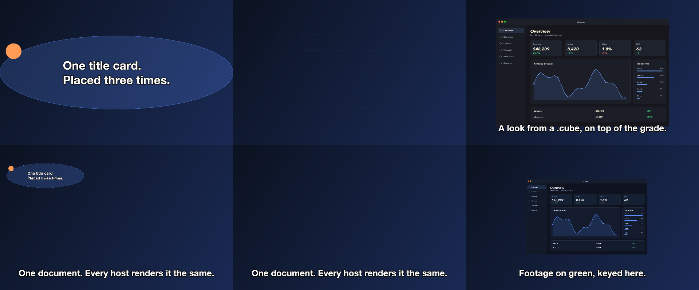

# 22 Product Story

A reused title card, a keyed clip, a warm-graded shot, a levelled voice line, four chapters.

*1440×900, 24 s.* Part of [the demos](../../demo.md): a fresh agent, the media and the prompt below, the public skill and the headless MCP, nothing else.

## Resources given to the agent

 
`green_lumen.mp4` ([file](../../demos/22-product-story/resources/green_lumen.mp4))
`look_warm.cube` ([file](22-product-story/resources/look_warm.cube))
 

## The prompt

> Make a 24-second product story, 1440 by 900, over a gradient: a title card that opens and closes the piece, the green-screen clip keyed and composed over the background, a screenshot with a warm look from the .cube file, one narrated line synthesized from the text below and levelled, and four chapter markers.
> 
> Files in `resources/`: green_lumen.mp4, look_warm.cube, ui_lumen_1.png.
> 
> Text to use, in order:
> - One title card.
> Placed three times.
> - Footage on green, keyed here.
> - A look from a .cube, on top of the grade.
> - One document. Every host renders it the same.

## What the agent made

Score **100%** (17 of 17 rubric checks).

| the agent's work | |
|---|---|
| turns | 54 |
| wall time | 5 min 21 s (API 5 min 09 s) |
| cost at API list price | $2.76 — on a Claude subscription this is plan usage, not a bill |
| tokens in | 2.9M (2.8M cache read, 76k cache write) |
| tokens out | 24k (10k thinking) |
| claude-haiku-4-5 | 1k in, 16 out, $0.00 |
| claude-opus-5 | 2.9M in, 24k out, $2.76 |

| MCP tool | calls | time |
|---|---|---|
| promo_render_frames | 3 | 6 s |
| promo_render_video | 1 | 5 s |
| promo_inspect | 2 | 0 s |
| promo_media_probe | 3 | 0 s |
| promo_media_filmstrip | 1 | 0 s |
| promo_validate | 3 (1 refused) | 0 s |
| promo_speak | 2 | 0 s |
| promo_schema | 1 | 0 s |
| promo_schema_full | 1 | 0 s |
| promo_workspace | 1 | 0 s |
| **all** | 18 | 11 s |

Six moments:

**[▶ Watch the video](https://github.com/garalex/promoshot/raw/demo-media/22-product-story.mp4)** (1280 wide, 1.8 MB) · [small copy](22-product-story/result.mp4) · [the project it wrote](22-product-story/result-metadata.json)

| check | | detail |
|---|---|---|
| canvas | ✓ | [1440, 900] vs [1440, 900] |
| duration | ✓ | 24.0s vs 24.0s |
| kind:background | ✓ | 1 vs 1 |
| kind:video | ✓ | 4 vs 3 |
| kind:caption | ✓ | 2 vs 3 |
| kind:image | ✓ | 1 vs 1 |
| kind:audio | ✓ | 1 vs 1 |
| feature:chromaKey | ✓ | True |
| feature:lut | ✓ | True |
| feature:chapters | ✓ | 4 vs 4 |
| feature:markers | ✓ | 4 vs 4 |
| feature:audioEffects | ✓ | True |
| feature:composition | ✓ | True |
| feature:gradient | ✓ | True |
| feature:narration | ✓ | True |
| feature:grade | ✓ | True |
| phrases | ✓ | 3 of 4 lines recognisable |

## The hand-built reference, same moments

---

[← all demos](../../demo.md) · [how the suite works](../../demos/README.md)
