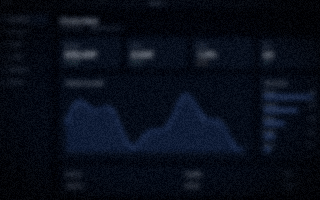
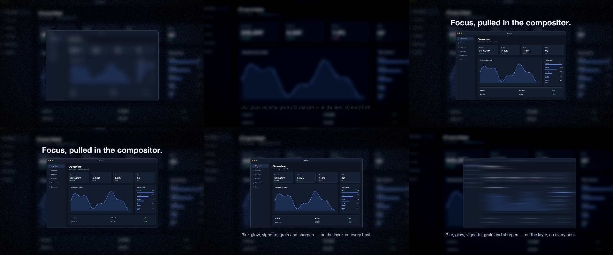
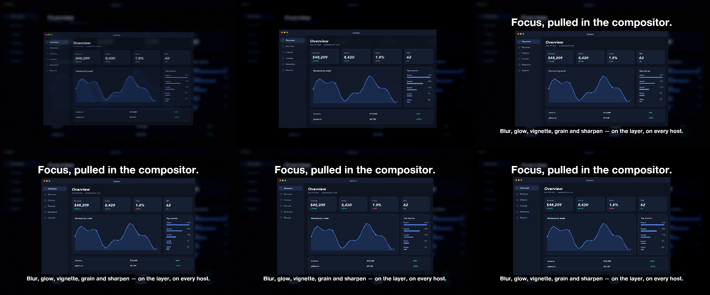

# 23 Soft Focus

A blurred, vignetted, grainy backdrop; a sharp hero that arrives out of blur and smears out; a headline that glows once.

*1440×900, 12 s.* Part of [the demos](../../demo.md): a fresh agent, the media and the prompt below, the public skill and the headless MCP, nothing else.

## Resources given to the agent

 

## The prompt

> Make a 12-second piece from this one screenshot: a blurred, vignetted, slightly grainy copy as the backdrop; a sharp copy in front that arrives out of a heavy blur and leaves as a sideways smear; a headline that resolves out of a blur and glows once as it lands; and a subline.
> 
> Files in `resources/`: ui_lumen_1.png.
> 
> Text to use, in order:
> - Focus, pulled in the compositor.
> - Blur, glow, vignette, grain and sharpen — on the layer, on every host.

## What the agent made

Score **100%** (6 of 6 rubric checks).

| the agent's work | |
|---|---|
| turns | 65 |
| wall time | 9 min 25 s (API 8 min 58 s) |
| cost at API list price | $3.90 — on a Claude subscription this is plan usage, not a bill |
| tokens in | 3.9M (3.8M cache read, 96k cache write) |
| tokens out | 42k (21k thinking) |
| claude-haiku-4-5 | 1k in, 17 out, $0.00 |
| claude-opus-5 | 3.9M in, 42k out, $3.90 |

Six moments:

[video](23-soft-focus/result.mp4) · [the project it wrote](23-soft-focus/result-metadata.json)

| check | | detail |
|---|---|---|
| duration | ✓ | 12.0s vs 12.0s |
| kind:background | ✓ | 1 vs 1 |
| kind:image | ✓ | 4 vs 2 |
| kind:caption | ✓ | 4 vs 2 |
| feature:effects | ✓ | True |
| phrases | ✓ | 2 of 2 lines recognisable |

## The hand-built reference, same moments

---

[← all demos](../../demo.md) · [how the suite works](../../demos/README.md)
