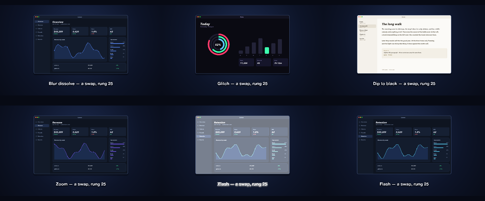
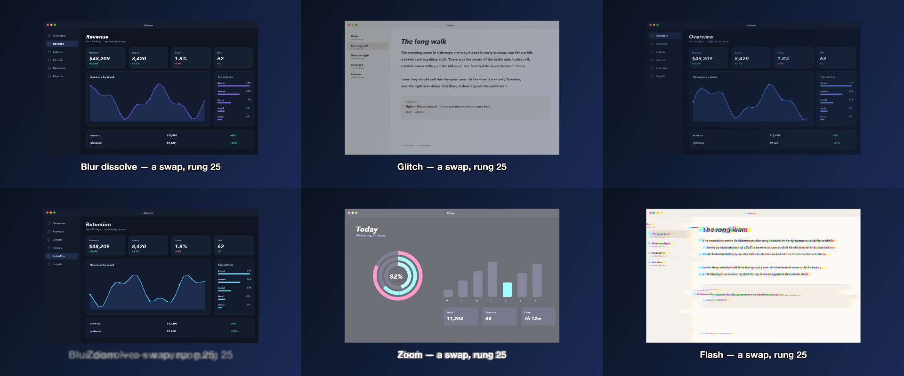

# 24 Cuts

Five screenshots on one layer, swapped through a blur dissolve, a zoom, a flash, a glitch and a dip, each named by a caption that swaps the same way.

*1440×900, 15 s.* Part of [the demos](../../demo.md): a fresh agent, the media and the prompt below, the public skill and the headless MCP, nothing else.

## Resources given to the agent

 
 
 
 
 

## The prompt

> Make a 15-second piece from these five screenshots on one framed image in the middle of a dark gradient: swap from one screenshot to the next every three seconds, and use a different transition for each swap — a blur dissolve, then a zoom, then a flash, then a glitch, then a dip to black — with a caption under the image that names the transition and swaps the same way each time.
> 
> Files in `resources/`: ui_lumen_1.png, ui_lumen_2.png, ui_lumen_5.png, ui_pulse_1.png, ui_verse_1.png.
> 
> Text to use, in order:
> - Blur dissolve — a swap, rung 25
> - Zoom — a swap, rung 25
> - Flash — a swap, rung 25
> - Glitch — a swap, rung 25
> - Dip to black — a swap, rung 25

## What the agent made

Score **88%** (7 of 8 rubric checks).

| the agent's work | |
|---|---|
| turns | 33 |
| wall time | 2 min 55 s (API 2 min 48 s) |
| cost at API list price | $1.60 — on a Claude subscription this is plan usage, not a bill |
| tokens in | 1.2M (1.2M cache read, 66k cache write) |
| tokens out | 14k (5k thinking) |
| claude-haiku-4-5 | 1k in, 14 out, $0.00 |
| claude-opus-5 | 1.2M in, 14k out, $1.60 |

| MCP tool | calls | time |
|---|---|---|
| promo_render_video | 1 | 5 s |
| promo_validate | 2 (1 refused) | 0 s |
| promo_render_frames | 1 | 0 s |
| promo_media_probe | 5 | 0 s |
| promo_inspect | 1 | 0 s |
| promo_schema | 1 | 0 s |
| promo_schema_full | 1 | 0 s |
| **all** | 12 | 6 s |

Six moments:

**[▶ Watch the video](https://github.com/garalex/promoshot/raw/demo-media/24-cuts.mp4)** (1280 wide, 0.9 MB) · [small copy](24-cuts/result.mp4) · [the project it wrote](24-cuts/result-metadata.json)

| check | | detail |
|---|---|---|
| duration | ✓ | 15.0s vs 14.6s |
| kind:background | ✓ | 1 vs 1 |
| kind:image | ✓ | 1 vs 1 |
| kind:caption | ✓ | 1 vs 1 |
| feature:gradient | ✓ | True |
| feature:swaps | ✗ | 8 vs 10 |
| feature:transitions | ✓ | True |
| phrases | ✓ | 5 of 5 lines recognisable |

## The hand-built reference, same moments

---

[← all demos](../../demo.md) · [how the suite works](../../demos/README.md)
