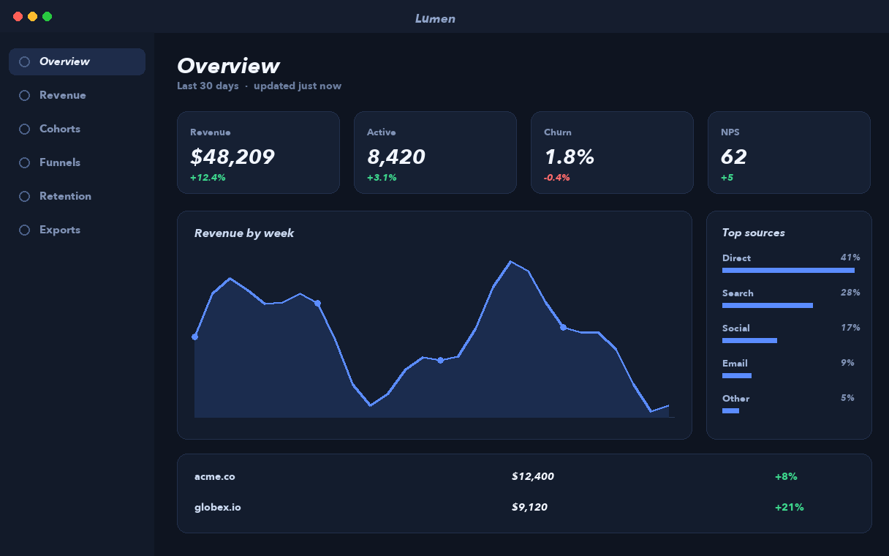
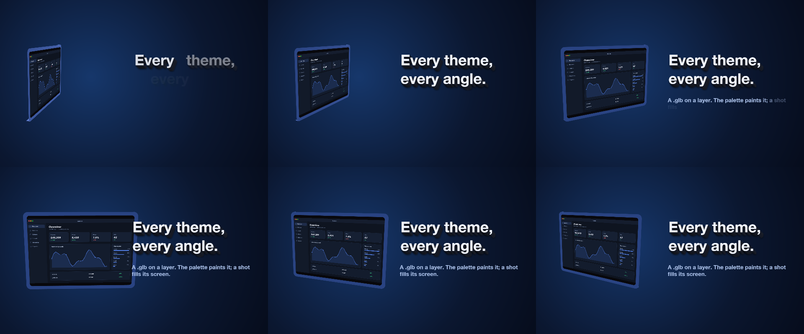
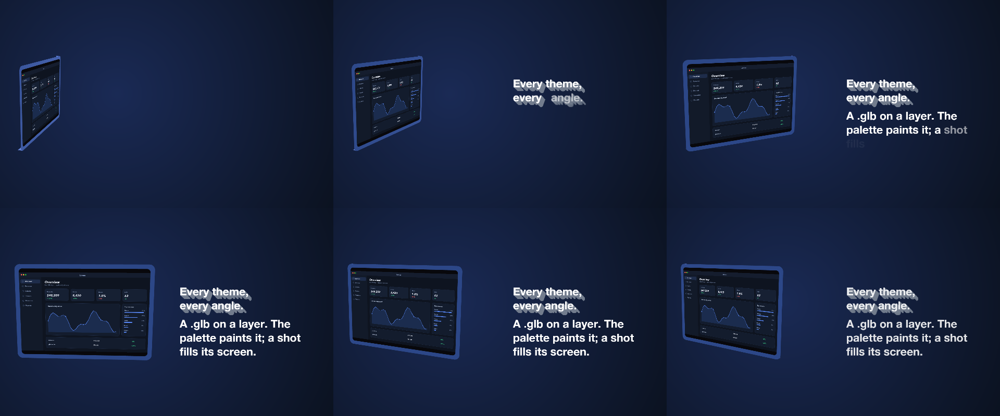

# 25 Turntable

The built-in tablet body on a turntable, its body painted by the palette and a screenshot on its screen, beside extruded kinetic type.

*1440×900, 7 s.* Part of [the demos](../../demo.md): a fresh agent, the media and the prompt below, the public skill and the headless MCP, nothing else.

## Resources given to the agent

`tablet.glb` ([file](../../demos/25-turntable/resources/tablet.glb))
 

## The prompt

> Make a 7-second piece on a 1440×900 canvas: a radial dark-blue gradient background; the tablet.glb model placed on the left, 420 px tall, its Body material painted with the palette's accent and its Screen material showing ui_lumen_1.png, turning on a turntable from a yaw of -70 to 35 degrees over the whole piece with an ease in and out, lit from the upper left; on the right a bold two-line title 'Every theme,\nevery angle.' in extruded type that slides in word by word, and under it a smaller line 'A .glb on a layer. The palette paints it; a shot fills its screen.' that fades in word by word two seconds later.
> 
> Files in `resources/`: tablet.glb, ui_lumen_1.png.
> 
> Text to use, in order:
> - Every theme,
> every angle.
> - A .glb on a layer. The palette paints it; a shot fills its screen.

## What the agent made

Score **100%** (13 of 13 rubric checks).

| the agent's work | |
|---|---|
| turns | 42 |
| wall time | 3 min 40 s (API 3 min 33 s) |
| cost at API list price | $1.98 — on a Claude subscription this is plan usage, not a bill |
| tokens in | 2.1M (2.1M cache read, 57k cache write) |
| tokens out | 15k (5k thinking) |
| claude-haiku-4-5 | 1k in, 14 out, $0.00 |
| claude-opus-5 | 2.1M in, 15k out, $1.98 |

| MCP tool | calls | time |
|---|---|---|
| promo_render_frames | 2 | 3 s |
| promo_render_video | 1 | 3 s |
| promo_media_probe | 2 | 1 s |
| promo_media_turntable | 1 | 0 s |
| promo_validate | 2 | 0 s |
| promo_inspect | 1 | 0 s |
| promo_schema | 1 | 0 s |
| promo_workspace | 1 | 0 s |
| promo_schema_full | 1 | 0 s |
| **all** | 12 | 6 s |

Six moments:

**[▶ Watch the video](https://github.com/garalex/promoshot/raw/demo-media/25-turntable.mp4)** (1280 wide, 0.6 MB) · [small copy](25-turntable/result.mp4) · [the project it wrote](25-turntable/result-metadata.json)

| check | | detail |
|---|---|---|
| canvas | ✓ | [1440, 900] vs [1440, 900] |
| duration | ✓ | 7.0s vs 7.0s |
| kind:background | ✓ | 1 vs 1 |
| kind:model | ✓ | 1 vs 1 |
| kind:caption | ✓ | 2 vs 2 |
| feature:gradient | ✓ | True |
| feature:reveal | ✓ | True |
| feature:model | ✓ | True |
| feature:camera | ✓ | True |
| feature:materials | ✓ | True |
| feature:depth | ✓ | True |
| feature:kineticReveal | ✓ | True |
| phrases | ✓ | 2 of 2 lines recognisable |

## The hand-built reference, same moments

---

[← all demos](../../demo.md) · [how the suite works](../../demos/README.md)
