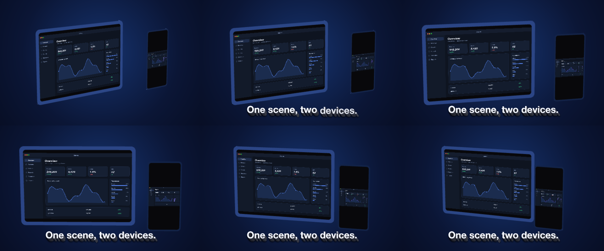
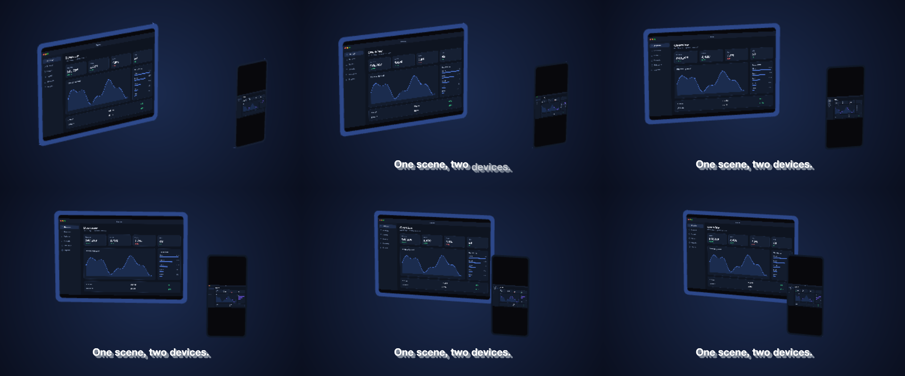

# 26 Stage

The tablet and phone bodies side by side in one stage, one camera orbiting both, a screenshot on each screen.

*1440×900, 8 s.* Part of [the demos](../../demo.md): a fresh agent, the media and the prompt below, the public skill and the headless MCP, nothing else.

## Resources given to the agent

`phone.glb` ([file](../../demos/26-stage/resources/phone.glb))
`tablet.glb` ([file](../../demos/26-stage/resources/tablet.glb))
 
 

## The prompt

> Make an 8-second piece on a 1440×900 canvas: a radial dark-blue gradient background; the tablet.glb and phone.glb models in ONE stage named 'desk' — the tablet first, its camera orbiting from a yaw of -38 to 22 over the piece with an ease in and out, the tablet's body painted with the palette's accent and its Screen showing ui_lumen_1.png, offset a little left across the stage; the phone offset right and a little forward in depth, its body the palette's edge colour and its Screen showing ui_lumen_2.png; the stage placed 620 px tall in the centre; and along the bottom a bold caption 'One scene, two devices.' in extruded type that rises in word by word from one second.
> 
> Files in `resources/`: phone.glb, tablet.glb, ui_lumen_1.png, ui_lumen_2.png.
> 
> Text to use, in order:
> - One scene, two devices.

## What the agent made

Score **100%** (13 of 13 rubric checks).

| the agent's work | |
|---|---|
| turns | 40 |
| wall time | 2 min 58 s (API 2 min 55 s) |
| cost at API list price | $1.93 — on a Claude subscription this is plan usage, not a bill |
| tokens in | 2.1M (2.1M cache read, 56k cache write) |
| tokens out | 13k (4k thinking) |
| claude-haiku-4-5 | 1k in, 15 out, $0.00 |
| claude-opus-5 | 2.1M in, 13k out, $1.93 |

| MCP tool | calls | time |
|---|---|---|
| promo_render_video | 1 | 1 s |
| promo_validate | 2 (1 refused) | 1 s |
| promo_render_frames | 1 | 0 s |
| promo_inspect | 1 | 0 s |
| promo_schema_types | 1 | 0 s |
| promo_schema | 1 | 0 s |
| promo_schema_full | 1 | 0 s |
| **all** | 8 | 2 s |

Six moments:

**[▶ Watch the video](https://github.com/garalex/promoshot/raw/demo-media/26-stage.mp4)** (1280 wide, 0.8 MB) · [small copy](26-stage/result.mp4) · [the project it wrote](26-stage/result-metadata.json)

| check | | detail |
|---|---|---|
| canvas | ✓ | [1440, 900] vs [1440, 900] |
| duration | ✓ | 8.0s vs 8.0s |
| kind:background | ✓ | 1 vs 1 |
| kind:model | ✓ | 2 vs 2 |
| kind:caption | ✓ | 1 vs 1 |
| feature:gradient | ✓ | True |
| feature:reveal | ✓ | True |
| feature:stage | ✓ | True |
| feature:model | ✓ | True |
| feature:camera | ✓ | True |
| feature:materials | ✓ | True |
| feature:depth | ✓ | True |
| phrases | ✓ | 1 of 1 lines recognisable |

## The hand-built reference, same moments

---

[← all demos](../../demo.md) · [how the suite works](../../demos/README.md)
