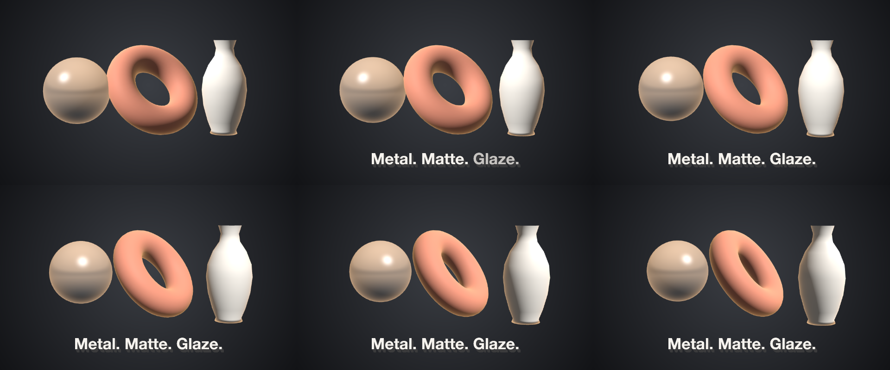
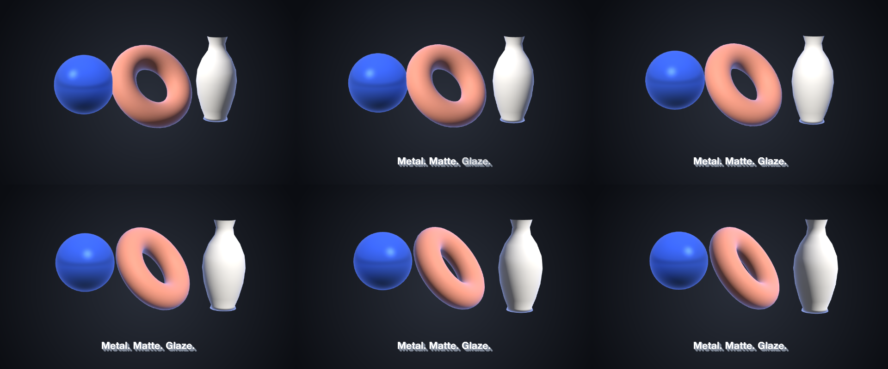

# 27 Materials

Three curved bodies — chrome, matte, glazed — on one bench under a key light that sweeps across them, the camera drifting.

*1440×900, 9 s.* Part of [the demos](../../demo.md): a fresh agent, the media and the prompt below, the public skill and the headless MCP, nothing else.

## Resources given to the agent

`sphere.glb` ([file](../../demos/27-materials/resources/sphere.glb))
`torus.glb` ([file](../../demos/27-materials/resources/torus.glb))
`vase.glb` ([file](../../demos/27-materials/resources/vase.glb))

## The prompt

> Make a 9-second piece on a 1440×900 canvas: a radial dark-grey gradient background; sphere.glb, torus.glb and vase.glb in ONE stage named 'bench' — the sphere first, offset 1.5 left, its body painted the palette's accent, its camera drifting from a yaw of -14 to 14 over the piece with an ease in and out while the key light sweeps from a yaw of -70 to 70 at intensity 1.3; the torus in the middle, lying at a pitch of 55 and turning from a yaw of 20 to 80; the vase offset 1.5 right; the stage placed 520 px tall in the centre; and along the bottom a bold caption 'Metal. Matte. Glaze.' in extruded type that fades in word by word from 1.2 seconds.
> 
> Files in `resources/`: sphere.glb, torus.glb, vase.glb.
> 
> Text to use, in order:
> - Metal. Matte. Glaze.

## What the agent made

Score **92%** (12 of 13 rubric checks).

| the agent's work | |
|---|---|
| turns | 34 |
| wall time | 2 min 27 s (API 2 min 23 s) |
| cost at API list price | $1.43 — on a Claude subscription this is plan usage, not a bill |
| tokens in | 1.5M (1.4M cache read, 45k cache write) |
| tokens out | 10k (3k thinking) |
| claude-haiku-4-5 | 1k in, 21 out, $0.00 |
| claude-opus-5 | 1.5M in, 10k out, $1.43 |

| MCP tool | calls | time |
|---|---|---|
| promo_render_video | 1 | 2 s |
| promo_validate | 2 | 0 s |
| promo_render_frames | 2 | 0 s |
| promo_render_still | 1 | 0 s |
| promo_inspect | 1 | 0 s |
| promo_schema | 1 | 0 s |
| promo_schema_full | 1 | 0 s |
| **all** | 9 | 2 s |

Six moments:

**[▶ Watch the video](https://github.com/garalex/promoshot/raw/demo-media/27-materials.mp4)** (1280 wide, 0.4 MB) · [small copy](27-materials/result.mp4) · [the project it wrote](27-materials/result-metadata.json)

| check | | detail |
|---|---|---|
| canvas | ✓ | [1440, 900] vs [1440, 900] |
| duration | ✓ | 9.0s vs 9.0s |
| kind:background | ✓ | 1 vs 1 |
| kind:model | ✓ | 3 vs 3 |
| kind:caption | ✓ | 1 vs 1 |
| feature:gradient | ✓ | True |
| feature:reveal | ✓ | True |
| feature:stage | ✓ | True |
| feature:model | ✓ | True |
| feature:camera | ✓ | True |
| feature:materials | ✗ | False |
| feature:depth | ✓ | True |
| phrases | ✓ | 1 of 1 lines recognisable |

## The hand-built reference, same moments

---

[← all demos](../../demo.md) · [how the suite works](../../demos/README.md)
