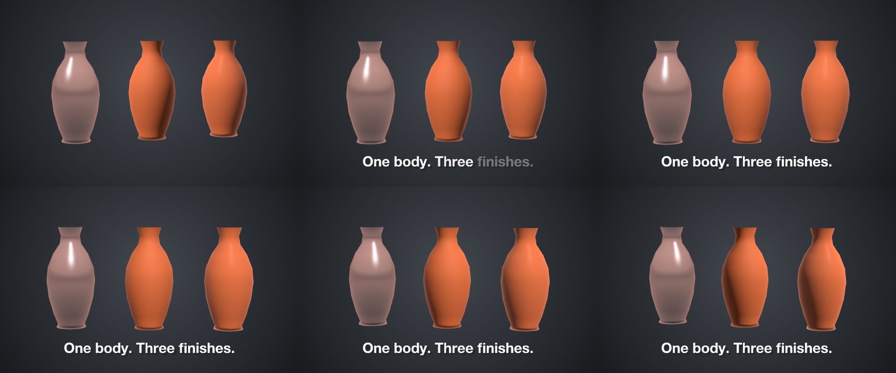
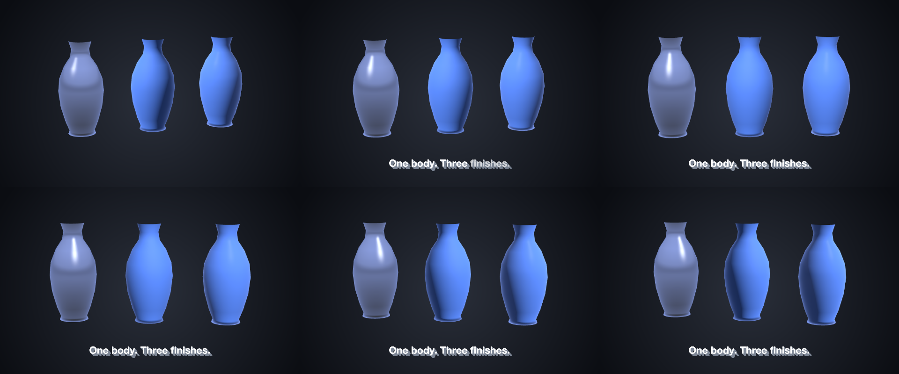

# 28 Finishes

One vase three ways — chrome, matte, gloss — the finish written on the binding rather than baked into the file, under a light that sweeps across them.

*1440×900, 9 s.* Part of [the demos](../../demo.md): a fresh agent, the media and the prompt below, the public skill and the headless MCP, nothing else.

## Resources given to the agent

`vase.glb` ([file](../../demos/28-finishes/resources/vase.glb))

## The prompt

> Make a 9-second piece on a 1440×900 canvas: a radial dark-grey gradient background; vase.glb three times in ONE stage named 'bench', as three model resources over the same file — the first offset 1.5 left, painted silver D2D6DC with a chrome finish written on the binding (metallic 1, roughness 0.12), its camera drifting from a yaw of -14 to 14 over the piece with an ease in and out while the key light sweeps from a yaw of -70 to 70 at intensity 1.3; the second in the middle, painted the palette's accent with a matte finish (metallic 0, roughness 0.85); the third offset 1.5 right, the same accent with a gloss finish (metallic 0, roughness 0.12); every vase turning a little on its own from a yaw of -20 to 20; the stage placed 520 px tall in the centre; and along the bottom a bold caption 'One body. Three finishes.' in extruded type that fades in word by word from 1.2 seconds.
> 
> Files in `resources/`: vase.glb.
> 
> Text to use, in order:
> - One body. Three finishes.

## What the agent made

Score **100%** (14 of 14 rubric checks).

| the agent's work | |
|---|---|
| turns | 27 |
| wall time | 2 min 57 s (API 2 min 50 s) |
| cost at API list price | $1.49 — on a Claude subscription this is plan usage, not a bill |
| tokens in | 1.5M (1.5M cache read, 47k cache write) |
| tokens out | 11k (5k thinking) |
| claude-haiku-4-5 | 1k in, 16 out, $0.00 |
| claude-opus-5 | 1.5M in, 11k out, $1.48 |

| MCP tool | calls | time |
|---|---|---|
| promo_render_frames | 2 | 3 s |
| promo_render_video | 1 | 2 s |
| promo_validate | 1 | 0 s |
| promo_inspect | 1 | 0 s |
| promo_schema | 1 | 0 s |
| promo_schema_full | 1 | 0 s |
| **all** | 7 | 5 s |

Six moments:

**[▶ Watch the video](https://github.com/garalex/promoshot/raw/demo-media/28-finishes.mp4)** (1280 wide, 0.3 MB) · [small copy](28-finishes/result.mp4) · [the project it wrote](28-finishes/result-metadata.json)

| check | | detail |
|---|---|---|
| canvas | ✓ | [1440, 900] vs [1440, 900] |
| duration | ✓ | 9.0s vs 9.0s |
| kind:background | ✓ | 1 vs 1 |
| kind:model | ✓ | 3 vs 3 |
| kind:caption | ✓ | 1 vs 1 |
| feature:gradient | ✓ | True |
| feature:reveal | ✓ | True |
| feature:stage | ✓ | True |
| feature:model | ✓ | True |
| feature:camera | ✓ | True |
| feature:materials | ✓ | True |
| feature:finish | ✓ | True |
| feature:depth | ✓ | True |
| phrases | ✓ | 1 of 1 lines recognisable |

## The hand-built reference, same moments

---

[← all demos](../../demo.md) · [how the suite works](../../demos/README.md)
