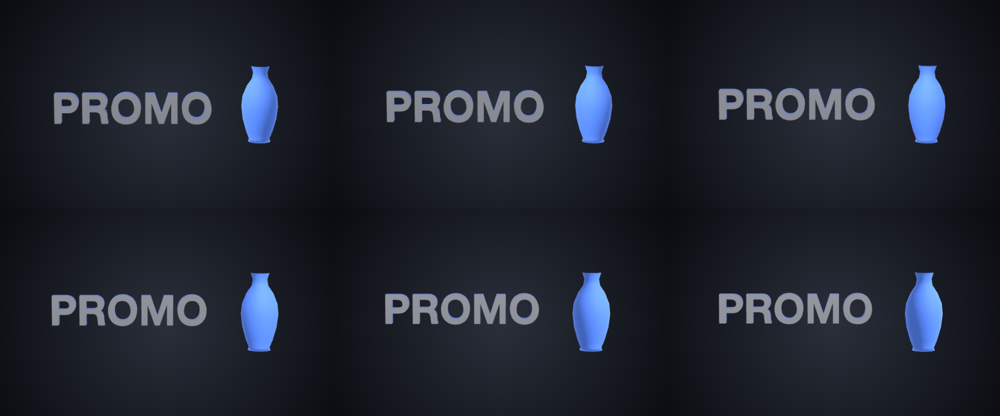

# 30 Title Body

The title as a body: real type the engine builds from a recipe, chrome on its face, standing on the bench with a vase under one sweeping light — no caption, no 2.5D.

*1440×900, 9 s.* Part of [the demos](../../demo.md): a fresh agent, the media and the prompt below, the public skill and the headless MCP, nothing else.

## Resources given to the agent

`vase.glb` ([file](../../demos/30-title-body/resources/vase.glb))

## The prompt

> Make a 9-second piece on a 1440×900 canvas: a radial dark-grey gradient background and the studio scene environment (compositionSettings.environment preset studio); ONE layer of kind 'stage' named 'Bench', placed 420 px tall in the centre, whose keyframes carry the camera (drifting from a yaw of -12 to 12 with an ease in and out) and the key light (sweeping from a yaw of -70 to 70 at intensity 1.3); its members are a TITLE that is a real 3D body — a model resource with no file and a recipe {"text": {"text": "PROMO", "bold": true, "depth": 0.3, "size": 0.8}}, its Face painted silver D2D6DC with a chrome finish (metallic 1, roughness 0.12) and its Side painted the palette's edge colour matte (metallic 0, roughness 0.6), offset 0.3 left and turning from a yaw of -12 to 12 — and vase.glb offset 1.55 right, painted the palette's accent with a matte finish (metallic 0, roughness 0.85), turning from -20 to 20. No caption layer: the title is the body.
> 
> Files in `resources/`: vase.glb.

## What the agent made

Score **100%** (13 of 13 rubric checks).

| the agent's work | |
|---|---|
| turns | 22 |
| wall time | 1 min 56 s (API 1 min 53 s) |
| cost at API list price | $1.18 — on a Claude subscription this is plan usage, not a bill |
| tokens in | 1.2M (1.1M cache read, 41k cache write) |
| tokens out | 8k (3k thinking) |
| claude-haiku-4-5 | 1k in, 17 out, $0.00 |
| claude-opus-5 | 1.2M in, 8k out, $1.17 |

| MCP tool | calls | time |
|---|---|---|
| promo_render_video | 1 | 2 s |
| promo_render_frames | 1 | 0 s |
| promo_validate | 1 | 0 s |
| promo_inspect | 1 | 0 s |
| promo_schema | 1 | 0 s |
| promo_schema_full | 1 | 0 s |
| **all** | 6 | 2 s |

Six moments:

**[▶ Watch the video](https://github.com/garalex/promoshot/raw/demo-media/30-title-body.mp4)** (1280 wide, 0.3 MB) · [small copy](30-title-body/result.mp4) · [the project it wrote](30-title-body/result-metadata.json)

| check | | detail |
|---|---|---|
| canvas | ✓ | [1440, 900] vs [1440, 900] |
| duration | ✓ | 9.0s vs 9.0s |
| kind:background | ✓ | 1 vs 1 |
| kind:stage | ✓ | 1 vs 1 |
| feature:gradient | ✓ | True |
| feature:stage | ✓ | True |
| feature:stageLayer | ✓ | True |
| feature:model | ✓ | True |
| feature:camera | ✓ | True |
| feature:materials | ✓ | True |
| feature:finish | ✓ | True |
| feature:textBody | ✓ | True |
| feature:environment | ✓ | True |

## The hand-built reference, same moments

---

[← all demos](../../demo.md) · [how the suite works](../../demos/README.md)
