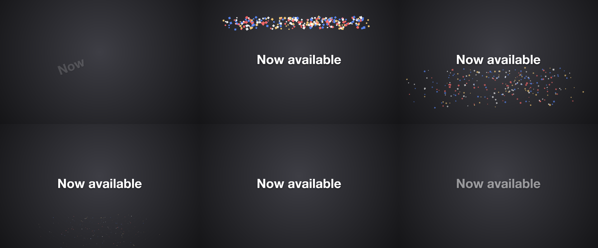
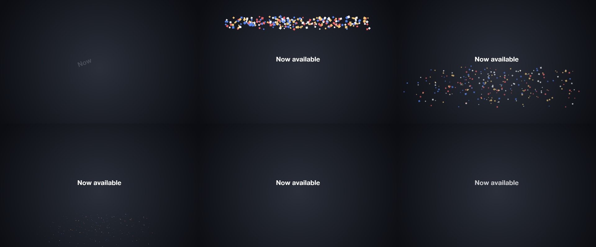

# 31 Confetti

A launch title with a confetti burst: particles as a recipe played by a drawing layer, every frame computed alone, the burst timed to the last word.

*1440×900, 6 s.* Part of [the demos](../../demo.md): a fresh agent, the media and the prompt below, the public skill and the headless MCP, nothing else.

## Resources given to the agent

*None — the prompt carries the text.*

## The prompt

> Make a 6-second piece on a 1440×900 canvas: a radial dark-grey gradient background; a bold 92 px caption 'Now available' centred (offset 20 px up) that tumbles in word by word over 0.8 seconds from 0.4 seconds and fades out at the end; and a CONFETTI BURST — a particles resource (kind particles, no file) with a recipe: anchor [0.5, 0.08], extent [0.7, 0], burst 260, rate 0, direction 270, spread 45, speed [0.15, 0.5], gravity 0.55, drag 0.7, size [0.01, 0.022], shape square, colours the palette's accent, white, FFD27A and FF6B6B, life [2.5, 4] — played by a drawing layer that starts at 1.2 seconds, when the last word has landed.
> 
> Text to use, in order:
> - Now available

## What the agent made

Score **100%** (10 of 10 rubric checks).

| the agent's work | |
|---|---|
| turns | 32 |
| wall time | 2 min 22 s (API 2 min 15 s) |
| cost at API list price | $1.42 — on a Claude subscription this is plan usage, not a bill |
| tokens in | 1.4M (1.3M cache read, 49k cache write) |
| tokens out | 10k (3k thinking) |
| claude-haiku-4-5 | 1k in, 13 out, $0.00 |
| claude-opus-5 | 1.4M in, 10k out, $1.42 |

| MCP tool | calls | time |
|---|---|---|
| promo_render_frames | 1 | 2 s |
| promo_render_video | 1 | 2 s |
| promo_validate | 1 | 0 s |
| promo_inspect | 1 | 0 s |
| promo_schema | 1 | 0 s |
| promo_schema_full | 1 | 0 s |
| promo_workspace | 1 | 0 s |
| **all** | 7 | 5 s |

Six moments:

**[▶ Watch the video](https://github.com/garalex/promoshot/raw/demo-media/31-confetti.mp4)** (1280 wide, 0.5 MB) · [small copy](31-confetti/result.mp4) · [the project it wrote](31-confetti/result-metadata.json)

| check | | detail |
|---|---|---|
| canvas | ✓ | [1440, 900] vs [1440, 900] |
| duration | ✓ | 6.0s vs 6.0s |
| kind:background | ✓ | 1 vs 1 |
| kind:caption | ✓ | 1 vs 1 |
| kind:drawing | ✓ | 1 vs 1 |
| feature:gradient | ✓ | True |
| feature:reveal | ✓ | True |
| feature:particles | ✓ | True |
| feature:kineticReveal | ✓ | True |
| phrases | ✓ | 1 of 1 lines recognisable |

## The hand-built reference, same moments

---

[← all demos](../../demo.md) · [how the suite works](../../demos/README.md)
