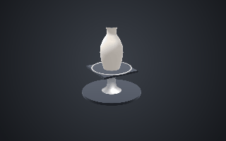
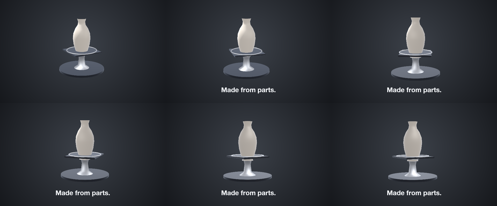
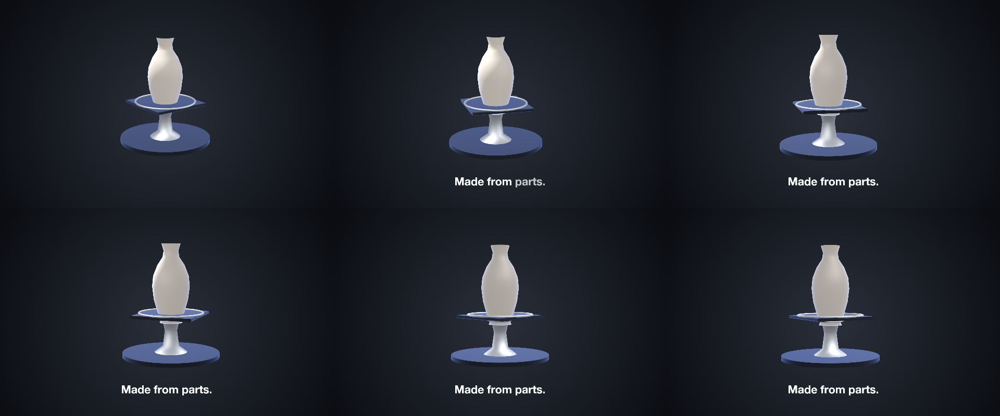

# 32 Stand

A stand made of parts — a plinth, a chrome stem, a plate and a ring written like an SVG — with the glazed vase standing on it under the studio.

*1440×900, 9 s.* Part of [the demos](../../demo.md): a fresh agent, the media and the prompt below, the public skill and the headless MCP, nothing else.

## Resources given to the agent

`vase.glb` ([file](../../demos/32-stand/resources/vase.glb))

## The prompt

> Make a 9-second piece on a 1440×900 canvas: a radial dark-grey gradient background and the studio scene environment; ONE layer of kind 'stage' named 'Bench', placed 560 px tall in the centre (offset 20 px up), whose keyframes carry the camera making one orbit in three quick eased-out turns with holds between (yaw -30 to 75 by 1.3 s, hold, to 200 by 4.4 s, hold, to 330 by 7.4 s; pitch 22 down to 6, distance 4.9 in to 4.0) and the key light flying ahead of each turn (yaw -140 to -60 to 40 to 140, pitch 70 down to 22, intensity 1.2 to 1.6, drifting a little during the holds). Its members: a STAND that is a model resource with no file and a PARTS recipe — a Base cylinder (radius 0.95, height 0.08, positioned at y 0.04), a Stem lathe (profile [[0.32,0.08],[0.16,0.2],[0.12,0.5],[0.16,0.7],[0.36,0.78],[0,0.78]]), a Plate box (size [1.2,0.06,1.2], radius 0.03, positioned at y 0.81) and a Ring torus (radius 0.62, tube 0.02, at y 0.85) — painted dark 1E2430 on Base and Plate and chrome D2D6DC (metallic 1, roughness 0.2) on Stem and Ring, offset 0.45 down; and vase.glb painted F2E9DC with a gloss finish (metallic 0.05, roughness 0.15), offset 0.9 up so it stands on the plate, turning from a yaw of -20 to 20; and along the bottom a bold caption 'Made from parts.' that fades in word by word from 1.2 seconds.
> 
> Files in `resources/`: vase.glb.
> 
> Text to use, in order:
> - Made from parts.

## What the agent made

Score **100%** (16 of 16 rubric checks).

| the agent's work | |
|---|---|
| turns | 34 |
| wall time | 4 min 17 s (API 4 min 10 s) |
| cost at API list price | $2.06 — on a Claude subscription this is plan usage, not a bill |
| tokens in | 2.1M (2.0M cache read, 58k cache write) |
| tokens out | 19k (9k thinking) |
| claude-haiku-4-5 | 2k in, 17 out, $0.00 |
| claude-opus-5 | 2.1M in, 19k out, $2.06 |

| MCP tool | calls | time |
|---|---|---|
| promo_render_frames | 3 | 3 s |
| promo_render_video | 1 | 2 s |
| promo_validate | 2 | 0 s |
| promo_inspect | 1 | 0 s |
| promo_schema | 1 | 0 s |
| promo_schema_full | 1 | 0 s |
| promo_workspace | 1 | 0 s |
| **all** | 10 | 5 s |

Six moments:

**[▶ Watch the video](https://github.com/garalex/promoshot/raw/demo-media/32-stand.mp4)** (1280 wide, 0.3 MB) · [small copy](32-stand/result.mp4) · [the project it wrote](32-stand/result-metadata.json)

| check | | detail |
|---|---|---|
| canvas | ✓ | [1440, 900] vs [1440, 900] |
| duration | ✓ | 9.0s vs 9.0s |
| kind:background | ✓ | 1 vs 1 |
| kind:stage | ✓ | 1 vs 1 |
| kind:caption | ✓ | 1 vs 1 |
| feature:gradient | ✓ | True |
| feature:reveal | ✓ | True |
| feature:stage | ✓ | True |
| feature:stageLayer | ✓ | True |
| feature:model | ✓ | True |
| feature:camera | ✓ | True |
| feature:materials | ✓ | True |
| feature:finish | ✓ | True |
| feature:environment | ✓ | True |
| feature:partsBody | ✓ | True |
| phrases | ✓ | 1 of 1 lines recognisable |

## The hand-built reference, same moments

---

[← all demos](../../demo.md) · [how the suite works](../../demos/README.md)
