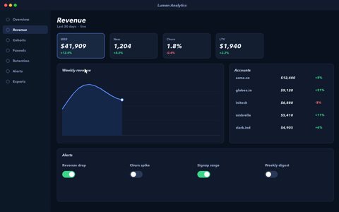
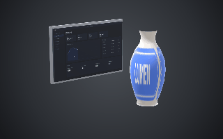
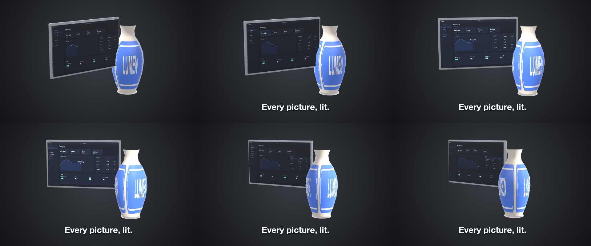
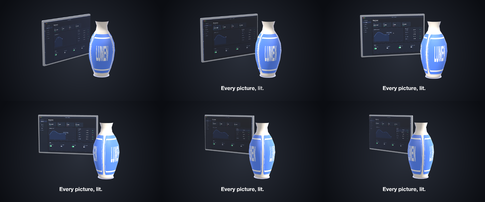

# 33 Worn

Pictures worn by bodies — a video playing on a glossy panel and a label tiled round the glazed vase — lit and reflecting like the surfaces they sit on, under a key light that flies across.

*1440×900, 9 s.* Part of [the demos](../../demo.md): a fresh agent, the media and the prompt below, the public skill and the headless MCP, nothing else.

## Resources given to the agent

 
 
`rec_lumen_2560.mp4` ([file](../../demos/33-worn/resources/rec_lumen_2560.mp4))

## The prompt

> Make a 9-second piece on a 1440×900 canvas: a radial dark-grey gradient background and the studio scene environment; ONE layer of kind 'stage' named 'Bench', placed 600 px tall in the centre (offset 30 px up), whose keyframes carry the camera (swinging from a yaw of -38 to 34, pitch 12 to 6, distance 4.6 to 4.1, with an ease in and out) and the key light flying over the scene (yaw -130 to 120, pitch 65 to 24, intensity 1.3 to 1.5). Its members: a PANEL that is a model resource with no file and a PARTS recipe — a Print box (size [1.6,1.0,0.05], radius 0.015) and a Frame box (size [1.68,1.08,0.04], radius 0.02, positioned at z -0.03) — whose Print slot WEARS the video rec_lumen_2560.mp4 as a surface ("mode": "surface", metallic 0, roughness 0.18) so the light shades it, with the Frame chrome D2D6DC (metallic 1, roughness 0.25), offset 0.42 left and 0.12 up; and a VASE that is a model resource with no file and a PARTS recipe of one lathe (slot Body, profile [[0.18,0.75],[0.14,0.62],[0.16,0.5],[0.26,0.35],[0.34,0.15],[0.36,-0.05],[0.33,-0.3],[0.26,-0.55],[0.2,-0.7],[0.22,-0.75],[0,-0.75]], 48 segments) whose Body slot WEARS label_lumen.png as a surface tiled three times round it (repeat [3,1]) over a glaze F2E9DC (metallic 0.05, roughness 0.15), offset 0.66 right and 0.28 down, turning from a yaw of -70 to 70; and along the bottom a bold caption 'Every picture, lit.' that fades in word by word from 1.2 seconds.
> 
> Files in `resources/`: label_lumen.png, rec_lumen_2560.mp4.
> 
> Text to use, in order:
> - Every picture, lit.

## What the agent made

Score **100%** (18 of 18 rubric checks).

| the agent's work | |
|---|---|
| turns | 32 |
| wall time | 2 min 29 s (API 2 min 18 s) |
| cost at API list price | $1.68 — on a Claude subscription this is plan usage, not a bill |
| tokens in | 1.9M (1.8M cache read, 51k cache write) |
| tokens out | 10k (2k thinking) |
| claude-haiku-4-5 | 2k in, 21 out, $0.00 |
| claude-opus-5 | 1.9M in, 10k out, $1.68 |

| MCP tool | calls | time |
|---|---|---|
| promo_render_frames | 2 | 4 s |
| promo_render_video | 1 | 3 s |
| promo_validate | 1 | 1 s |
| promo_media_probe | 1 | 0 s |
| promo_inspect | 1 | 0 s |
| promo_schema_types | 1 | 0 s |
| promo_schema | 1 | 0 s |
| promo_schema_full | 1 | 0 s |
| promo_workspace | 1 | 0 s |
| **all** | 10 | 8 s |

Six moments:

**[▶ Watch the video](https://github.com/garalex/promoshot/raw/demo-media/33-worn.mp4)** (1280 wide, 0.9 MB) · [small copy](33-worn/result.mp4) · [the project it wrote](33-worn/result-metadata.json)

| check | | detail |
|---|---|---|
| canvas | ✓ | [1440, 900] vs [1440, 900] |
| duration | ✓ | 9.0s vs 9.0s |
| kind:background | ✓ | 1 vs 1 |
| kind:stage | ✓ | 1 vs 1 |
| kind:caption | ✓ | 1 vs 1 |
| feature:gradient | ✓ | True |
| feature:reveal | ✓ | True |
| feature:stage | ✓ | True |
| feature:stageLayer | ✓ | True |
| feature:model | ✓ | True |
| feature:camera | ✓ | True |
| feature:materials | ✓ | True |
| feature:finish | ✓ | True |
| feature:wornPicture | ✓ | True |
| feature:wornVideo | ✓ | True |
| feature:environment | ✓ | True |
| feature:partsBody | ✓ | True |
| phrases | ✓ | 1 of 1 lines recognisable |

## The hand-built reference, same moments

---

[← all demos](../../demo.md) · [how the suite works](../../demos/README.md)
