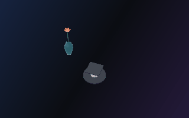
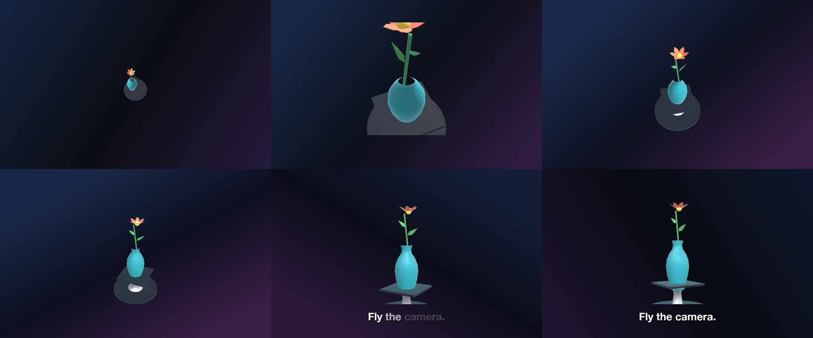
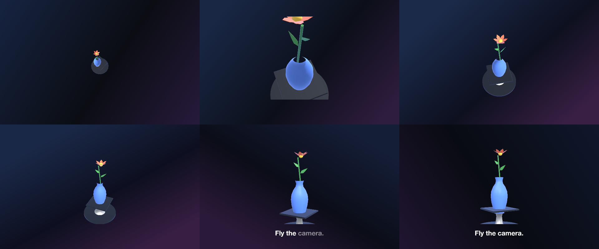

# 35 Spiral In

The camera spirals down a helix onto the stand with its gaze pinned to the vase, which flew in on an arc of its own — routes in the stage, the 3D twin of the motion path, on the camera and on a member.

*1440×900, 10 s.* Part of [the demos](../../demo.md): a fresh agent, the media and the prompt below, the public skill and the headless MCP, nothing else.

## Resources given to the agent

*None — the prompt carries the text.*

## The prompt

> Make a 10-second piece on a 1440×900 canvas: a background whose linear gradient drifts on three eased keyframes (16233F / 0B0D12 / 241A3A corner to corner at 0 s; 1B2A4A / 0D1020 / 3A1F44 from [0.3,0] to [0.8,1] at 5 s; 10162A / 090B12 / 1F1530 from [1,0] to [0,1] at 10 s) and the studio scene environment; ONE layer of kind 'stage' named 'Bench', placed 600 px tall in the centre (offset 30 px up), with a key light at yaw 40, pitch 40, intensity 1.4. Two PATH resources with a ROUTE: 'Helix' — 49 smooth points of a three-turn helix, from radius 0.32 at height 1.0 winding down to radius 0.2 at height 0 — and 'Arc' — three smooth points [0,0,0], [0.5,0.45,0.15], [1,0,0]. The stage's camera keyframes: at 0 s yaw -160, pitch 50, distance 3.8, fov 30, target the point [0,1.5,0]; at 7 s yaw 20, pitch 6, distance 3.1, fov 30, with a motionPath naming the Helix route and target the point [0,1.6,0] (7 s, "easing": "smooth") so the camera spirals down onto the stand looking at the vase and its flower; at 9.6 s yaw 60, pitch 10, distance 3.4 with a motionPath naming the Arc route and target the point [0,1.4,0] (2.6 s, "easing": "smooth") as the light moves to yaw 70, pitch 30. Members: a STAND that is a model resource with no file and a PARTS recipe — a Base cylinder (radius 0.95, height 0.08, at y 0.04), a Stem lathe (profile [[0.32,0.08],[0.16,0.2],[0.12,0.5],[0.16,0.7],[0.36,0.78],[0,0.78]]) and a Plate box (size [1.2,0.06,1.2], radius 0.03, at y 0.81) — painted dark 1E2430 on Base and Plate (roughness 0.85 / 0.8) and chrome D2D6DC on the Stem (metallic 1, roughness 0.2), offset 0.45 down; and a VASE that is a model resource with no file and a PARTS recipe of one lathe (slot Body, profile [[0.18,0.75],[0.14,0.62],[0.16,0.5],[0.26,0.35],[0.34,0.15],[0.36,-0.05],[0.33,-0.3],[0.26,-0.55],[0.2,-0.7],[0.22,-0.75],[0,-0.75]], 48 segments) painted @accent (metallic 0.1, roughness 0.2), which arrives along the Arc route from stageOffset [2.4,1.4] at depth 0.6 to [0,0.9] at depth 0 by 1.6 s (ease out), turning from a yaw of -60 to 20; a FLOWER that is a model resource with no file and a PARTS recipe riding in the vase on the same arc, offsets and turn — a Stem cylinder (radius 0.025, height 1.7, 24 segments, at [0.02,0.85,0], rotation [0,0,6]), two Leaf extrusions of the path [[0,0],[0.18,0.25],[0.12,0.6],[0,1],[-0.12,0.6],[-0.18,0.25]] (depth 0.012; one scale 0.36 at [0.04,1.05,0] rotation [0,20,-55], one scale 0.3 at [-0.02,1.3,0.02] rotation [0,-160,50]), a Heart sphere (radius 0.09, at [0.06,1.76,0]) and six Petal extrusions of the path [[0,0],[0.22,0.3],[0.2,0.7],[0,1],[-0.2,0.7],[-0.22,0.3]] (depth 0.014, scale 0.34, at [0.06,1.72,0], rotation [-58, k×60, 0] for k 0…5) — painted Stem 3E8E4A (roughness 0.6), Leaf 4CA35A (roughness 0.55), Petal FF7A59 (roughness 0.45), Heart FFD54A (roughness 0.5); and from 7.2 s along the bottom a bold caption 'Fly the camera.' that fades in word by word.
> 
> Text to use, in order:
> - Fly the camera.

## What the agent made

Score **100%** (21 of 21 rubric checks).

| the agent's work | |
|---|---|
| turns | 30 |
| wall time | 4 min 16 s (API 4 min 12 s) |
| cost at API list price | $2.60 — on a Claude subscription this is plan usage, not a bill |
| tokens in | 2.5M (2.5M cache read, 83k cache write) |
| tokens out | 21k (7k thinking) |
| claude-haiku-4-5 | 2k in, 15 out, $0.00 |
| claude-opus-5 | 2.5M in, 21k out, $2.59 |

| MCP tool | calls | time |
|---|---|---|
| promo_render_video | 1 | 2 s |
| promo_render_frames | 1 | 0 s |
| promo_validate | 1 | 0 s |
| promo_inspect | 1 | 0 s |
| promo_schema_types | 1 | 0 s |
| promo_schema | 1 | 0 s |
| promo_schema_full | 1 | 0 s |
| **all** | 7 | 2 s |

Six moments:

**[▶ Watch the video](https://github.com/garalex/promoshot/raw/demo-media/35-spiral-in.mp4)** (1280 wide, 1.0 MB) · [small copy](35-spiral-in/result.mp4) · [the project it wrote](35-spiral-in/result-metadata.json)

| check | | detail |
|---|---|---|
| canvas | ✓ | [1440, 900] vs [1440, 900] |
| duration | ✓ | 10.0s vs 10.0s |
| kind:background | ✓ | 1 vs 1 |
| kind:stage | ✓ | 1 vs 1 |
| kind:caption | ✓ | 1 vs 1 |
| feature:motionPath | ✓ | True |
| feature:gradient | ✓ | True |
| feature:reveal | ✓ | True |
| feature:stage | ✓ | True |
| feature:stageLayer | ✓ | True |
| feature:model | ✓ | True |
| feature:camera | ✓ | True |
| feature:materials | ✓ | True |
| feature:finish | ✓ | True |
| feature:route | ✓ | True |
| feature:cameraRoute | ✓ | True |
| feature:cameraTarget | ✓ | True |
| feature:memberRoute | ✓ | True |
| feature:environment | ✓ | True |
| feature:partsBody | ✓ | True |
| phrases | ✓ | 1 of 1 lines recognisable |

## The hand-built reference, same moments

---

[← all demos](../../demo.md) · [how the suite works](../../demos/README.md)
