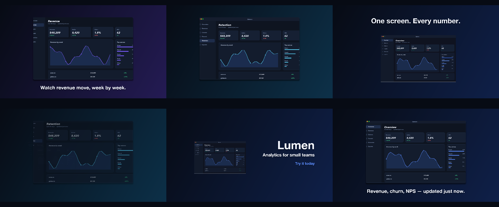

# C1 Launch video

Lumen is an analytics app for small teams.

*Any canvas, 20 to 30 s.* A **creative run**: a goal, the material and the tools, nothing about how. Part of [the demos](../../demo.md): a fresh agent, the media and the prompt below, the public skill and the headless MCP, nothing else.

## Resources given to the agent

 
 
 
 
 
 
`green_lumen.mp4` ([file](../../demos/c1-launch-video/resources/green_lumen.mp4))

## The prompt

> Lumen is an analytics app for small teams. Here are five screenshots — three of Lumen, and one each of two sibling apps from the same suite, Pulse and Verse, which you may use or leave out — and a short clip of the Lumen window drifting over a green screen. Make a launch video, 20 to 30 seconds, landscape, that makes someone want to try it. Everything else is your call: pacing, words, motion, looks.
> 
> Files in `resources/`: ui_lumen_1.png, ui_lumen_2.png, ui_lumen_5.png, ui_pulse_1.png, ui_verse_1.png, green_lumen.mp4.

## What the agent made

Score **100%** (8 of 8 rubric checks).

| the agent's work | |
|---|---|
| turns | 44 |
| wall time | 6 min 46 s (API 6 min 36 s) |
| cost at API list price | $2.55 — on a Claude subscription this is plan usage, not a bill |
| tokens in | 2.0M (1.9M cache read, 85k cache write) |
| tokens out | 30k (17k thinking) |
| claude-haiku-4-5 | 1k in, 13 out, $0.00 |
| claude-opus-5 | 2.0M in, 30k out, $2.55 |

| MCP tool | calls | time |
|---|---|---|
| promo_render_video | 1 | 8 s |
| promo_render_frames | 3 | 1 s |
| promo_inspect | 1 | 0 s |
| promo_media_filmstrip | 1 | 0 s |
| promo_media_probe | 2 | 0 s |
| promo_validate | 2 | 0 s |
| promo_schema | 1 | 0 s |
| promo_workspace | 1 | 0 s |
| promo_schema_full | 1 | 0 s |
| **all** | 13 | 9 s |

Six moments:

**[▶ Watch the video](https://github.com/garalex/promoshot/raw/demo-media/c1-launch-video.mp4)** (1280 wide, 1.9 MB) · [small copy](c1-launch-video/result.mp4) · [the project it wrote](c1-launch-video/result-metadata.json)

What it reached for on its own: chromaKey, viewport, gradient, transitions, mediaCuts, motionBlur.

The agent's own notes:

> Done. `out.promo/Exports/export.mp4` — 1920×1080, 26.0s, 30 fps.
> 
> **One thing you should know:** only three of the five screenshots are Lumen. `ui_pulse_1.png` is a fitness app called Pulse (activity rings, steps, sleep) and `ui_verse_1.png` is a writing app called Verse (drafts, prose, an editing suggestion). Different products, different chrome, different titlebars. I left them out — dropping a fitness dashboard into a Lumen launch video is the fastest way to make the whole thing look untrustworthy. If they were meant to be Lumen views, they need re-capturing.
> 
> The green-screen clip isn't a presenter either — it's the Lumen Overview window drifting on green. That turned out to be more useful than a presenter would have been: chroma-keyed, it's a free-floating hero window.
> 
> **The cut (26s)**
> 
> | Time | |
> |---|---|
> | 0.0–3.6 | Keyed window floats and pushes in on a gradient ground. *"One screen. Every number."* |
> | 3.3–9.9 | Dissolves into the **Overview** shot, slow Ken Burns push. *"Revenue, churn, NPS — updated just now."* |
> | 9.4–15.5 | **Revenue** slides up from below with motion blur, pulling back out of a zoom. *"Watch revenue move, week by week."* |
> | 14.9–20.6 | **Retention** slides up, pushing in. *"See exactly who stays."* |
> | 20.3–26.0 | Split close card: keyed window drifting at half speed on the left, **Lumen** / *Analytics for small teams* / *Try it today* on the right. |
> 
> Choices worth calling out:
> 
> - **The slide-up between shots mirrors the sidebar.** Overview → Revenue → Retention is top-to-bottom in Lumen's own nav, so pushing each new panel up from the bottom reads as moving down the list rather than as a generic wipe.
> - **The background follows each shot's accent** — blue, violet, cyan, back to blue — on an eased gradient ramp. The shots are near-bla

| check | | detail |
|---|---|---|
| valid | ✓ | promo validate |
| rendered | ✓ | an mp4 in Exports/ |
| length | ✓ | 26.0s, asked 20–30s |
| uses:ui_lumen_1.png | ✓ | referenced by a resource |
| uses:green_lumen.mp4 | ✓ | referenced by a resource |
| vocabulary | ✓ | 6 features: chromaKey, viewport, gradient, transitions, mediaCuts, motionBlur |
| words | ✓ | 7 captions |
| layers | ✓ | 13 layers |

---

[← all demos](../../demo.md) · [how the suite works](../../demos/README.md)
