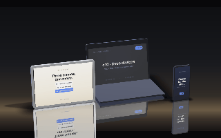
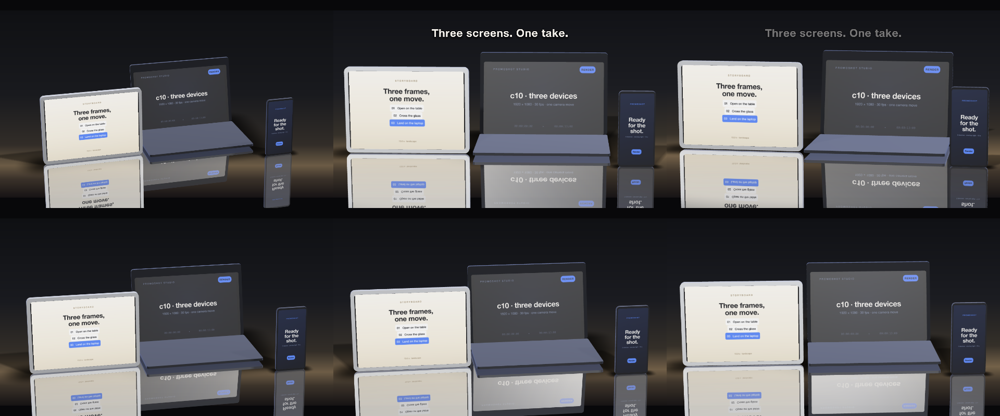

# C10 Three devices, no files

The three-device scene of C9 from a two-line brief and no media at all: does a fresh agent, given only the skill, reach for device bodies, finish words, a floor, an environment and a keyed light — and make its own screens?

*Any canvas, 9 to 16 s.* A **creative run**: a goal, the material and the tools, nothing about how. Part of [the demos](../../demo.md): a fresh agent, the media and the prompt below, the public skill and the headless MCP, nothing else.

## Resources given to the agent

*None — the prompt carries the text.*

## The prompt

> No media. Three devices — a phone, a tablet and a laptop — together on a polished table under studio light, glass on every screen and something of your own showing on each, one camera move through the scene, ten to fifteen seconds, landscape. Make it look real: the table reflects them, they cast shadows, the light catches the glass. Whatever you need beyond what the format gives you, make yourself.

## What the agent made

Score **100%** (6 of 6 rubric checks).

| the agent's work | |
|---|---|
| turns | 77 |
| wall time | 13 min 02 s (API 12 min 42 s) |
| cost at API list price | $5.59 — on a Claude subscription this is plan usage, not a bill |
| tokens in | 5.6M (5.4M cache read, 150k cache write) |
| tokens out | 55k (28k thinking) |
| claude-opus-5 | 5.6M in, 55k out, $5.59 |

| MCP tool | calls | time |
|---|---|---|
| promo_render_video | 1 | 15 s |
| promo_render_frames | 4 | 1 s |
| promo_render_still | 6 | 1 s |
| promo_validate | 2 | 0 s |
| promo_inspect | 1 | 0 s |
| promo_schema | 1 | 0 s |
| promo_workspace | 1 | 0 s |
| promo_schema_full | 2 | 0 s |
| **all** | 18 | 17 s |

Six moments:

**[▶ Watch the video](https://github.com/garalex/promoshot/raw/demo-media/c10-three-devices.mp4)** (1280 wide, 1.4 MB) · [small copy](c10-three-devices/result.mp4) · [the project it wrote](c10-three-devices/result-metadata.json)

What it reached for on its own: composition, effects, gradient, stage, stageLayer, model, camera, materials, finishWord, floor, device, light, environment.

The agent's own notes:

> Done — `out.promo` is written, validated, inspected, and rendered.
> 
> **`Exports/export.mp4`** — 1920×1080, 390 frames @ 30 fps (13.0 s), landscape.
> 
> **What's in it.** `resources/` was empty, so nothing in the shot is imported media — the whole scene is built out of the format:
> 
> - **The three devices** are generated model bodies (`recipe: {"device": {"kind": "phone" | "tablet" | "laptop"}}`), standing together in one `stage` layer through one camera and one depth buffer, arranged by `stageOffset`/`depth` — tablet left, laptop centre-back, phone front-right.
> - **The screens** are three nested `composition` resources bound to each body's `Screen` slot, so each device is genuinely showing something of its own: a phone app screen, a landscape storyboard, and an editor window. They're built from background gradients and captions (the plated captions do the chips and buttons), and they play on the layer's clock.
> - **Glass** is `"finish": "glass"` on every `Screen` slot, `"anodized"` on the bodies, under a `studio` environment — that's what puts the key light's glance across each screen.
> - **The table** is `"floor": "mirror"` on the stage — it gives the reflections and the contact shadows — over a background layer whose vertical gradient paints the warm horizon the light pools on, with a vignette and a little grain.
> - **One camera move**: four keyframes with `smooth` easing so the speed carries through rather than stopping at each one — yaw −18° → +10°, pitch 21° → 8°, dolly 4.9 → 4.2 radii — while the key light swings the opposite way, so the highlight travels across the glass as the camera crosses it. One title lands at 8.4 s and clears before the end.
> 
> **What I changed after looking.** Three passes on the contact sheets fixed real problems: the tablet body is landscape and my

| check | | detail |
|---|---|---|
| valid | ✓ | promo validate |
| rendered | ✓ | an mp4 in Exports/ |
| length | ✓ | 13.0s, asked 9–16s |
| vocabulary | ✓ | 13 features: composition, effects, gradient, stage, stageLayer, model, camera, materials, finishWord, floor, device, light, environment |
| words | ✓ | 16 captions |
| layers | ✓ | 3 layers |

---

[← all demos](../../demo.md) · [how the suite works](../../demos/README.md)
