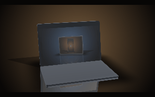
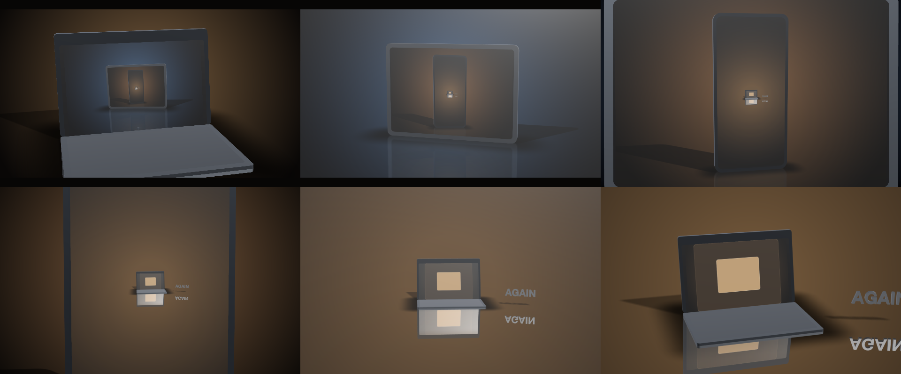

# C11 Through the screens, no files

A laptop whose screen shows a tablet whose screen shows a phone, and a camera that flies into each screen and on into the next — from a two-line brief and no media. Does a fresh agent, given only the skill, find compositions on screens and a flight that lands on the picture?

*Any canvas, 18 to 32 s.* A **creative run**: a goal, the material and the tools, nothing about how. Part of [the demos](../../demo.md): a fresh agent, the media and the prompt below, the public skill and the headless MCP, nothing else.

## Resources given to the agent

*None — the prompt carries the text.*

## The prompt

> No media. A laptop on a polished table under studio light; on its glass screen, a tablet on a table of its own; on the tablet's screen, a phone; on the phone's screen, something of yours. The camera flies into each screen in turn — the picture on the screen becomes the whole frame and the flight carries on into the next — one continuous movement, twenty to thirty seconds, landscape. Make it look real: reflections, shadows, the light catching the glass. Whatever you need beyond what the format gives you, make yourself.

## What the agent made

Score **83%** (5 of 6 rubric checks).

| the agent's work | |
|---|---|
| turns | 139 |
| wall time | 41 min 10 s (API 39 min 17 s) |
| cost at API list price | $18.66 — on a Claude subscription this is plan usage, not a bill |
| tokens in | 23.9M (23.6M cache read, 274k cache write) |
| tokens out | 164k (114k thinking) |
| claude-opus-5 | 23.9M in, 164k out, $18.66 |

| MCP tool | calls | time |
|---|---|---|
| promo_render_video | 1 | 1 min 16 s |
| promo_render_frames | 21 | 14 s |
| promo_render_still | 15 | 2 s |
| promo_validate | 4 | 0 s |
| promo_inspect | 1 | 0 s |
| promo_schema | 1 | 0 s |
| promo_schema_full | 3 | 0 s |
| promo_workspace | 1 | 0 s |
| **all** | 47 | 1 min 32 s |

Six moments:

**[▶ Watch the video](https://github.com/garalex/promoshot/raw/demo-media/c11-through-the-screens.mp4)** (1280 wide, 1.6 MB) · [small copy](c11-through-the-screens/result.mp4) · [the project it wrote](c11-through-the-screens/result-metadata.json)

What it reached for on its own: composition, gradient, stage, stageLayer, model, camera, materials, finishWord, floor, device, light, cameraTarget, textBody, environment.

The agent's own notes:

> Done. **`out.promo`** is written, validates clean, and the video is rendered.
> 
> **The piece** — 26.4s, 1920×1080, one continuous flight:
> 
> | | |
> |---|---|
> | 0–7.1s | a laptop on a polished table, studio key, mirrored floor — flying into its glass |
> | 7.1–12.4s | on the laptop's screen, a tablet on a cooler table of its own |
> | 12.4–21.0s | on the tablet's screen, a phone |
> | 21.0–26.4s | on the phone's screen: the same warm table, the same laptop, and the word **AGAIN** standing on it in chrome — the ring closes on the opening frame, held for the last beat |
> 
> **How the seams work.** Each level is a `stage` layer — a device recipe body on a `mirror`/`satin` floor under a `studio` environment, screen bound with `finish: "glass"` so the key light glances off it. The whole flight is one exponential zoom on a single clock (rate eased in over 1.6s, held, eased to rest at 26s). Each level's camera carries it until that screen exactly covers the frame; then a flat copy of the same nested composition — held on the project clock from t=0, so it is on exactly the frame the screen was showing — dissolves in over 0.35s at the identical rect, and the next level's camera picks up at the same rate. Composite zoom rate is continuous across every handoff; the only thing that changes is the glare lifting off the glass as you pass through it.
> 
> **Getting there needed measurement, not guessing.** I calibrated each device by binding a magenta composition to its Screen slot and measuring the rect: `widthPx = A/(distance − s)`, with `A` scaling as `1/tan(fov/2)` and with canvas *height* (fov is vertical — confirmed to 0.03%). Two things the model got wrong, both caught by rendering:
> 
> - Screens are rounded rects and the fitted `A` carries ~1–5% error, so each screen is driven 4.5–17% past exact co

| check | | detail |
|---|---|---|
| valid | ✓ | promo validate |
| rendered | ✓ | an mp4 in Exports/ |
| length | ✓ | 26.4s, asked 18–32s |
| vocabulary | ✓ | 14 features: composition, gradient, stage, stageLayer, model, camera, materials, finishWord, floor, device, light, cameraTarget, textBody, environment |
| words | ✗ | 0 captions |
| layers | ✓ | 3 layers |

---

[← all demos](../../demo.md) · [how the suite works](../../demos/README.md)
