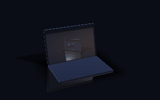
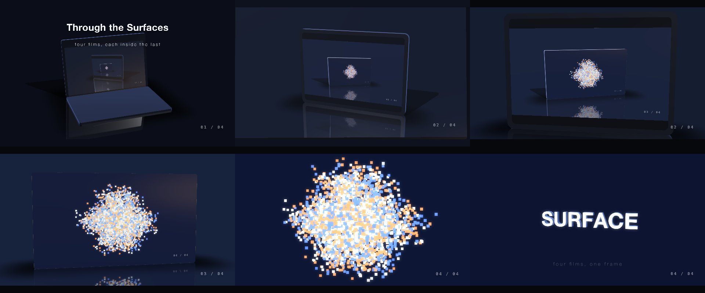

# C12 Through the surfaces, no files

A composition as the texture on a surface, three or four levels deep, each level its own film, and a maximum close-up on the surface as the whole transition — from a short brief and no media. The hand-built reference on the page does the same thing with no measurement at all.

*Any canvas, 18 to 32 s.* A **creative run**: a goal, the material and the tools, nothing about how. Part of [the demos](../../demo.md): a fresh agent, the media and the prompt below, the public skill and the headless MCP, nothing else.

## Resources given to the agent

*None — the prompt carries the text.*

## The prompt

> No media. Use a composition as the texture on a surface, three or four levels deep: a scene whose device screen shows another composition, whose surface shows another, and so on, down to a movie of your own that plays for the whole length. Each level is its own film with its own camera. To pass from one level into the next, take the camera to a maximum close-up on that surface and switch to the composition it shows — the close-up is the illusion of the transition. Twenty to thirty seconds, landscape, on a polished table under studio light with glass on the screens.

## What the agent made

Score **100%** (6 of 6 rubric checks).

| the agent's work | |
|---|---|
| turns | 94 |
| wall time | 28 min 10 s (API 27 min 17 s) |
| cost at API list price | $11.42 — on a Claude subscription this is plan usage, not a bill |
| tokens in | 12.9M (12.6M cache read, 223k cache write) |
| tokens out | 115k (65k thinking) |
| claude-opus-5 | 12.9M in, 115k out, $11.42 |

| MCP tool | calls | time |
|---|---|---|
| promo_render_video | 1 | 36 s |
| promo_render_frames | 16 | 8 s |
| promo_render_still | 3 | 0 s |
| promo_validate | 4 | 0 s |
| promo_inspect | 1 | 0 s |
| promo_schema_types | 1 | 0 s |
| promo_schema | 1 | 0 s |
| promo_workspace | 1 | 0 s |
| promo_schema_full | 4 | 0 s |
| **all** | 32 | 45 s |

Six moments:

**[▶ Watch the video](https://github.com/garalex/promoshot/raw/demo-media/c12-through-the-surfaces.mp4)** (1280 wide, 4.1 MB) · [small copy](c12-through-the-surfaces/result.mp4) · [the project it wrote](c12-through-the-surfaces/result-metadata.json)

What it reached for on its own: chapters, markers, composition, stage, stageLayer, model, camera, materials, finish, finishWord, floor, device, light, morph, cameraTarget, facedBox, textBody, environment, particles, partsBody, mediaCuts.

The agent's own notes:

> **`out.promo` is built, validated, inspected, and rendered.** `Exports/export.mp4` — 1920×1080, 26.0 s, 780 frames, 12 MB. `Resources/` is empty: nothing in the piece comes from a file.
> 
> **Four films, each on a surface in the one above**
> 
> | | level | surface it wears | camera |
> |---|---|---|---|
> | 0.0–6.6 | a laptop on the polished table | its `Screen` → level two | fov 20, d 6.24 → 1.45 |
> | 6.6–13.1 | a tablet on the table | its `Screen` → level three | fov 26, d 6.62 → 1.82 |
> | 13.1–19.3 | a slab — a faced box, surface and nothing else | its front face → level four | fov 24, d 7.00 → 2.20 |
> | 19.3–26.0 | the cloud: a cube bursts into 4 200 points that drift and gather into the word SURFACE | — | slow orbit, d 3.4 → 1.5 |
> 
> `promo_inspect` confirms the recursion: each composition is *placed by 1 layer, on 1 slot* — once worn on the surface above, once full-frame after the cut.
> 
> All four run one shared 26-second clock, so level four is genuinely playing from frame one — you can see it as a speck three screens deep at t=0.5, and the descent arrives just in time to watch it gather. Each descent is a `mediaCut` that starts the incoming composition at the exact second the surface was showing; it enters at the 7% overfill it had on the glass and settles to full frame over 1.2 s, so the close-up carries through the cut. A depth gauge (`01 / 04` … `04 / 04`) sits in each film's own corner and clears before the next fills the frame.
> 
> **Three things I had to measure, because nothing reports them**
> 
> - Camera distance **clamps at ≈1.046 bounds radii** — a laptop can't be made to fill the frame by moving closer, so each level's close-up is set by `fov` instead. The law `distance = A(fov)/widthPx + s` (with `A(fov) = A32·tan16°/tan(fov/2)`, verified to 4 s.f.) put every dive on its m

| check | | detail |
|---|---|---|
| valid | ✓ | promo validate |
| rendered | ✓ | an mp4 in Exports/ |
| length | ✓ | 26.0s, asked 18–32s |
| vocabulary | ✓ | 21 features: chapters, markers, composition, stage, stageLayer, model, camera, materials, finish, finishWord, floor, device, light, morph, cameraTarget, facedBox, textBody, environment, particles, partsBody, mediaCuts |
| words | ✓ | 7 captions |
| layers | ✓ | 6 layers |

## The hand-built reference, same moments

---

[← all demos](../../demo.md) · [how the suite works](../../demos/README.md)
