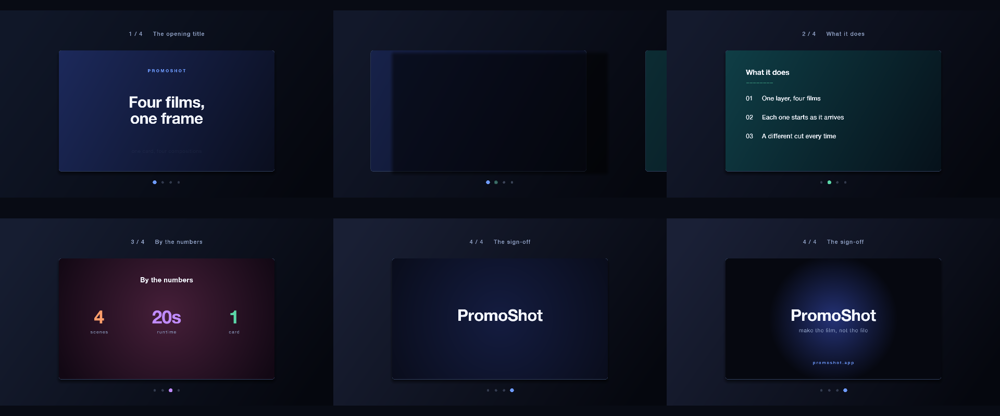
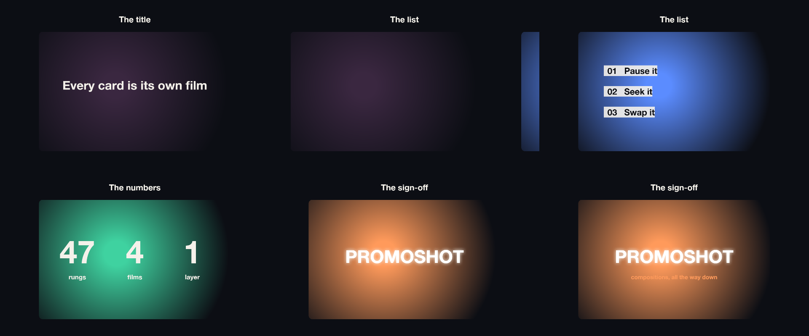

# C13 A carousel of films, no files

Four scenes as compositions in one card-shaped rectangle on a flat canvas, each its own film starting as it arrives, a different cut between each — from a short brief and no media. Does a fresh agent find the one-layer carousel: a swap keyframe per card with its transition and a fresh start?

*Any canvas, 14 to 26 s.* A **creative run**: a goal, the material and the tools, nothing about how. Part of [the demos](../../demo.md): a fresh agent, the media and the prompt below, the public skill and the headless MCP, nothing else.

## Resources given to the agent

*None — the prompt carries the text.*

## The prompt

> No media, no 3D. Four short scenes, each its own composition with its own motion — a title, a list, some numbers, a sign-off — shown one after another in one card-shaped rectangle on a flat canvas, like a carousel: each scene starts as it arrives, and a different cut between each pair — a push, a wipe, a dissolve, whatever reads well. A line above the card says which scene is up. Fifteen to twenty-five seconds, landscape.

## What the agent made

Score **100%** (6 of 6 rubric checks).

| the agent's work | |
|---|---|
| turns | 20 |
| wall time | 6 min 02 s (API 5 min 55 s) |
| cost at API list price | $2.20 — on a Claude subscription this is plan usage, not a bill |
| tokens in | 1.4M (1.3M cache read, 80k cache write) |
| tokens out | 30k (15k thinking) |
| claude-opus-5 | 1.4M in, 30k out, $2.20 |

| MCP tool | calls | time |
|---|---|---|
| promo_render_video | 1 | 5 s |
| promo_render_frames | 1 | 0 s |
| promo_validate | 1 | 0 s |
| promo_inspect | 1 | 0 s |
| promo_explain | 1 | 0 s |
| promo_schema | 1 | 0 s |
| promo_schema_full | 2 | 0 s |
| promo_workspace | 1 | 0 s |
| **all** | 9 | 5 s |

Six moments:

**[▶ Watch the video](https://github.com/garalex/promoshot/raw/demo-media/c13-carousel-of-films.mp4)** (1280 wide, 0.9 MB) · [small copy](c13-carousel-of-films/result.mp4) · [the project it wrote](c13-carousel-of-films/result-metadata.json)

What it reached for on its own: composition, gradient, swaps, transitions.

The agent's own notes:

> Done. `out.promo` is written, validated, inspected, sampled and rendered.
> 
> **`Exports/export.mp4`** — 1920×1080, 20.5 s, 615 frames @ 30 fps, 2.2 MB.
> 
> **How it's built.** `Resources/` is empty because the piece needs no media — every scene is a **composition resource** (1280×720, card-shaped), drawn entirely from gradients and type.
> 
> - **Scene 1 — The opening title**: kicker, "Four films, / one frame" arriving word-by-word on a rise reveal, subtitle under it, over a drifting blue gradient.
> - **Scene 2 — What it does**: a title, a rule, three numbered rows sliding in from the left 0.4 s apart, teal.
> - **Scene 3 — By the numbers**: `4 / 20s / 1` scaling up from 62 pt to 108 pt on eased `fontSize` tracks, staggered, with labels fading in behind them, magenta radial.
> - **Scene 4 — The sign-off**: the wordmark assembling character-by-character, tagline, URL, over a radial that closes in.
> 
> **The carousel is one video layer.** `card` starts on scene 1 and takes over the other three with swap keyframes at 5 / 10 / 15 s, each carrying `sourceTime: 0` — that's what makes a scene start from its own beginning as it arrives rather than being sampled at wherever the main timeline already stands. `promo_explain` at 15.2 s confirms it: `showing: compD`, and scene 4's tagline is still fading in a second and a half later, which only happens on a restarted clock.
> 
> **Three different cuts**, one per pair: a **push** from the right (0.7 s) into scene 2, a **wipe** from the left (0.6 s) into scene 3, a **dissolve** (0.8 s) into scene 4.
> 
> **Around the card**: the line above it changes with each scene (four caption layers with lives strictly clear of each other, so no two headlines ever cross-fade), and four carousel dots below it — one drawing resource per position, swapped on a single drawing

| check | | detail |
|---|---|---|
| valid | ✓ | promo validate |
| rendered | ✓ | an mp4 in Exports/ |
| length | ✓ | 20.5s, asked 14–26s |
| vocabulary | ✓ | 4 features: composition, gradient, swaps, transitions |
| words | ✓ | 22 captions |
| layers | ✓ | 7 layers |

## The hand-built reference, same moments

---

[← all demos](../../demo.md) · [how the suite works](../../demos/README.md)
