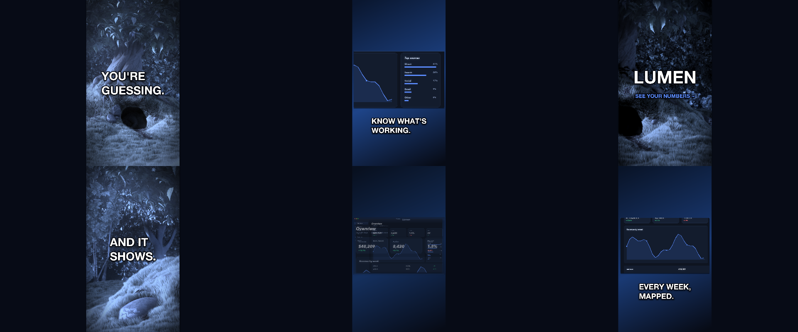

# C2 Social teaser

This is a screen recording and one screenshot from the same app.

*Any canvas, 12 to 18 s.* A **creative run**: a goal, the material and the tools, nothing about how. Part of [the demos](../../demo.md): a fresh agent, the media and the prompt below, the public skill and the headless MCP, nothing else.

## Resources given to the agent

 
`bbb_test.mp4` ([file](../../demos/_media/bbb_test.mp4))
 

## The prompt

> This is a screen recording and one screenshot from the same app. Make a 15-second vertical teaser for social media — the kind that stops a thumb. Loud is fine. Your choice of words, cuts and effects.
> 
> Files in `resources/`: bbb_test.mp4, ui_lumen_1.png.

## What the agent made

Score **100%** (7 of 7 rubric checks).

| the agent's work | |
|---|---|
| turns | 49 |
| wall time | 10 min 35 s (API 10 min 09 s) |
| cost at API list price | $3.70 — on a Claude subscription this is plan usage, not a bill |
| tokens in | 3.2M (3.1M cache read, 102k cache write) |
| tokens out | 45k (28k thinking) |
| claude-haiku-4-5 | 1k in, 15 out, $0.00 |
| claude-opus-5 | 3.2M in, 45k out, $3.70 |

| MCP tool | calls | time |
|---|---|---|
| promo_render_video | 1 | 13 s |
| promo_render_frames | 4 | 11 s |
| promo_media_filmstrip | 2 | 1 s |
| promo_inspect | 1 | 0 s |
| promo_media_probe | 2 | 0 s |
| promo_validate | 2 | 0 s |
| promo_schema | 1 | 0 s |
| promo_workspace | 1 | 0 s |
| promo_schema_full | 1 | 0 s |
| **all** | 15 | 25 s |

Six moments:

**[▶ Watch the video](https://github.com/garalex/promoshot/raw/demo-media/c2-social-teaser.mp4)** (1280 wide, 7.3 MB) · [small copy](c2-social-teaser/result.mp4) · [the project it wrote](c2-social-teaser/result-metadata.json)

What it reached for on its own: effects, viewport, gradient, transitions, mediaCuts, motionBlur, grade.

The agent's own notes:

> Done. The teaser is rendered.
> 
> **`out.promo/Exports/lumen-teaser-15s-vertical.mp4`** — 1080×1920, 15.0s, 30fps, 450 frames.
> 
> **What I made of the material:** the recording is nature b-roll (10s, static camera, no audio track); the screenshot is a dark-navy "Lumen" analytics dashboard. So the b-roll became the graded emotional hook and the screenshot became the product proof, cut together on a cool blue-steel palette pulled from the UI itself.
> 
> **The cut:**
> 
> | Time | Beat |
> |---|---|
> | 0.0 | Zoom-punch open on graded b-roll — **"YOU'RE GUESSING."** (word-by-word scale-on) |
> | 2.3 | **Glitch cut** to a new crop — **"AND IT SHOWS."** |
> | 4.2 | **White flash** + accent flare on the background → dashboard slams in, **"THIS IS LUMEN"** |
> | 6.3 | Hard cut, punch-in on the KPI row — **"REVENUE. LIVE."** ($48,209 · +12.4%) |
> | 8.4 | Hard cut to the revenue chart — **"EVERY WEEK, MAPPED."** |
> | 10.4 | Hard cut to Top sources — **"KNOW WHAT'S WORKING."** (Direct 41%) |
> | 12.3 | Flash to outro b-roll — **LUMEN** scales in, **SEE YOUR NUMBERS →** |
> 
> Craft notes: the three product beats are one image layer driven by `viewport` jumps, each with its own eased push so every cut re-accelerates; footage carries a duotone grade (`@highlight` gel, sat 0.1, contrast 1.3) plus vignette and grain; every layer that moves has a 180° shutter. Captions are plate-less with a 9px outline and shadow so they hold over bright footage. Copy is tied to what's actually on screen — no claim the picture doesn't support.
> 
> Validated clean (`ok — nothing the renderer would quietly correct`), inspect reports 13/13 renderable, 2 resources, no undefined colours. I checked framing at every beat with contact-sheet renders and corrected two things: the KPI crop was clipping the $48,209 headline number, and the chart

| check | | detail |
|---|---|---|
| valid | ✓ | promo validate |
| rendered | ✓ | an mp4 in Exports/ |
| length | ✓ | 15.0s, asked 12–18s |
| uses:bbb_test.mp4 | ✓ | referenced by a resource |
| vocabulary | ✓ | 7 features: effects, viewport, gradient, transitions, mediaCuts, motionBlur, grade |
| words | ✓ | 8 captions |
| layers | ✓ | 13 layers |

---

[← all demos](../../demo.md) · [how the suite works](../../demos/README.md)
