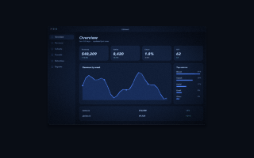
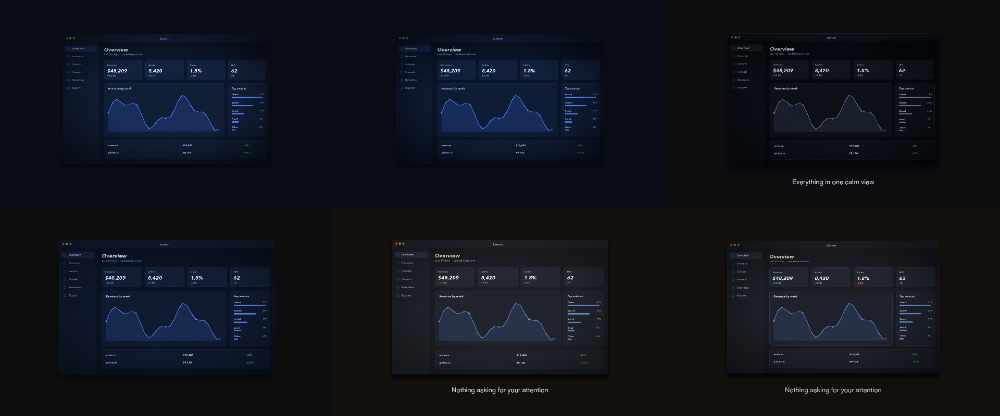

# C3 Mood piece

One screenshot and three colour looks in.

*Any canvas, 10 to 14 s.* A **creative run**: a goal, the material and the tools, nothing about how. Part of [the demos](../../demo.md): a fresh agent, the media and the prompt below, the public skill and the headless MCP, nothing else.

## Resources given to the agent

 
`look_warm.cube` ([file](c3-mood-piece/resources/look_warm.cube))
`look_cool.cube` ([file](c3-mood-piece/resources/look_cool.cube))
`look_mono.cube` ([file](c3-mood-piece/resources/look_mono.cube))

## The prompt

> One screenshot and three colour looks in .cube files. Make a 12-second piece about focus and calm — something a person would happily watch loop on a landing page. No brief beyond that.
> 
> Files in `resources/`: ui_lumen_1.png, look_warm.cube, look_cool.cube, look_mono.cube.

## What the agent made

Score **100%** (7 of 7 rubric checks).

| the agent's work | |
|---|---|
| turns | 42 |
| wall time | 6 min 22 s (API 6 min 18 s) |
| cost at API list price | $2.17 — on a Claude subscription this is plan usage, not a bill |
| tokens in | 1.7M (1.7M cache read, 68k cache write) |
| tokens out | 27k (17k thinking) |
| claude-haiku-4-5 | 1k in, 14 out, $0.00 |
| claude-opus-5 | 1.7M in, 27k out, $2.17 |

| MCP tool | calls | time |
|---|---|---|
| promo_render_video | 1 | 3 s |
| promo_render_frames | 2 | 0 s |
| promo_media_probe | 2 | 0 s |
| promo_render_still | 1 | 0 s |
| promo_validate | 2 | 0 s |
| promo_inspect | 1 | 0 s |
| promo_schema | 1 | 0 s |
| promo_workspace | 1 | 0 s |
| **all** | 11 | 3 s |

Six moments:

**[▶ Watch the video](https://github.com/garalex/promoshot/raw/demo-media/c3-mood-piece.mp4)** (1280 wide, 1.0 MB) · [small copy](c3-mood-piece/result.mp4) · [the project it wrote](c3-mood-piece/result-metadata.json)

What it reached for on its own: lut, effects, grade.

The agent's own notes:

> **`out.promo/Exports/export.mp4`** — 1920×1080, 12.00s, 30fps. Validates clean; 6 of 6 layers renderable.
> 
> **The piece — "Quiet Hours"**
> 
> One idea: the dashboard breathes, and the three .cube looks are the phases of the breath.
> 
> - **0–1s** the frame arrives 4px soft and settles into focus; vignette wide, ground near-black blue.
> - **~3s** the *mono* look washes in to 58% — colour quietly drains out under "Everything in one calm view."
> - **~6s** the breath peaks: card grows 748→778px, vignette opens 0.55→0.34, colour back to *cool*.
> - **~8s** the *warm* look takes over fully, grounds lifting brown while the chart blue holds, under "Nothing asking for your attention." The background colour warms with it.
> - **11–12s** warm recedes, vignette closes, focus softens back to 4px.
> 
> **It loops seamlessly.** t=12 is pixel-identical to t=0 — same look (pure cool), same 748px height, same blur, same vignette, both washes at zero. No flash, no jump on repeat.
> 
> **The one technique worth knowing:** `lutAmount` isn't keyframable, so the three looks are three copies of the same image layer, each with its own LUT, all spanning the full 12s and sharing an *identical* placement/blur/vignette keyframe track. Only opacity differs between them. Because they're pixel-registered at every instant, cross-fading them dissolves colour rather than producing a double image — which is what you'd get from the more obvious approach of overlapping three shorter layers with their own camera moves.
> 
> Two smaller calls I made without asking: the warm layer carries a whisper of pre-LUT lift (`brightness` 0.035, `saturation` 1.06) because on a source this dark and blue the warm LUT alone barely separated from cool; and captions are 38pt unbold at 0.92 opacity rather than headline-sized, so the image stays the su

| check | | detail |
|---|---|---|
| valid | ✓ | promo validate |
| rendered | ✓ | an mp4 in Exports/ |
| length | ✓ | 12.0s, asked 10–14s |
| uses:ui_lumen_1.png | ✓ | referenced by a resource |
| vocabulary | ✓ | 3 features: lut, effects, grade |
| words | ✓ | 2 captions |
| layers | ✓ | 6 layers |

---

[← all demos](../../demo.md) · [how the suite works](../../demos/README.md)
