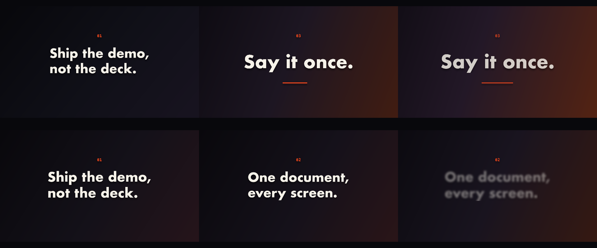

# C4 Manifesto

No media.

*Any canvas, 9 to 16 s.* A **creative run**: a goal, the material and the tools, nothing about how. Part of [the demos](../../demo.md): a fresh agent, the media and the prompt below, the public skill and the headless MCP, nothing else.

## Resources given to the agent

*None — the prompt carries the text.*

## The prompt

> No media. Three lines: 'Ship the demo, not the deck.' 'One document, every screen.' 'Say it once.' Make a striking 10-to-15-second typographic piece from them, any canvas you like.

## What the agent made

Score **83%** (5 of 6 rubric checks).

| the agent's work | |
|---|---|
| turns | 28 |
| wall time | 3 min 55 s (API 3 min 32 s) |
| cost at API list price | $1.66 — on a Claude subscription this is plan usage, not a bill |
| tokens in | 1.3M (1.2M cache read, 64k cache write) |
| tokens out | 17k (8k thinking) |
| claude-haiku-4-5 | 1k in, 15 out, $0.00 |
| claude-opus-5 | 1.3M in, 17k out, $1.66 |

| MCP tool | calls | time |
|---|---|---|
| promo_render_video | 1 | 20 s |
| promo_render_frames | 2 | 1 s |
| promo_validate | 2 | 0 s |
| promo_inspect | 1 | 0 s |
| promo_schema | 1 | 0 s |
| promo_schema_full | 1 | 0 s |
| **all** | 8 | 21 s |

Six moments:

**[▶ Watch the video](https://github.com/garalex/promoshot/raw/demo-media/c4-manifesto.mp4)** (1280 wide, 0.8 MB) · [small copy](c4-manifesto/result.mp4) · [the project it wrote](c4-manifesto/result-metadata.json)

What it reached for on its own: gradient, transitions.

The agent's own notes:

> Done — `out.promo/Exports/export.mp4`, 1920×1080 @ 60fps, 13.6s.
> 
> **The piece.** `resources/` was empty, so it's pure type on an animated ground — no media, nothing copied into `Resources/`.
> 
> - **Ground** — a three-stop linear gradient on the background layer, keyframed across four states with `easeInOut`. It starts near-black and cool, and warms through the piece until an ember bleeds in from the right corner under the last line. The axis drifts slightly too, so the light never sits still.
> - **Type** — Futura bold, warm off-white, with a soft drop shadow. Each line gets its own reveal so the three read as three different kinds of statement:
>   - `01 Ship the demo, / not the deck.` — word-by-word **rise**
>   - `02 One document, / every screen.` — character **wipe**, a typewriter at 28ms
>   - `03 Say it once.` — word **scale**, slower, and set much larger (164→178pt)
> - **Rhythm** — lines 1 and 2 leave on a `blurDissolve`, defocusing out rather than fading; line 3 holds to the end and gets an accent rule that wipes in beneath it. Every headline drifts a few points larger over its life, so nothing is ever static.
> - Small mono `01/02/03` kickers in the accent orange sit above each line, holding the manifesto structure.
> 
> Colours are a full eight-role palette (`@canvas`, `@text`, `@accent`, …), so re-skinning it is one array.
> 
> Validated clean (`ok — nothing the renderer would quietly correct`), inspected at 8/8 layers renderable, and checked against a contact sheet at `Exports/frames/` before the render — that's what caught the em-dash rule breaking into separate dashes (now heavy box-drawing glyphs, which tile into one continuous line).

| check | | detail |
|---|---|---|
| valid | ✓ | promo validate |
| rendered | ✓ | an mp4 in Exports/ |
| length | ✓ | 13.6s, asked 9–16s |
| vocabulary | ✗ | 2 features: gradient, transitions |
| words | ✓ | 7 captions |
| layers | ✓ | 8 layers |

---

[← all demos](../../demo.md) · [how the suite works](../../demos/README.md)
