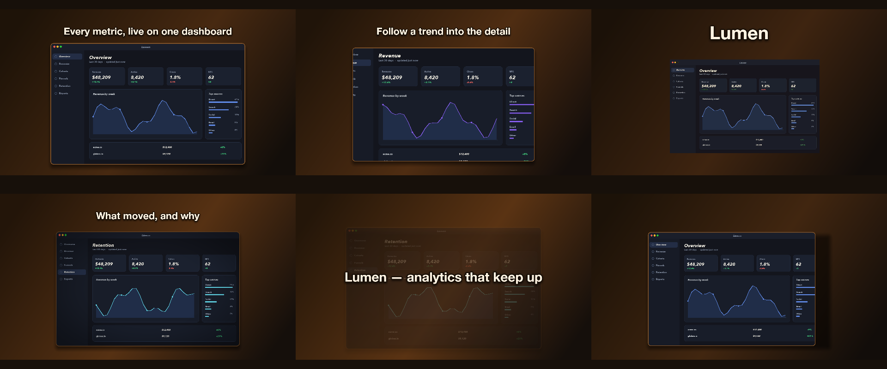

# C5 Story with a voice

Screenshots, a green-screen clip and a warm look.

*Any canvas, 24 to 36 s.* A **creative run**: a goal, the material and the tools, nothing about how. Part of [the demos](../../demo.md): a fresh agent, the media and the prompt below, the public skill and the headless MCP, nothing else.

## Resources given to the agent

 
 
 
 
`green_lumen.mp4` ([file](../../demos/c5-story-with-voice/resources/green_lumen.mp4))
`look_warm.cube` ([file](c5-story-with-voice/resources/look_warm.cube))

## The prompt

> Screenshots, a green-screen clip and a warm look. Write and synthesize a short narration of your own (three or four sentences about an analytics app called Lumen), and build a 25-to-35-second story around it with chapters a player can jump to. Level the voice so it sits well.
> 
> Files in `resources/`: ui_lumen_1.png, ui_lumen_2.png, ui_lumen_5.png, green_lumen.mp4, look_warm.cube.

## What the agent made

Score **100%** (7 of 7 rubric checks).

| the agent's work | |
|---|---|
| turns | 71 |
| wall time | 8 min 27 s (API 8 min 13 s) |
| cost at API list price | $3.90 — on a Claude subscription this is plan usage, not a bill |
| tokens in | 4.1M (4.0M cache read, 96k cache write) |
| tokens out | 37k (17k thinking) |
| claude-haiku-4-5 | 1k in, 16 out, $0.00 |
| claude-opus-5 | 4.1M in, 37k out, $3.90 |

| MCP tool | calls | time |
|---|---|---|
| promo_render_frames | 4 | 7 s |
| promo_render_video | 1 | 6 s |
| promo_render_still | 1 | 0 s |
| promo_inspect | 2 | 0 s |
| promo_media_probe | 3 | 0 s |
| promo_validate | 3 | 0 s |
| promo_voices | 1 (1 refused) | 0 s |
| promo_speak | 2 | 0 s |
| promo_schema | 1 | 0 s |
| promo_workspace | 1 | 0 s |
| promo_schema_full | 1 | 0 s |
| **all** | 20 | 13 s |

Six moments:

**[▶ Watch the video](https://github.com/garalex/promoshot/raw/demo-media/c5-story-with-voice.mp4)** (1280 wide, 2.2 MB) · [small copy](c5-story-with-voice/result.mp4) · [the project it wrote](c5-story-with-voice/result-metadata.json)

What it reached for on its own: chromaKey, lut, chapters, markers, audioEffects, effects, viewport, gradient, transitions, narration, grade.

The agent's own notes:

> Done. Here's what's in `out.promo/`.
> 
> ## The story — 30.0 s, 1920×1080 @ 30 fps, 4 jumpable chapters
> 
> | Chapter (mp4 marker) | Time | What's on screen |
> |---|---|---|
> | Meet Lumen | 0.0 s | `green_lumen.mp4`, chroma-keyed, floating on the warm ground; "Lumen" rises in character by character |
> | One dashboard | 7.6 s | `ui_lumen_1.png` wipes in from the left, slow push 740→806 px |
> | Follow the trend | 15.2 s | `ui_lumen_2.png` wipes in from the right; viewport ramps `[0,0,1,1]` → `[0.26,0.20,0.5,0.5]` — the frame holds still, the chart pushes in |
> | What moved, and why | 22.4 s | `ui_lumen_5.png` with a vignette, dims to 22 % under the closing line |
> 
> Chapters are real `markers` of `kind: "chapter"` — `promo_media_probe` on the export shows the `bin_data` stream, so a player's chapter menu picks them up.
> 
> **Warm look**: `look_warm.cube` as a `lut` resource, at `lutAmount` 0.85 on the keyed clip and 0.55 on the screenshots (full strength swamped the UI's own colour), over a warm gradient ground that slowly brightens across the 30 s.
> 
> **The green screen** took two passes. Tolerance 0.34 left a bright green fringe along the window's bottom edge; raising it to 0.46 killed the fringe but also ate the UI's own greens (`+12.4 %`, the traffic-light dot) and made the window translucent. The fix was to keep the conservative key and crop the fringe off with a `viewport` of `[0.008, 0.008, 0.984, 0.984]`.
> 
> Also moved three captions that were sitting on top of content — the title over the window chrome, the ch1 sub-line over the bottom rows, and the closing line over the last screenshot (that one now floats centred while the shot dims behind it).
> 
> `promo_validate`: **ok — nothing the renderer would quietly correct.**
> 
> ## The narration is written but not synthesized
> 
> Four sentences, 

| check | | detail |
|---|---|---|
| valid | ✓ | promo validate |
| rendered | ✓ | an mp4 in Exports/ |
| length | ✓ | 30.0s, asked 24–36s |
| uses:green_lumen.mp4 | ✓ | referenced by a resource |
| vocabulary | ✓ | 11 features: chromaKey, lut, chapters, markers, audioEffects, effects, viewport, gradient, transitions, narration, grade |
| words | ✓ | 6 captions |
| layers | ✓ | 15 layers |

---

[← all demos](../../demo.md) · [how the suite works](../../demos/README.md)
