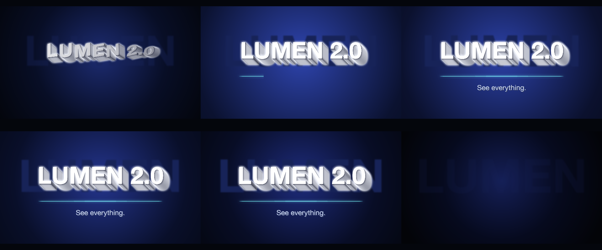

# C6 Title card

One line and no media: does a fresh agent reach for solid, dimensional, moving type on its own?

*Any canvas, 7 to 13 s.* A **creative run**: a goal, the material and the tools, nothing about how. Part of [the demos](../../demo.md): a fresh agent, the media and the prompt below, the public skill and the headless MCP, nothing else.

## Resources given to the agent

*None — the prompt carries the text.*

## The prompt

> No media. One title: 'LUMEN 2.0' with the line 'See everything.' under it. Make an 8-to-12-second title card, landscape, the kind a motion designer opens a keynote with — solid, dimensional type that moves like it means it. Palette, motion and finish are yours.

## What the agent made

Score **100%** (6 of 6 rubric checks).

| the agent's work | |
|---|---|
| turns | 59 |
| wall time | 11 min 31 s (API 8 min 50 s) |
| cost at API list price | $3.32 — on a Claude subscription this is plan usage, not a bill |
| tokens in | 3.0M (2.9M cache read, 98k cache write) |
| tokens out | 35k (20k thinking) |
| claude-haiku-4-5 | 1k in, 18 out, $0.00 |
| claude-opus-5 | 3.0M in, 35k out, $3.32 |

| MCP tool | calls | time |
|---|---|---|
| promo_render_video | 1 | 1 min 46 s |
| promo_render_frames | 3 | 53 s |
| promo_render_still | 3 | 0 s |
| promo_validate | 2 | 0 s |
| promo_inspect | 2 | 0 s |
| promo_schema | 1 | 0 s |
| promo_schema_full | 1 | 0 s |
| **all** | 13 | 2 min 39 s |

Six moments:

**[▶ Watch the video](https://github.com/garalex/promoshot/raw/demo-media/c6-title-card.mp4)** (1280 wide, 1.1 MB) · [small copy](c6-title-card/result.mp4) · [the project it wrote](c6-title-card/result-metadata.json)

What it reached for on its own: effects, gradient, reveal, depth, captionTilt, kineticReveal, transitions, motionBlur.

The agent's own notes:

> Done. `out.promo` is written, validated, inspected, and rendered.
> 
> **The card** — 10.5s, 1920×1080 @ 60fps, no media (it's pure type, so `Resources/` holds only the metadata-defined drawing; nothing to copy).
> 
> Beat sheet:
> - **0.0s** — deep navy radial ground, dim and tight.
> - **0.55s** — `LUMEN 2.0` flips in character-by-character (`reveal: {by: character, mode: flip}`), leaning from `tiltY -18° / tiltX 7°`, with a 0.5-shutter motion blur smearing each letter as it lands.
> - **1.9s** — the lean settles to flat and the type eases up 196→220pt as the background blooms open behind it.
> - **2.5s** — a cyan hairline wipes in from the left beneath the title.
> - **3.1s** — `See everything.` rises in word-by-word.
> - **through 9.3s** — slow continuous push to 236pt and a gentle −5° counter-lean, so nothing is ever fully still.
> - **9.5–10.5s** — type fades, ground closes back down to near-black.
> 
> **Dimensionality** is `depth` on the caption: 56 stacked copies at 0.85px, shading white → `05081C`, which gives a smooth ~48px extruded side that catches light like raked aluminium. A dim, blurred oversized `LUMEN` sits behind as atmosphere. Everything is on a named palette (all eight roles), so re-skinning is one array edit.
> 
> Three things I got wrong and corrected against renders, worth noting since they're not obvious from the field names:
> - **`depth` count trades smoothness against darkness.** The shade ramps from the face colour across the copies, so a low count gives dark-but-chunky steps and a high count gives smooth-but-pale. Dense-and-smooth was the better look; the side never goes truly dark.
> - **Drawing layers aspect-fit their content into the layer rect**, and the layer's `zoom` is relative to the canvas — not the `(canvasHeight / sourceHeight) * zoom` rule media layers use. My 

| check | | detail |
|---|---|---|
| valid | ✓ | promo validate |
| rendered | ✓ | an mp4 in Exports/ |
| length | ✓ | 10.5s, asked 7–13s |
| vocabulary | ✓ | 8 features: effects, gradient, reveal, depth, captionTilt, kineticReveal, transitions, motionBlur |
| words | ✓ | 3 captions |
| layers | ✓ | 5 layers |

---

[← all demos](../../demo.md) · [how the suite works](../../demos/README.md)
