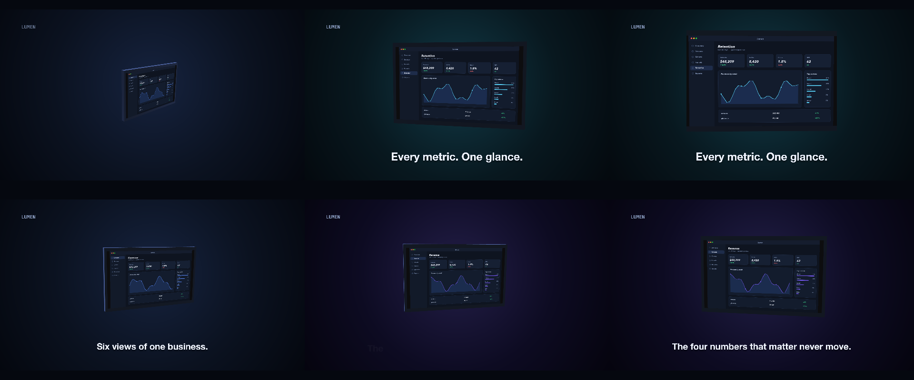

# C7 Product spin

A tablet model and three screenshots, no instructions: does a fresh agent look at the model, put the app on its screen and move the camera like a product film?

*Any canvas, 9 to 16 s.* A **creative run**: a goal, the material and the tools, nothing about how. Part of [the demos](../../demo.md): a fresh agent, the media and the prompt below, the public skill and the headless MCP, nothing else.

## Resources given to the agent

`slab.glb` ([file](../../demos/c7-product-spin/resources/slab.glb))
 
 
 

## The prompt

> A 3D model of a tablet (slab.glb — look at it before you place it) and three screenshots of Lumen, an analytics app. Make a 10-to-15-second product spot, landscape, where the device is the hero: show the app on its screen, move the camera like a product film would, and say one thing worth saying. Palette, type and motion are yours.
> 
> Files in `resources/`: slab.glb, ui_lumen_1.png, ui_lumen_2.png, ui_lumen_5.png.

## What the agent made

Score **100%** (7 of 7 rubric checks).

| the agent's work | |
|---|---|
| turns | 72 |
| wall time | 10 min 34 s (API 10 min 26 s) |
| cost at API list price | $4.41 — on a Claude subscription this is plan usage, not a bill |
| tokens in | 4.3M (4.2M cache read, 115k cache write) |
| tokens out | 47k (25k thinking) |
| claude-haiku-4-5 | 1k in, 13 out, $0.00 |
| claude-opus-5 | 4.3M in, 47k out, $4.41 |

| MCP tool | calls | time |
|---|---|---|
| promo_render_video | 1 | 3 s |
| promo_render_frames | 2 | 3 s |
| promo_media_probe | 2 | 0 s |
| promo_render_still | 5 | 0 s |
| promo_media_turntable | 1 | 0 s |
| promo_validate | 2 | 0 s |
| promo_inspect | 1 | 0 s |
| promo_schema_types | 1 | 0 s |
| promo_schema | 1 | 0 s |
| promo_workspace | 1 | 0 s |
| promo_schema_full | 1 | 0 s |
| **all** | 18 | 7 s |

Six moments:

**[▶ Watch the video](https://github.com/garalex/promoshot/raw/demo-media/c7-product-spin.mp4)** (1280 wide, 1.0 MB) · [small copy](c7-product-spin/result.mp4) · [the project it wrote](c7-product-spin/result-metadata.json)

What it reached for on its own: gradient, reveal, model, camera, materials.

The agent's own notes:

> Done. `out.promo` renders a 13.4s landscape spot: **`out.promo/Exports/lumen-spot.mp4`** (1920×1080, h264, 30fps).
> 
> **How it's built**
> 
> One continuous camera move, not three shots. The tablet is a `model` layer; the camera dollies in and orbits the whole 13.4s — yaw −52° → −16° → +14° → −3°, pitch 17° → 2°, distance 4.9 → 3.15 boundsRadius, fov easing 30 → 28 on the last push. The device grows from ~300px to ~700px tall, all of it eased `easeInOut`.
> 
> The screen changes are the trick: `materials` lives on the **resource**, not the layer, so there are three model resources all pointing at `slab.glb`, each binding the `Screen` slot to a different screenshot. Each shot's camera move decelerates into a rest pose, and the next layer begins parked on that exact pose — so during the 0.5s cross-dissolve the camera is holding still and only the UI swaps. I verified both dissolve points by rendering the two sides in isolation: pixel-identical framing.
> 
> **What it says**, and why those lines are defensible from the images:
> 1. *"Six views of one business."* — the sidebar has exactly six items.
> 2. *"The four numbers that matter never move."* — Revenue / Active / Churn / NPS are identical and identically placed on all three screens. That's the actual product idea, and the film demonstrates it while saying it.
> 3. *"Every metric. One glance."* — the payoff, on the hero frame where the UI is fully legible.
> 
> Type is word-by-word `rise` reveals, plate-less over a radial studio gradient that tints navy → violet → teal to follow each screen's own accent colour. Palette is named (all eight roles), so it re-skins from one array.
> 
> Two things worth flagging: the model's `Screen` quad has a clean 0..1 UV map (I checked the GLB directly after the first render came out flat grey), which is why the s

| check | | detail |
|---|---|---|
| valid | ✓ | promo validate |
| rendered | ✓ | an mp4 in Exports/ |
| length | ✓ | 13.4s, asked 9–16s |
| uses:slab.glb | ✓ | referenced by a resource |
| vocabulary | ✓ | 5 features: gradient, reveal, model, camera, materials |
| words | ✓ | 4 captions |
| layers | ✓ | 8 layers |

---

[← all demos](../../demo.md) · [how the suite works](../../demos/README.md)
