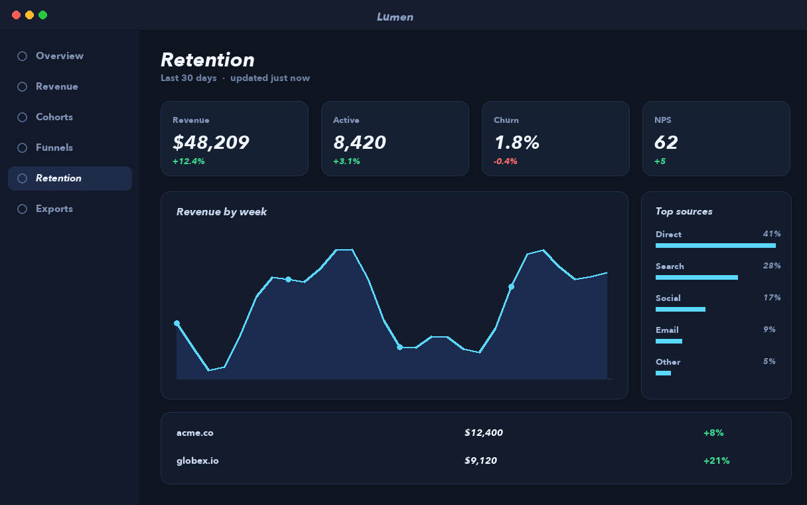
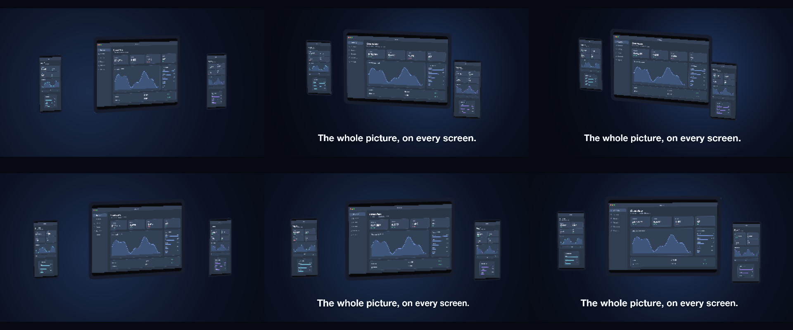

# C8 A scene, not a shot

Two device bodies, three screenshots, one sentence asking for a scene: does a fresh agent build a stage with both devices, the app on each screen and a camera move through it?

*Any canvas, 11 to 19 s.* A **creative run**: a goal, the material and the tools, nothing about how. Part of [the demos](../../demo.md): a fresh agent, the media and the prompt below, the public skill and the headless MCP, nothing else.

## Resources given to the agent

`tablet.glb` ([file](../../demos/c8-scene/resources/tablet.glb))
`phone.glb` ([file](../../demos/c8-scene/resources/phone.glb))
 
 
 

## The prompt

> Two device models (tablet.glb and phone.glb — look at them first) and three screenshots of Lumen, an analytics app. Make a 12-to-18-second landscape piece that is a SCENE rather than a product shot: both devices in one space, the app on both screens, one camera move through it, and a line of type that belongs in the scene. Everything else is yours.
> 
> Files in `resources/`: tablet.glb, phone.glb, ui_lumen_1.png, ui_lumen_2.png, ui_lumen_5.png.

## What the agent made

Score **88%** (7 of 8 rubric checks).

| the agent's work | |
|---|---|
| turns | 114 |
| wall time | 17 min 23 s (API 17 min 12 s) |
| cost at API list price | $9.43 — on a Claude subscription this is plan usage, not a bill |
| tokens in | 12.6M (12.4M cache read, 152k cache write) |
| tokens out | 68k (33k thinking) |
| claude-haiku-4-5 | 1k in, 15 out, $0.00 |
| claude-opus-5 | 12.6M in, 68k out, $9.43 |

| MCP tool | calls | time |
|---|---|---|
| promo_render_video | 1 | 4 s |
| promo_render_frames | 3 | 3 s |
| promo_render_still | 12 | 1 s |
| promo_media_probe | 1 | 0 s |
| promo_validate | 3 | 0 s |
| promo_inspect | 1 | 0 s |
| promo_explain | 1 | 0 s |
| promo_schema_types | 1 | 0 s |
| promo_schema | 1 | 0 s |
| promo_workspace | 1 | 0 s |
| promo_schema_full | 1 | 0 s |
| **all** | 26 | 8 s |

Six moments:

**[▶ Watch the video](https://github.com/garalex/promoshot/raw/demo-media/c8-scene.mp4)** (1280 wide, 1.5 MB) · [small copy](c8-scene/result.mp4) · [the project it wrote](c8-scene/result-metadata.json)

What it reached for on its own: gradient, reveal, stage, model, camera, materials, captionTilt.

The agent's own notes:

> Done. `out.promo` renders a 16-second landscape scene.
> 
> **What it is** — one studio space, three devices standing on a common floor line, each running Lumen:
> 
> | | screen | position |
> |---|---|---|
> | tablet (hero) | Overview | stage centre, depth 0 |
> | phone | Revenue | right, foreground (depth +0.55) |
> | phone | Retention | left, behind (depth −0.42) |
> 
> All three are members of one `stage` ("studio"), so they share a camera and a depth buffer — the parallax and the overlaps in the last shot are real, not stacked layers.
> 
> **The camera move** is a single 15.9s `easeInOut` arc: yaw −37° → +18°, pitch 3° → 14°, distance 7.0 → 5.9 radii, with the frame growing 580 → 690px. It starts wide and low from the left, swings right, rises, and closes in; the key light travels the other way (yaw 34° → −20°) so highlights sweep across the bodies, and the background's radial glow drifts with it.
> 
> **The line** — "The whole picture, on every screen." — arrives at 4.2s once the space is established, word by word on a `rise` reveal, and leans in perspective (tiltY 20° → −9°) so it turns with the room rather than sitting flat on the glass.
> 
> **Two things I had to build**
> 
> - The phone screens: the source shots are 1216×760 landscape and `phone.glb`'s screen is portrait (0.72 × 1.52), so stretching them would have looked wrong. I recomposed `ui_lumen_2` and `ui_lumen_5` into genuine 720×1520 phone layouts (wordmark bar, page title, KPI cards 2×2, chart, table, top sources) and gamma-lifted all three screens so they read as lit displays against dark bodies.
> - Device scale: the two models aren't in a common unit — `phone.glb` is 1.52 tall against the tablet's 0.90, so a phone would have towered over a tablet. `phone_a.glb`/`phone_b.glb` are the phone with a 0.45 node scale, which puts it at ~0.7×

| check | | detail |
|---|---|---|
| valid | ✓ | promo validate |
| rendered | ✓ | an mp4 in Exports/ |
| length | ✓ | 16.0s, asked 11–19s |
| uses:tablet.glb | ✓ | referenced by a resource |
| uses:phone.glb | ✗ | not used |
| vocabulary | ✓ | 7 features: gradient, reveal, stage, model, camera, materials, captionTilt |
| words | ✓ | 1 captions |
| layers | ✓ | 5 layers |

---

[← all demos](../../demo.md) · [how the suite works](../../demos/README.md)
