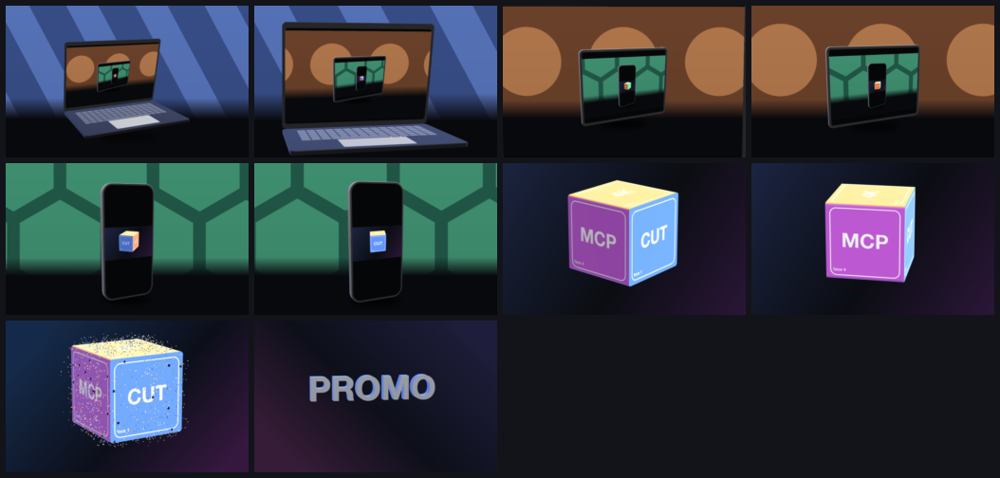
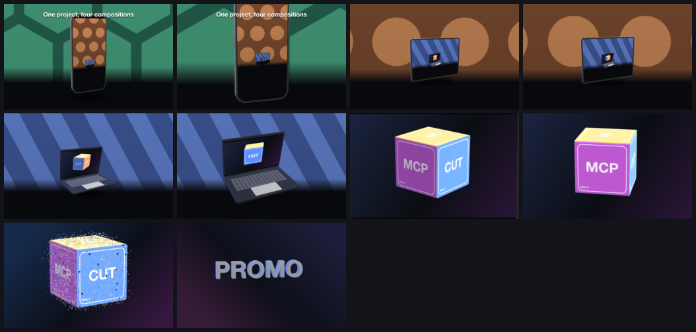

# C9 Infinite screens

A built showcase, not an agent run: a script writes four compositions from the format and flies through them — every screen plays the next scene, each cut lands on the picture already on the screen.

*1440×900, 29 to 36 s.* A **built showcase**, not an agent run: [`demos/c9-infinite-screens/build.py`](../../demos/c9-infinite-screens/build.py) writes the project straight from the format, and its resources are in [`demos/c9-infinite-screens/resources/`](../../demos/c9-infinite-screens/resources). Part of [the demos](../../demo.md).

## The brief

> Make a piece of about thirty seconds on a 1440×900 canvas that flies
> forward through screens in one movement. A laptop from the shared
> library stands on a floor under a slowly panning patterned background;
> its screen shows a tablet on another floor, whose screen shows a phone
> on a third, whose screen shows the first frame of the cube piece. From
> the first frame the camera flies toward the laptop's screen at one
> steady rate — the body growing and straightening, the background growing
> and panning with it — until the picture on the screen is the canvas,
> and the piece cuts to that scene already flying at the same rate; then
> the tablet's, then the phone's. Nothing pauses. The last cut lands on
> the cube piece (34 Cube To Word), which then plays whole, as authored.

## Laptop first

A laptop on a table whose screen shows a tablet, whose screen shows a phone, whose screen shows the cube piece; one continuous flight through all three, the backgrounds scrolling at every depth.

**[▶ Watch the video](https://github.com/garalex/promoshot/raw/demo-media/c9-infinite-screens-laptop-first.mp4)** (1280 wide, 7.2 MB, 32 s) · [small copy](c9-infinite-screens/laptop-first.mp4) · [the project](c9-infinite-screens/laptop-first-metadata.json)

## Phone first

The other way up — a phone, a tablet, a laptop, the cube — with a headline per scene, each screen playing a scene built to its own shape, and the laptop typing PROMOSHOT on its keyboard before the last flight.

**[▶ Watch the video](https://github.com/garalex/promoshot/raw/demo-media/c9-infinite-screens-phone-first.mp4)** (1280 wide, 7.6 MB, 35 s) · [small copy](c9-infinite-screens/phone-first.mp4) · [the project](c9-infinite-screens/phone-first-metadata.json)

## What the piece is built to do

- **four scenes** — layers named Laptop, Tablet and Phone precede the cube piece's Bench stage in time
- **the screens show the next scene** — each device's Screen slot binds the next scene's composition, whose clock starts on the film's first frame
- **screens move** — frames of a device's screen two seconds apart differ: the next scene's background is scrolling on it
- **one rate** — every body's placed height follows one exponential rate, and the next scene starts growing at that rate
- **no holds** — no placement keyframe repeats the previous one's height
- **invisible cuts** — the frame before and after each cut differ by less than a small threshold
- **the final scene is the cube piece** — the last ten seconds are 34-cube-to-word's layers and resources, time-shifted only
- **length** — between thirty and forty seconds

---

[← all demos](../../demo.md) · [how the suite works](../../demos/README.md)
